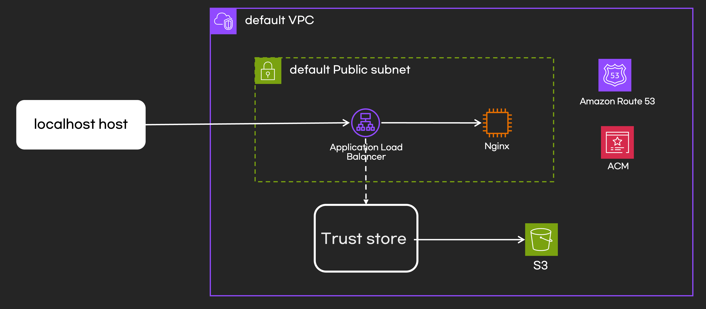
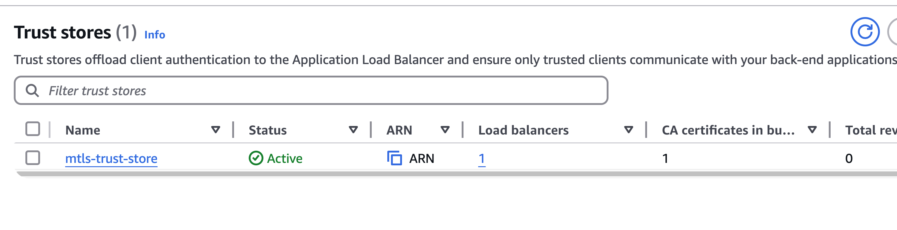
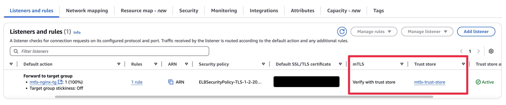

## 개요

* AWS ALB mTLS실습을 위한 테라폼 코드
* 이 테라폼 코드를 사용하려면 ACM, Route53 Hostzone이 있어야 합니다.



## 실행방법

1. 인증서 생성

```sh
make create-certs
ls -l ./certs
```

2. 테라폼 변수 설정


```sh
$ vi terraform.tfvars
trust_store_bucket_name = "{bucket name}" # 인증서를 저장
use_acm                 = true
acm_domain              = "{your ACM domain}"
route53_zone_id         = "{your Route53 hostzone id}"
domain_name             = "{your ALB route53 A record}"
```

3. terraform apply

```sh
terraform plan
terraform apply
```

## 핵심 리소스 확인

* trust store 확인



* ALB listener에 mTLS 설정 확인



* s3에 root CA 버킷과 revocation 버킷 확인
