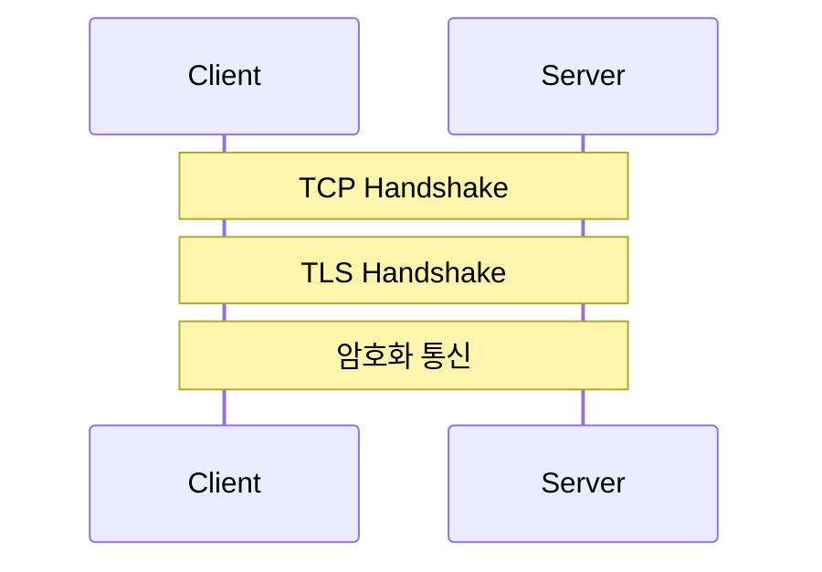
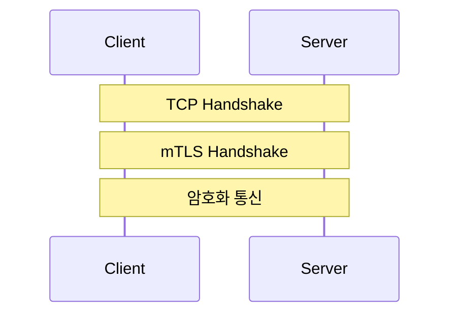

## 개요
* mTLS 이론

## TLS

* TLS 핸드쉐이크는 서버 인증서만 검증

```mermaid
sequenceDiagram
  participant Client
  participant Server

  Note over Client,Server: TCP Handshake
  Note over Client,Server: TLS Handshake
  Note over Client,Server: 암호화 통신
```

## mTLS

* mTLS 핸드쉐이크는 클라이언트 인증서도 검증

```mermaid
sequenceDiagram
  participant Client
  participant Server

  Note over Client,Server: TCP Handshake
  Note over Client,Server: mTLS Handshake
  Note over Client,Server: 암호화 통신
```
