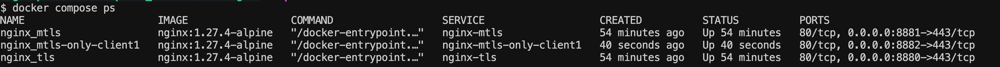
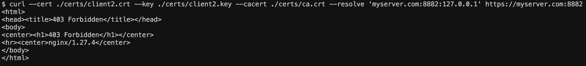

<!-- TOC -->

- [개요](#%EA%B0%9C%EC%9A%94)
- [실습 준비](#%EC%8B%A4%EC%8A%B5-%EC%A4%80%EB%B9%84)
  - [인증서 생성](#%EC%9D%B8%EC%A6%9D%EC%84%9C-%EC%83%9D%EC%84%B1)
  - [nginx 컨테이너 실행](#nginx-%EC%BB%A8%ED%85%8C%EC%9D%B4%EB%84%88-%EC%8B%A4%ED%96%89)
  - [/etc/hosts파일 변조](#etchosts%ED%8C%8C%EC%9D%BC-%EB%B3%80%EC%A1%B0)
- [호출 테스트](#%ED%98%B8%EC%B6%9C-%ED%85%8C%EC%8A%A4%ED%8A%B8)
  - [TLS가 적용된 nginx 호출](#tls%EA%B0%80-%EC%A0%81%EC%9A%A9%EB%90%9C-nginx-%ED%98%B8%EC%B6%9C)
  - [mTLS가 적용된 nginx 호출](#mtls%EA%B0%80-%EC%A0%81%EC%9A%A9%EB%90%9C-nginx-%ED%98%B8%EC%B6%9C)
- [mTLS가 적용된 nginx를 호출하려면?](#mtls%EA%B0%80-%EC%A0%81%EC%9A%A9%EB%90%9C-nginx%EB%A5%BC-%ED%98%B8%EC%B6%9C%ED%95%98%EB%A0%A4%EB%A9%B4)
- [mTLS가 적용된 nginx에 클라이언트 인증서 필터링](#mtls%EA%B0%80-%EC%A0%81%EC%9A%A9%EB%90%9C-nginx%EC%97%90-%ED%81%B4%EB%9D%BC%EC%9D%B4%EC%96%B8%ED%8A%B8-%EC%9D%B8%EC%A6%9D%EC%84%9C-%ED%95%84%ED%84%B0%EB%A7%81)
  - [원리](#%EC%9B%90%EB%A6%AC)
  - [실습](#%EC%8B%A4%EC%8A%B5)
- [더 볼거리](#%EB%8D%94-%EB%B3%BC%EA%B1%B0%EB%A6%AC)
- [참고자료](#%EC%B0%B8%EA%B3%A0%EC%9E%90%EB%A3%8C)

<!-- /TOC -->  * nginx_mtls-only-client1: CN=client1만 허용하는 mTLS nginx

## 개요
* nginx mTLS

## 실습 준비

### 인증서 생성

* Makefile에 정의된 certs job을 실행합니다.

```sh
make create-certs
```

### nginx 컨테이너 실행

* docker compose로 컨테이너 3개 실행
  * nginx_tls: tls통신하는 nginx
  * nginx_tls: mTLS통신하는 nginx

```sh
$ docker compose up -d
[+] Running 3/3
 ✔ Container nginx_mtls
 ✔ Container nginx_tls
 ✔ Container nginx_mtls-only-client1
```

```sh
docker compose ps
```



### /etc/hosts파일 변조

* [nginx.conf](./conf/default.conf#6)의 host이름이 myserver.com입니다.

## 호출 테스트

### TLS가 적용된 nginx 호출

* 정상적으로 호출 됨

```sh
$ curl --resolve 'myserver.com:8880:127.0.0.1' https://myserver.com:8880 --cacert ./certs/ca.crt
<!DOCTYPE html>
<html>
<head>
<title>Welcome to nginx!</title>
```

```sh
$ curl --resolve 'myserver.com:8881:127.0.0.1' https://myserver.com:8881 --cacert ./certs/ca.crt
<html>
<head><title>400 No required SSL certificate was sent</title></head>
<body>
<center><h1>400 Bad Request</h1></center>
<center>No required SSL certificate was sent</center>
<hr><center>nginx/1.27.4</center>
</body>
</html>
```

### mTLS가 적용된 nginx 호출

* 호출 실패

```sh
$ curl --resolve 'myserver.com:8881:127.0.0.1' https://myserver.com:8881 --cacert ./certs/ca.crt
<html>
<head><title>400 No required SSL certificate was sent</title></head>
<body>
<center><h1>400 Bad Request</h1></center>
<center>No required SSL certificate was sent</center>
<hr><center>nginx/1.27.4</center>
</body>
</html>
```

## mTLS가 적용된 nginx를 호출하려면?

* client1 클라이언트 인증서로 통신 성공

```sh
$ curl --cert ./certs/client1.crt --key ./certs/client1.key --cacert ./certs/ca.crt --resolve 'myserver.com:8881:127.0.0.1' https://myserver.com:8881
<!DOCTYPE html>
<html>
<head>
<title>Welcome to nginx!</title>
```

* client2 클라이언트 인증서로 통신 성공

```sh
$ curl --cert ./certs/client2.crt --key ./certs/client2.key --cacert ./certs/ca.crt --resolve 'myserver.com:8881:127.0.0.1' https://myserver.com:8881
<!DOCTYPE html>
<html>
<head>
<title>Welcome to nginx!</title>
```

## mTLS가 적용된 nginx에 클라이언트 인증서 필터링

* client1 인증서는 허용하고 client2 인증서는 거부

### 원리

* 인증서 OU필드에 allowed일때만 허용
* [파일링크](./conf/only_client1_with_nginx.conf#5)

```conf
map $ssl_client_s_dn $client_allowed {
  default 0;
  ~OU=allowed 1;
}
```

### 실습

```sh
$ curl --cert ./certs/client1.crt --key ./certs/client1.key --cacert ./certs/ca.crt --resolve 'myserver.com:8882:127.0.0.1' https://myserver.com:8882
<!DOCTYPE html>
<html>
<head>
<title>Welcome to nginx!</title>
```

```sh
$ curl --cert ./certs/client2.crt --key ./certs/client2.key --cacert ./certs/ca.crt --resolve 'myserver.com:8882:127.0.0.1' https://myserver.com:8882
<html>
<head><title>403 Forbidden</title></head>
<body>
<center><h1>403 Forbidden</h1></center>
<hr><center>nginx/1.27.4</center>
</body>
</html>
```



## 더 볼거리
* [wireshark로 패킷 덤프](./wireshark.md)

## 참고자료
* cloudflare: https://blog.cloudflare.com/tls-certificate-optimization-technical-details/
* curl resolve argument: https://wott.io/blog/tutorials/2019/07/15/mtls-with-nginx
