# OAuth Hands-on

이 프로젝트는 OAuth 개념을 익히기 위한 핸즈온입니다.

## OAuth 프로토콜이란?

OAuth 프로토콜 이론은 저의 블로그 설명으로 대신합니다.

- 블로그 링크: [https://malwareanalysis.tistory.com/889](https://malwareanalysis.tistory.com/889 "https://malwareanalysis.tistory.com/889")

## 용어

OAuth 프로토콜을 사용해서 개발을 하거나 다른 사람과 커뮤니케이션을 할 때 용어 통일이 매우 중요합니다. 용어에 대한 설명은 Okta 문서가 잘 설명되어 있습니다.

- Okta 문서: https://developer.okta.com/docs/concepts/oauth-openid/

1. Client: 리소스에 접근하는 제 3자 애플리케이션
2. Resource Server: 접근하려고 하는 리소스를 관리하는 서버
3. Resource Owner: 리소스 주체인 사용자
4. Authorization Server: 리소스에 접근할 수 있는 토큰을 발급하는 서버

## 핸즈온 1. Google playground

Google Playground에서는 Google에서 제공하는 리소스에 대한 OAuth 프로토콜을 체험할 수 있게 합니다. 테스트하려면 Google 계정이 필요합니다.

1. Google Playground에 접속합니다.

- Google Playground 링크: https://developers.google.com/oauthplayground/

2. 테스트하고 싶은 리소스를 선택합니다. 저는 YouTube Auth를 선택했습니다.

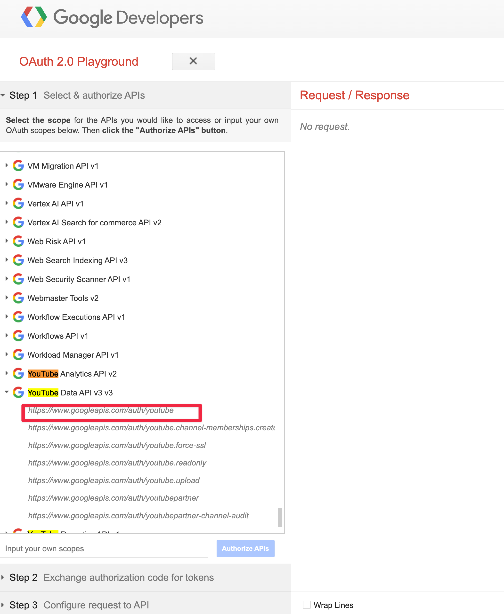

3. 하단 Authorize APIs 버튼을 클릭합니다.

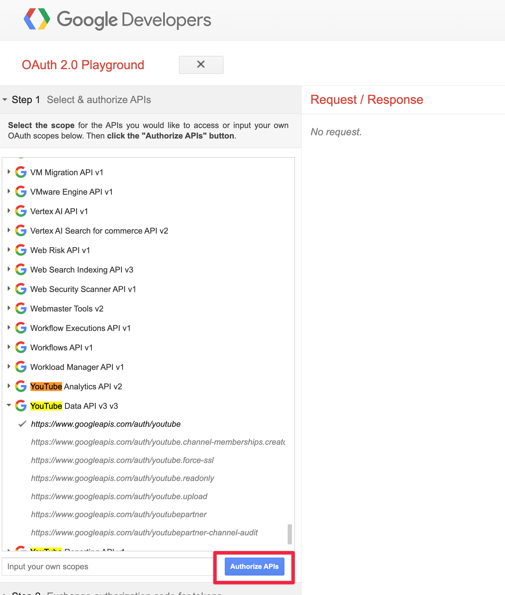

4. 사용자 인증 과정과 어떤 YouTube 계정을 사용할지 선택 페이지가 나옵니다.

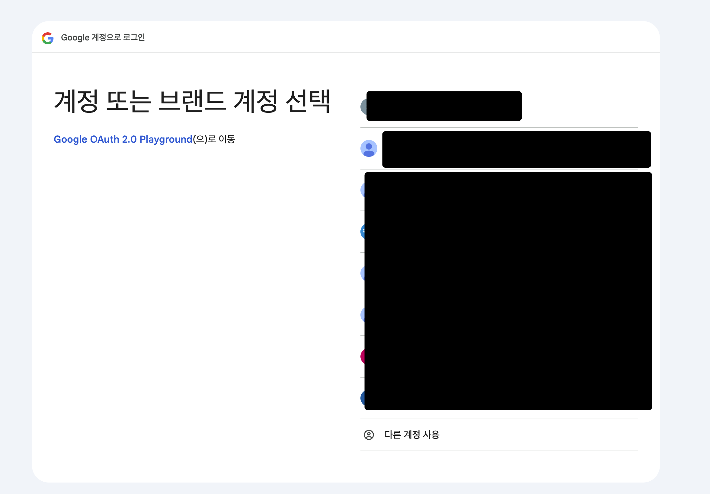

5. 인증이 끝나면 OAuth 프로토콜 페이지가 나옵니다. 어떤 권한을 Client에게 제공할지 권한 설정 페이지입니다. 부여할 권한은 페이지 중에 표시됩니다. 이 예제에서는 YouTube 동영상, 재생목록 등 권한을 부여합니다.

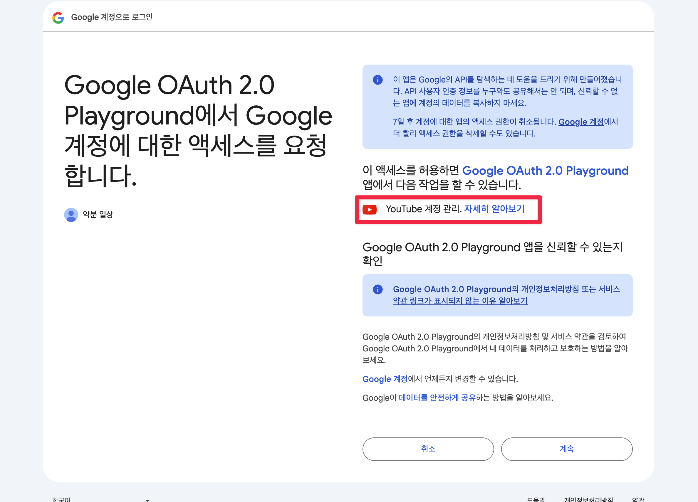

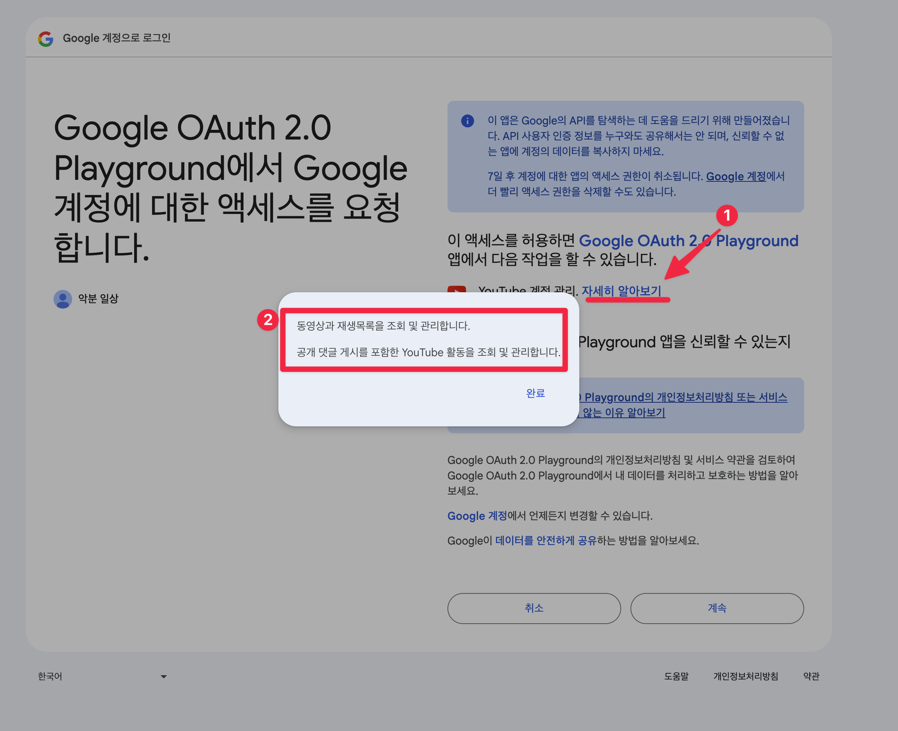

6. OAuth 프로토콜 과정이 끝나면 Code를 받습니다. Code를 Token으로 교환해야 Token을 발급받을 수 있습니다. Code를 Token으로 교환하는 이유는 Playground의 예제가 Token 발급받는 과정을 Authorization Code 방식으로 했기 때문입니다.

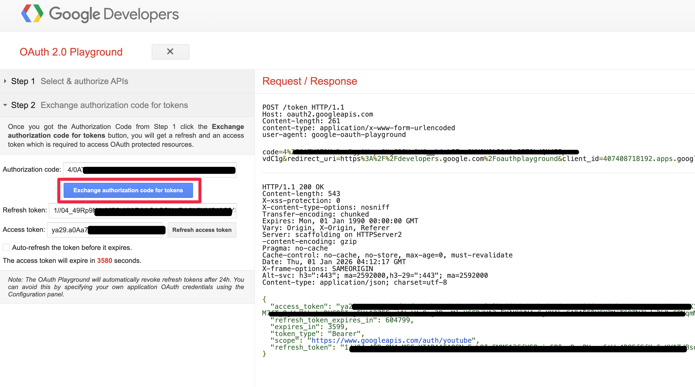

## 핸즈온 2. 내가 만든 애플리케이션으로 OAuth 프로토콜 사용

핸즈온 2는 Python으로 백엔드 애플리케이션을 만들고 직접 OAuth 프로토콜을 사용합니다.

### 핸즈온 설명

애플리케이션은 Authorization Code 방식을 사용하여 토큰을 발급받습니다. 애플리케이션은 /login과 /callback API가 있습니다.

1. /login API는 Google Authorization Server가 OAuth 프로토콜로 수락을 하기 위해 필요한 파라미터를 설정하고 리다이렉트(302)시킵니다.
2. 사용자는 리다이렉트 때문에 Google Authorization Server 페이지로 이동합니다. 이 과정에서 인증과 권한 수락을 합니다.

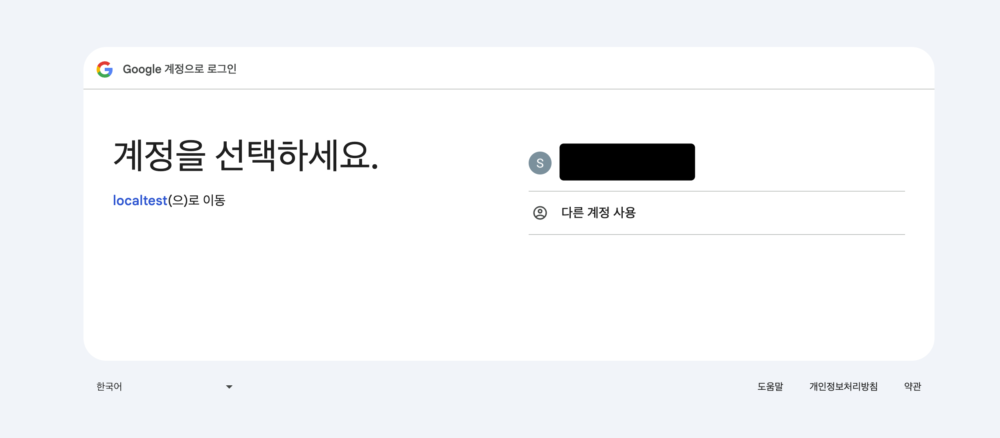

3. Google Authorization Server가 권한 수락까지 끝나면 Code를 발급합니다. 애플리케이션은 이 Code로 토큰을 발급해야 합니다. 그래서 Google Authorization Server는 Code 발급 이후에 callback API를 호출하게 합니다.

4. 애플리케이션의 callback API가 호출되면 발급받은 Code로 토큰을 교환합니다.

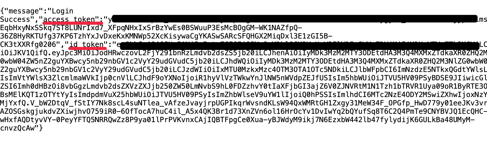

지금까지 말한 과정은 아래 그림과 같습니다.

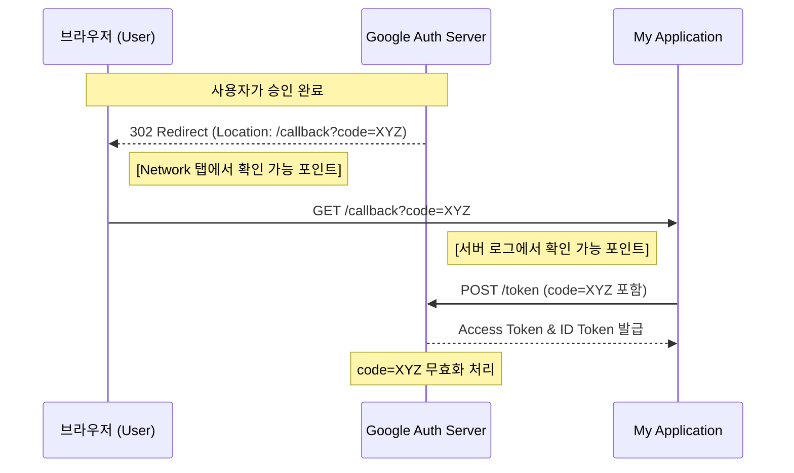

### 핸즈온 하는 방법

1. Google Cloud Platform에 로그인합니다.
2. API & Services -> OAuth consent screen 메뉴로 이동합니다. 이 메뉴는 OAuth 프로토콜에서 권한을 수락할 때 동의 화면입니다.

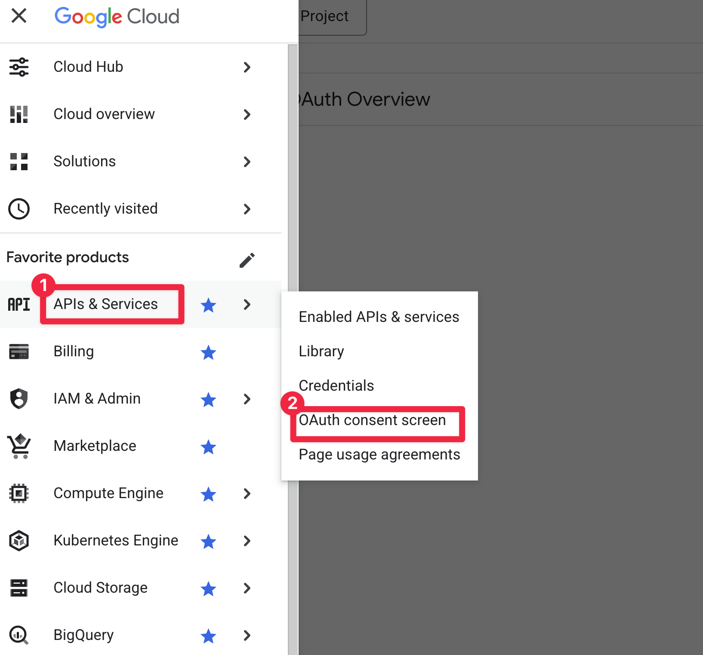

3. 동의 화면을 생성합니다.

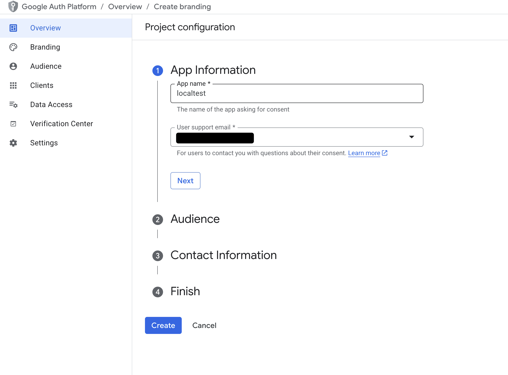

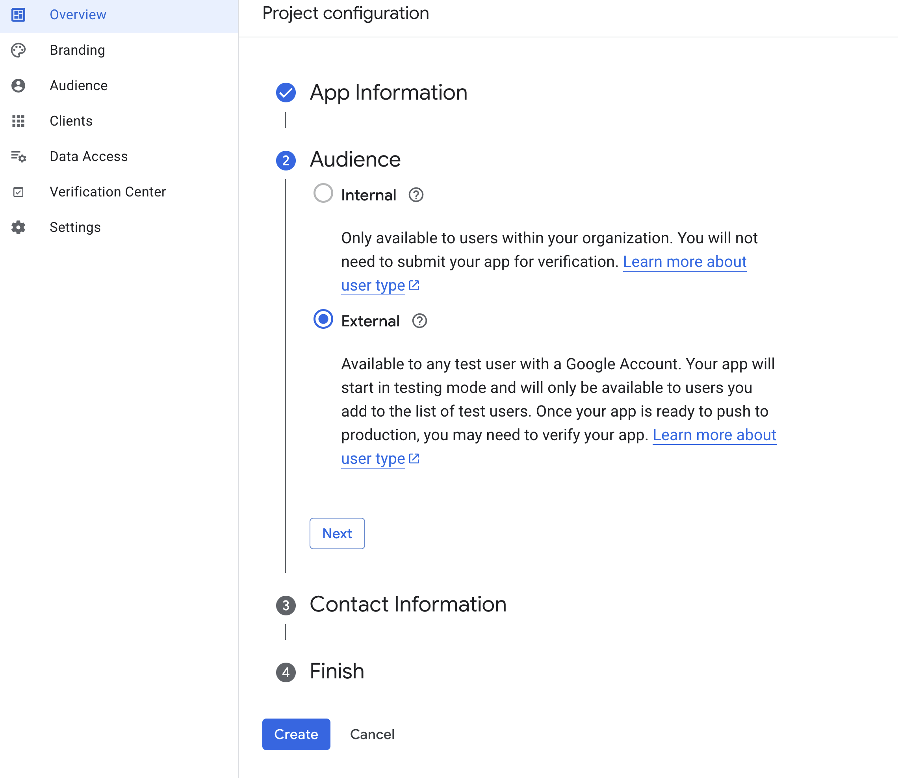

4. Client를 만듭니다. Client는 애플리케이션입니다. 애플리케이션이 Google Authorization Server와 OAuth 프로토콜 통신하려면 내 애플리케이션을 등록해야 합니다.

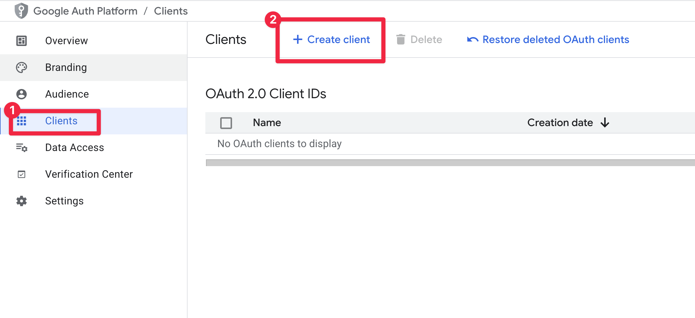

5. Client 생성이 완료되면 토큰이 생성됩니다. 이 토큰은 애플리케이션 환경 변수로 주입합니다.

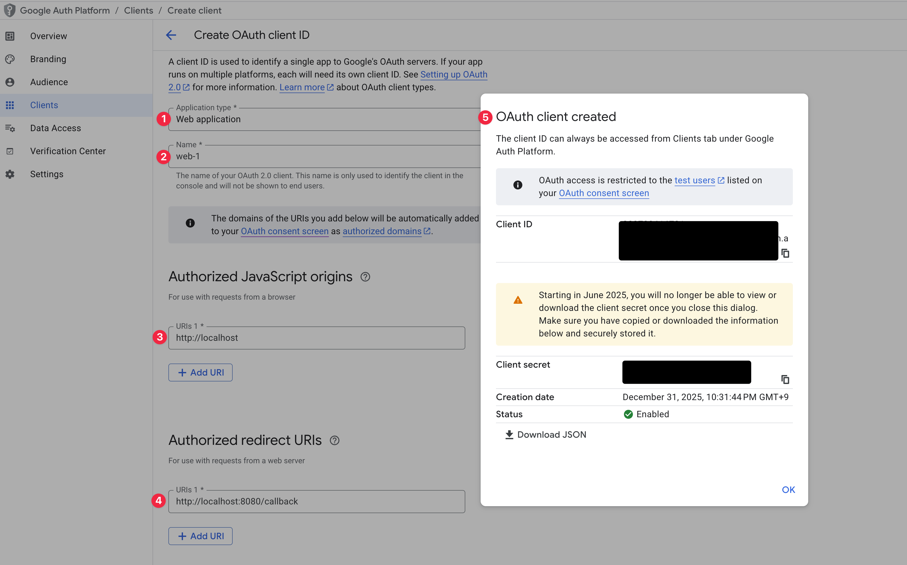

6. app 디렉터리로 이동합니다. 그리고 uv로 Python 패키지를 설치합니다.

```sh
cd app
uv sync
```

7. Python 애플리케이션을 실행합니다. 그리고 Google 로그인 버튼을 클릭하여 실습을 진행합니다.

```sh
uvicorn main:app --port 8080
```

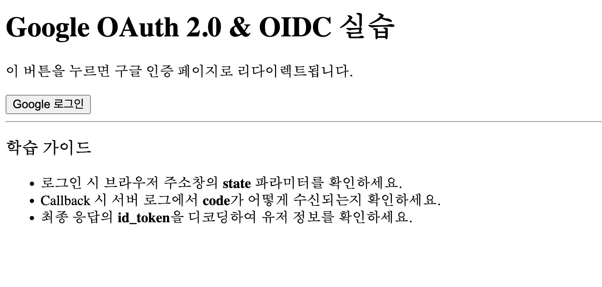

## 참고자료

- Okta: https://developer.okta.com/docs/concepts/oauth-openid/
- Cloudflare: https://www.cloudflare.com/ko-kr/learning/access-management/what-is-oauth/
- Google: https://developers.google.com/identity/protocols/oauth2/web-server#prerequisites
