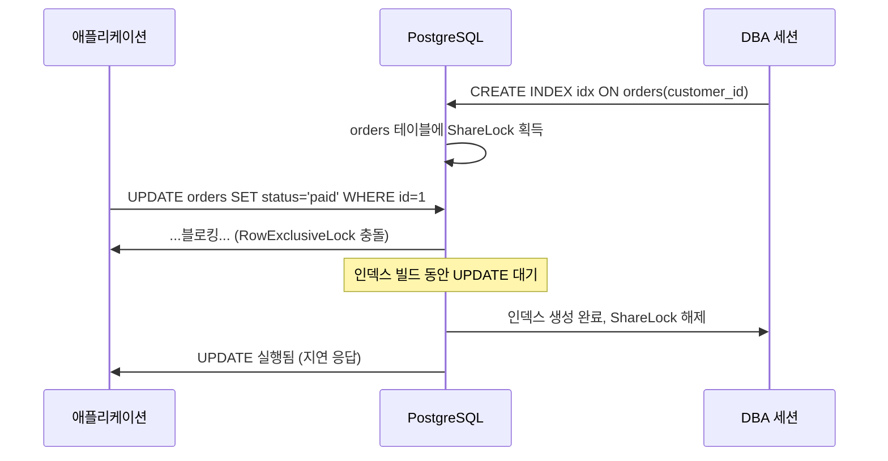
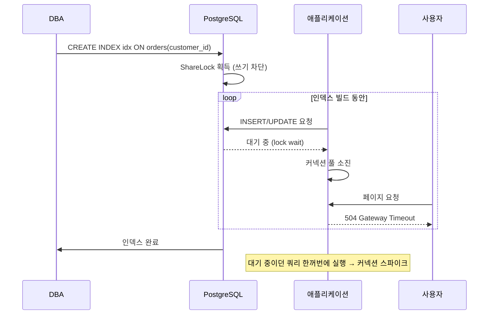

# CREATE INDEX CONCURRENTLY 개념

## 목차

- [공부 배경](#공부-배경)
- [이 글을 읽고 답할 수 있는 질문](#이-글을-읽고-답할-수-있는-질문)
- [두 명령은 어떤 락을 잡는가](#두-명령은-어떤-락을-잡는가)
- [CONCURRENTLY는 왜 테이블을 두 번 스캔하는가](#concurrently는-왜-테이블을-두-번-스캔하는가)
- [언제 CONCURRENTLY를 써야 하는가](#언제-concurrently를-써야-하는가)
- [안 쓰면 어떻게 되는가](#안-쓰면-어떻게-되는가)
- [어떻게 모니터링하는가](#어떻게-모니터링하는가)
- [CONCURRENTLY의 약점 - invalid 인덱스](#concurrently의-약점---invalid-인덱스)
- [헷갈리면 안 되는 점](#헷갈리면-안-되는-점)
- [결론](#결론)

## 공부 배경

운영 중인 PostgreSQL 테이블에 인덱스를 추가하려고 `CREATE INDEX`를 날렸다가 API 응답이 멈춰버린 경험이 있습니다. 로그를 보니 `UPDATE` 쿼리가 인덱스 생성이 끝날 때까지 전부 대기 중이었습니다. 그때부터 `CONCURRENTLY` 옵션을 찾아 쓰게 됐는데, 단순히 "락을 덜 잡는다"는 수준으로만 이해하고 있었습니다. 이 문서는 내부 동작과 함정을 직접 재현하면서 다시 정리한 기록입니다.

## 이 글을 읽고 답할 수 있는 질문

1. `ShareLock`과 `ShareUpdateExclusiveLock`은 무엇을 블로킹하는가?
2. `CONCURRENTLY`가 테이블 스캔을 두 번 하는 이유는 무엇인가?
3. 작은 개발 테이블에서는 왜 차이를 못 느끼는가?
4. `pg_stat_progress_create_index`의 `phase`는 어떻게 읽어야 하는가?
5. 실패한 `CONCURRENTLY` 작업이 남긴 invalid 인덱스는 왜 쿼리 플래너보다 더 위험한가?

## 두 명령은 어떤 락을 잡는가

PostgreSQL의 인덱스 생성 명령은 두 가지이고, 테이블에 잡는 락이 다릅니다.

| 명령 | 테이블 락 | 허용되는 작업 | 차단되는 작업 |
|------|-----------|--------------|--------------|
| `CREATE INDEX` | `ShareLock` | `SELECT` | `INSERT`, `UPDATE`, `DELETE`, 다른 DDL |
| `CREATE INDEX CONCURRENTLY` | `ShareUpdateExclusiveLock` | `SELECT`, `INSERT`, `UPDATE`, `DELETE` | 같은 테이블의 다른 DDL, `VACUUM FULL` |

`ShareLock`은 쓰기 자체를 막기 때문에 운영 중인 테이블에서는 사실상 사용할 수 없습니다. `ShareUpdateExclusiveLock`은 DML(INSERT/UPDATE/DELETE)과 양립할 수 있어서 서비스가 살아있는 상태로 인덱스를 추가할 수 있습니다.

아래 시퀀스 다이어그램은 `CREATE INDEX` 실행 중 UPDATE가 블로킹되는 흐름입니다.



`CONCURRENTLY`는 같은 상황에서 UPDATE를 블로킹하지 않습니다.

## CONCURRENTLY는 왜 테이블을 두 번 스캔하는가

`CONCURRENTLY`가 쓰기를 허용하려면 인덱스를 만드는 동안 들어오는 변경을 놓치면 안 됩니다. PostgreSQL은 이걸 "1차 스캔 + 2차 보정 스캔" 방식으로 해결합니다.

| 단계 | 하는 일 |
|------|---------|
| 1. 카탈로그 등록 | 인덱스 메타데이터를 `pg_index`에 `indisready=false`로 먼저 등록 |
| 2. 1차 빌드 | 스냅샷 시점 데이터로 인덱스 엔트리 채움 (이 동안 INSERT/UPDATE는 계속 들어옴) |
| 3. 2차 검증 | 1차 빌드 이후 변경된 행을 따라잡으며 인덱스에 반영 |
| 4. 오래된 트랜잭션 대기 | 아직 1차 빌드 시점 이전의 스냅샷을 보고 있는 트랜잭션이 끝날 때까지 기다림 |
| 5. 사용 가능 표시 | `indisvalid=true`로 바꿔서 플래너가 이 인덱스를 사용하도록 함 |

**그래서 `CONCURRENTLY`는 일반 `CREATE INDEX`보다 느리고 CPU/IO를 더 씁니다.** 대신 쓰기를 막지 않습니다. 이게 핵심 트레이드오프입니다.

## 언제 CONCURRENTLY를 써야 하는가

판단 기준은 단순합니다.

| 상황 | 선택 |
|------|------|
| 운영 중 서비스가 붙어 있는 테이블 | `CONCURRENTLY` |
| 신규 테이블(트래픽 없음) | 일반 `CREATE INDEX` |
| 마이그레이션 중 서비스 중단 윈도우가 확보됨 | 일반 `CREATE INDEX` (더 빠름) |
| 행이 수억 건 이상이고 인덱스 빌드가 30분 이상 걸림 | `CONCURRENTLY` 필수 |
| 테이블이 작지만 TPS가 높음 | `CONCURRENTLY` (짧은 블로킹도 치명적) |

**"운영 중인가"와 "허용 가능한 다운타임이 있는가"로 판단합니다.** 테이블 크기만으로 결정하면 안 됩니다. 작은 테이블이라도 초당 수천 건 쓰기가 들어오면 몇 초의 블로킹도 에러로 이어집니다.

## 안 쓰면 어떻게 되는가

운영 중인 테이블에 일반 `CREATE INDEX`를 실행하면 아래 순서로 장애가 확산됩니다.



순서대로 이런 문제가 발생합니다.

1. **DML 대기 큐 누적**: `INSERT/UPDATE/DELETE`가 전부 `ShareLock`을 기다림
2. **애플리케이션 커넥션 풀 소진**: DB 응답이 없으니 커넥션이 반환되지 않음
3. **API 타임아웃**: 풀에서 커넥션을 못 받은 요청이 5xx를 반환
4. **인덱스 완료 시점의 스파이크**: 락이 풀리는 순간 대기 쿼리가 한꺼번에 실행되면서 CPU 폭발
5. **복구 지연**: 커넥션 풀이 정상화될 때까지 서비스 불안정

**한 줄의 `CREATE INDEX`가 전체 API 응답을 멈추게 만듭니다.** `CONCURRENTLY`는 정확히 이 문제를 피하려고 존재합니다.

## 어떻게 모니터링하는가

인덱스 생성은 길게는 수십 분이 걸리기 때문에 "지금 몇 퍼센트 진행됐는지", "왜 멈춰있는지"를 볼 수 있어야 합니다. PostgreSQL 12부터 `pg_stat_progress_create_index` 뷰로 제공합니다.

### 진행률 보기

아래 쿼리는 현재 실행 중인 인덱스 생성의 진행 단계와 블록 진행률을 보여줍니다.

```sql
SELECT
  pid,
  relid::regclass AS table_name,
  index_relid::regclass AS index_name,
  phase,
  blocks_done,
  blocks_total,
  ROUND(100.0 * blocks_done / NULLIF(blocks_total, 0), 2) AS progress_pct,
  tuples_done,
  tuples_total
FROM pg_stat_progress_create_index;
```

`phase` 컬럼의 주요 값과 의미는 다음과 같습니다.

| phase | 의미 |
|-------|------|
| `initializing` | 인덱스 메타데이터 등록 중 |
| `building index` | 1차 테이블 스캔, 인덱스 빌드 중 |
| `waiting for writers before build` | 이전 트랜잭션 종료 대기 |
| `building index: scanning table` | B-tree 등 특정 인덱스의 내부 스캔 단계 |
| `waiting for writers before validation` | 2차 스캔 전 진행 중 트랜잭션 종료 대기 |
| `index validation: scanning index` | 2차 검증 스캔 |
| `waiting for old snapshots` | 오래된 스냅샷을 들고 있는 트랜잭션 종료 대기 |

### 락 경합 보기

`CONCURRENTLY`가 `waiting for writers`에서 오래 멈춰있다면 긴 트랜잭션이 원인입니다. `pg_locks`와 `pg_stat_activity`로 범인을 찾습니다.

아래 쿼리는 아직 끝나지 않은 트랜잭션을 오래된 순서로 보여줍니다.

```sql
SELECT
  pid,
  now() - xact_start AS xact_duration,
  state,
  query
FROM pg_stat_activity
WHERE xact_start IS NOT NULL
  AND pid <> pg_backend_pid()
ORDER BY xact_start ASC
LIMIT 10;
```

오래된 트랜잭션이 있으면 애플리케이션 쪽에서 커넥션을 놓고 있는지부터 확인합니다. `CONCURRENTLY`는 이 트랜잭션들이 끝날 때까지 기다립니다.

## CONCURRENTLY의 약점 - invalid 인덱스

`CONCURRENTLY`는 공짜가 아닙니다. 빌드 도중 에러가 나거나(예: UNIQUE 제약 위반) 세션이 끊기면 **invalid 상태 인덱스가 테이블에 남습니다.**

아래 쿼리로 invalid 인덱스를 찾을 수 있습니다.

```sql
SELECT
  c.relname AS index_name,
  t.relname AS table_name,
  i.indisvalid,
  i.indisready
FROM pg_index i
JOIN pg_class c ON c.oid = i.indexrelid
JOIN pg_class t ON t.oid = i.indrelid
WHERE NOT i.indisvalid;
```

invalid 인덱스가 남아있으면 다음 문제가 생깁니다.

- **쿼리에는 사용되지 않지만 DML마다 업데이트됨** → 쓰기 속도 저하
- **디스크와 shared_buffers 공간 차지**
- **`pg_upgrade`에서 에러 원인**

복구는 두 가지 방법이 있습니다.

| 방법 | 명령 | 언제 |
|------|------|------|
| 재빌드 | `REINDEX INDEX CONCURRENTLY idx_name` | 인덱스 정의 그대로 다시 만들고 싶을 때 |
| 삭제 후 재생성 | `DROP INDEX CONCURRENTLY idx_name` → `CREATE INDEX CONCURRENTLY ...` | 인덱스 정의를 바꿔서 다시 만들 때 |

**중요한 점은 `DROP INDEX`도 `CONCURRENTLY`를 써야 한다는 것입니다.** 일반 `DROP INDEX`는 `AccessExclusiveLock`을 잡아서 `SELECT`까지 막습니다.

## 헷갈리면 안 되는 점

- **`CONCURRENTLY`는 트랜잭션 블록 안에서 실행할 수 없습니다.** `BEGIN ... COMMIT` 안에 넣으면 에러가 납니다. 마이그레이션 도구에서 자주 걸리는 함정입니다.
- **UNIQUE 인덱스를 `CONCURRENTLY`로 만들다 실패하면, 원인이 된 중복 데이터를 정리하고 invalid 인덱스를 삭제한 뒤 다시 시도해야 합니다.**
- **`CONCURRENTLY`가 끝나도 테이블 통계는 자동 갱신되지 않습니다.** 빌드 후 `ANALYZE`를 돌려서 플래너가 새 인덱스를 정확히 선택하도록 합니다.
- **`CONCURRENTLY`는 테이블의 다른 DDL과 공존할 수 없습니다.** 같은 테이블에 `ALTER TABLE`, 또 다른 `CREATE INDEX CONCURRENTLY`를 동시에 돌리면 서로 대기합니다.

## 결론

운영 중인 테이블에는 `CREATE INDEX CONCURRENTLY`가 기본값입니다. 일반 `CREATE INDEX`는 쓰기를 전부 막기 때문에 서비스 중단과 같습니다. `CONCURRENTLY`는 더 느리고 실패 시 invalid 인덱스가 남는다는 대가를 치르지만, 그 대가를 관리하는 쪽이 운영 가능한 선택입니다. `pg_stat_progress_create_index`로 진행을 확인하고, 끝난 뒤에는 `pg_index.indisvalid`를 검증하는 것까지가 한 세트입니다.
