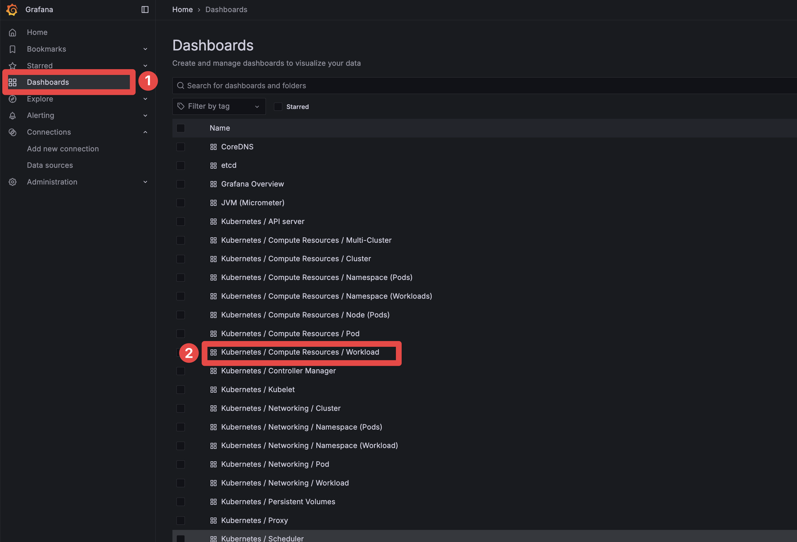
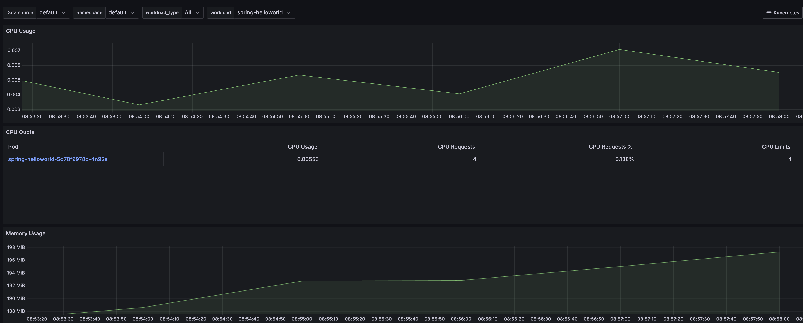
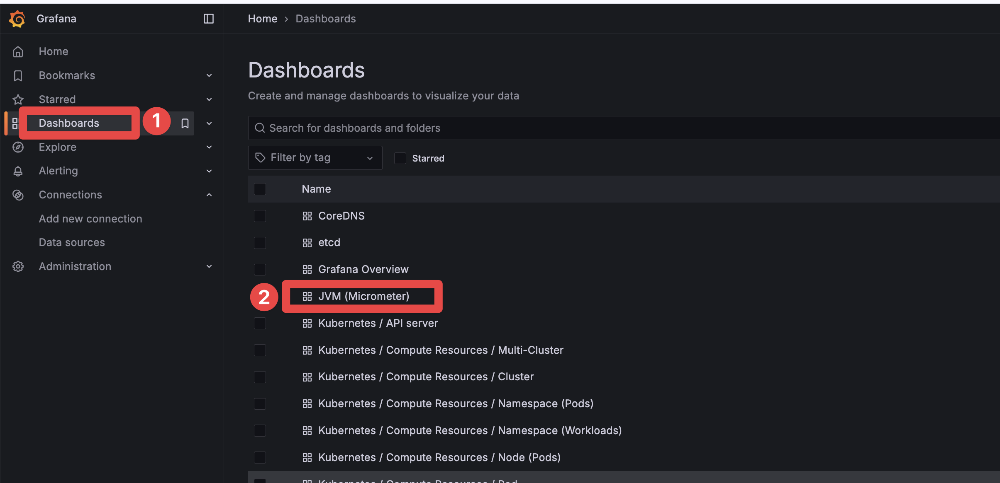
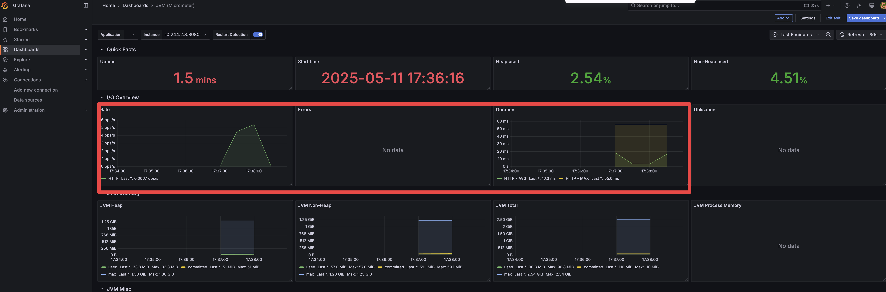

## 개요

* 모니터링 방법론 중 RED method와 use method를 실습합니다.

## USE method란?

* USE method는 아래 3가지 메트릭의 첫글자를 종합한 단어입니다. **CPU, Memory, 네트워크 등과 같은 시스템 자원의 상태**를 모니터링 합니다.
  * Utilization(이용률 또는 사용률): 자원을 얼마나 사용했는지 백분율로 표시
  * Saturation(포화도): 자원이 할일의 양이 얼마나 쌓여있는지
  * Errors(에러): 자원과 관련된 문제: 디스크 읽기 오류, 네트워크 전송 오류 등

## RED method란?

* RED method는 아래 3가지 메트릭의 첫글자를 종합한 단어입니다. **시스템 입장보다는 서비스 입장에서 모니터링합니다.**
  * Rate: 단위당 요청수, 예: TPS(초당요청수)
  * Errors: 요청 실패
  * Duration: 요청이 걸린 시간

## 환경 구축

* 쿠버네티스: kind 클러스터
* 모니터링: proemtheus operator, grafana, JVM metrics, kubernetes metrics
* 접속주소
  * firebase-admin SDK 9.2.0: http://localhost:30080/send
  * firebase-admin SDK 9.4.3: http://localhost:30090/send
  * grafana: http://localhost:30085 (admin/password1234)

> 실습을 하기 위해 firebase 프로젝트가 생성되어 있어야 합니다.

1. kind 클러스터 생성

```sh
cd kind_cluster
make up
```

2. helm chart 릴리즈

* metric-server, proemtheus-operator helm chart를 릴리즈합니다.

```sh
helmfile apply
```

3. 그라파나 접속

* 접속 주소

```sh
http://localhost:30085
```

* 아이디/비밀번호: admin/password1234

## 테스트 방법

1. springboot 애플리케이션 pod 배포

* springboot는 JVM 메트릭을 수집할 수 있는 메트릭 엔드포인트로가 있고, 프로메테우스가 해당 엔드포인트로 JVM 메트릭을 수집합니다.

```sh
kubectl apply -f ./manifests/springbot
```

2. k6로 부하 테스트 진행

```sh
k6 run ./stress_script/test.js
```

3. 그라파나에서 부하 테스트 모니터링

* USE method





* RED method





## 참고자료

* https://grafana.com/blog/2018/08/02/the-red-method-how-to-instrument-your-services/
* https://youtu.be/zk77VS98Em8?si=3SYDJqIM4IzL29NY
