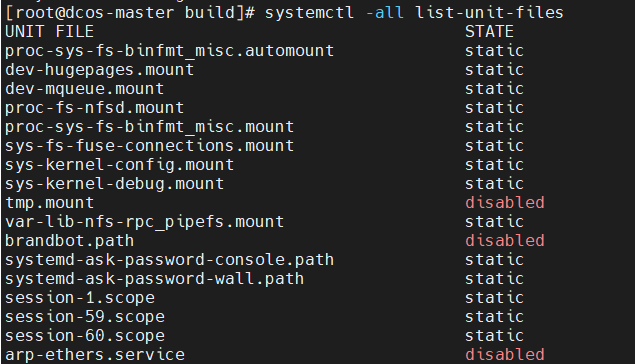

# 개요
* 리눅스 공부 정리

<br>

# systemctl
* systemctl에 등록된 데몬은 unit으로 관리된다.
* unit 목록 출력 명령어
```sh
systemctl -all list-unit-files
```



<br>

# 참고자료
* [1] [블로그-systemctl](https://stackframe.tistory.com/13)