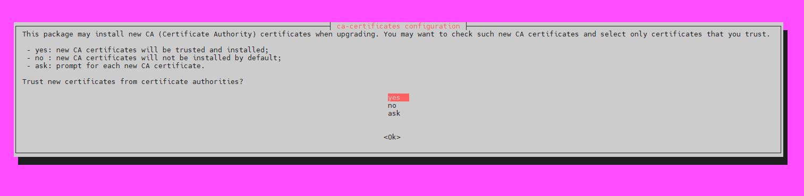

# 개요
* 리눅스에서 self-signed 인증서 생성 방법

<br>

# 인증서 생성
1. 디렉터리를 만들고 이동한다. 이 예제는 /tmp/example-ca이름으로 디렉터리를 생성한다.
```sh
mkdir /tmp/example-ca
cd  /tmp/example-ca
```
2. 인증서를 생성한다. Common Name은 인증할 도메인을 입력해야한다.
```sh
openssl req -x509 -sha256 -nodes -newkey rsa:2048 -days 365 -keyout localhost.key -out localhost.crt
```


# 인증서 신뢰 설정
> self-signed 인증서는 인증기관이 관리하지 않으므로 "untrsted" 인증서이다.
1. 운영체제를 확인한다. 이 문서는 ubuntu 18을 사용한다.
2. 생성한 인증서 디렉터리 운영체제가 관리하는 cert디렉터리로 옮긴다. ubuntu 18은 /usr/share/ca-certificates 디렉터리에서 관리한다.
```sh
mv /tmp/example-ca /usr/share/ca-certificates
```
3. 옮긴 인증서를 등록한다. reconfigure명령어는 /etc/ca-certificates.conf파일에 생성한 인증서를 추가한다.
```sh
dpkg-reconfigure ca-certificates
tail /etc/ca-certificates.conf
```


<br>

# 참고자료
* https://imagineer.in/blog/https-on-localhost-with-nginx/
* https://nillk.tistory.com/29
* https://gist.github.com/jessedearing/2351836