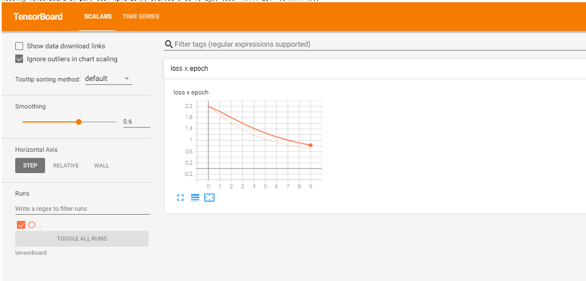
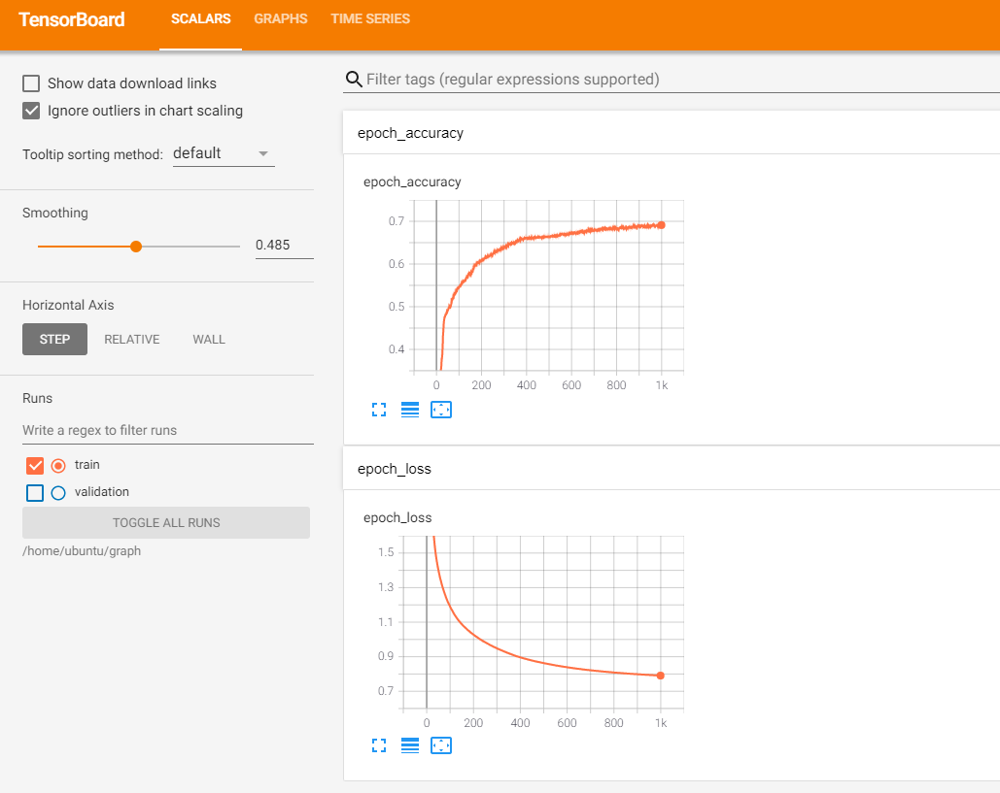

# 개요
* 텐서보드 실행 예제

# 파일목록
* kera_tensorboard.py: 케라스 텐서보드 사용 예제
* minst.py, minst.ipynb: torch 텐서보드 사용 예제
* keras 디렉터리: keras 텐서보드 파일
* torch 디렉터리: torch 텐서보드 파일

# 텐서보드 실행 방법
## torch
```sh
tensorboard  --logdir=torch
```



## keras
```sh
tensorboard  --logdir=keras
```

