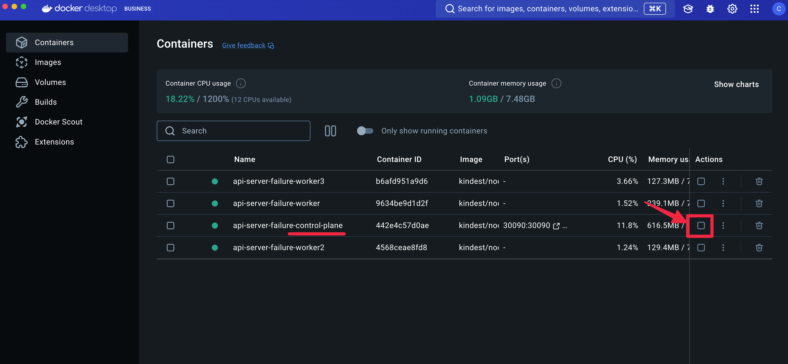

## 개요
* kubernetes control plane API server가 장애나면 어떻게 될까?
* kind cluster로 테스트했기 때문에 결과가 다소 부정확

## 실습환경

### kind kubernetes 생성

```sh
cd kind-cluster
make up
```

### httpbin 애플리케이션 배포

```sh
$ kubectl apply -f ./httpbin
$ kubectl get pod
NAME                       READY   STATUS    RESTARTS   AGE
httpbin-7cc7c58d4d-qkcw9   1/1     Running   0          104s
```

### httpbin 호출

```sh
$ curl http://127.0.0.1:30090
<!DOCTYPE html>
<html lang="en">

<head>
    <meta charset="UTF-8">
    <title>httpbin.org</title>
... 이하 생략
```

## 실습

### httpbin 배포

```sh
kubectl apply -f ./httpbin
```

```sh
$ kubectl get pod,svc
NAME                          READY   STATUS    RESTARTS   AGE
pod/httpbin-84c549fcc-7jmz4   1/1     Running   0          7m26s
pod/httpbin-84c549fcc-lrgt9   1/1     Running   0          7m26s
pod/httpbin-84c549fcc-t5ls7   1/1     Running   0          7m26s

NAME                 TYPE        CLUSTER-IP      EXTERNAL-IP   PORT(S)        AGE
service/httpbin      NodePort    10.96.237.254   <none>        80:30090/TCP   7m26s
service/kubernetes   ClusterIP   10.96.0.1       <none>        443/TCP        8m3s
```

### control plane container 중지

* docker desktop에서 control plane node container를 정지



### kubelet 로그 확인

1. kubelet 로그 조회

> [kubelet 로그 파일 바로가기](./worekr-node.log.txt)

```sh
$ docker exec -it {worker node container id} /bin/bash
$ journalctl -u kubelet
```

2. (16:08:56) control plane node와 worekr node 연결 실패

```sh
E1228 16:08:56.965332     228 kubelet_node_status.go:544] "Error updating node status, will retry" err="error getting node \"api-server-failure-worker2\": Get \"https://api-server-failure-control-plane:6443/api/v1/nodes/api-server-failure-worker2?resourceVersion=0&timeout=10s\": dial tcp 172.18.0.4:6443: connect: connection refused"
```

3. (16:08:57) Node Lease Failure

```sh
E1228 16:08:57.706615     228 controller.go:195] "Failed to update lease" err="Put \"https://api-server-failure-control-plane:6443/apis/coordination.k8s.io/v1/namespaces/kube-node-lease/leases/api-server-failure-worker2?timeout=10s\": dial tcp 172.18.0.4:6443: connect: connection refused"
```

4. (16:08:58) DNS resolution failure

```sh
E1228 16:09:07.309294     228 reflector.go:150] k8s.io/client-go/informers/factory.go:160: Failed to watch *v1.RuntimeClass: Get "https://api-server-failure-control-plane:6443/apis/node.k8s.io/v1/runtimeclasses?allowWatchBookmarks=true&resourceVersion=1006&timeout=5m10s&timeoutSeconds=310&watch=true": dial tcp: lookup api-server-failure-control-plane on 192.168.65.254:53: no such host
```

5. (16:09:08) Pod Watch Issues

```sh
E1228 16:09:07.451597     228 reflector.go:150] pkg/kubelet/config/apiserver.go:66: Failed to watch *v1.Pod: Get "https://api-server-failure-control-plane:6443/api/v1/pods?allowWatchBookmarks=true&fieldSelector=spec.nodeName%3Dapi-server-failure-worker2&resourceVersion=1006&timeoutSeconds=442&watch=true": dial tcp: lookup api-server-failure-control-plane on 192.168.65.254:53: no such host
```

### httpbin 호출 확인

* worker node에서 httpbin container 실행 확인

```sh
$ docker exec -it api-server-failure-worker /bin/bash
(pod)$ crictl ps
CONTAINER           IMAGE               CREATED             STATE               NAME                ATTEMPT             POD ID              POD
84d524f676555       47cdafade8b6d       26 minutes ago      Running             httpbin             0                   ee1d42170c670       httpbin-84c549fcc-7jmz4
```

* worker node에서 httpbin nodePort 호출

```sh
curl 127.0.0.1:30090
<!DOCTYPE html>
<html lang="en">

<head>
    <meta charset="UTF-8">
    <title>httpbin.org</title>
... 이하 생략
```

## 정리

* control plane이 비정상정이면, worker node kubelet에서 오류로그가 발견됨

1. First sees connection refused errors (control plane unreachable)
2. Then DNS resolution failures (cannot resolve control plane hostname)
3. Continues to retry with exponential backoff

* control plane이 비정상 적이어서 새로운 쿠버네티스 작업은 불가능 하지만, 기존 컨테이너, 네트워크 등 설정은 유효함
