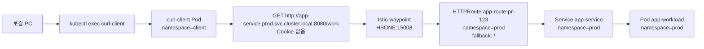
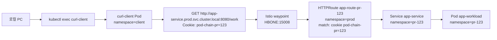

# 목적

## TL;DR

하나의 테스트 환경을 여러 팀이 같이 쓰면 PR별 변경이 쉽게 섞입니다. 이 실습의 목적은 테스트 환경을 여러 개 만드는 것이 아니라, 한 cluster 안에서 PR마다 임시 workload와 Service를 만들고 필요한 경우 Gateway API route를 붙여 충돌을 줄이는 것입니다.

운영 코드가 호출하는 주소는 `app-service.prod.svc.cluster.local` 같은 Service FQDN입니다. 실습도 같은 전제를 따릅니다. client는 항상 prod Service FQDN을 호출하고, Istio Ambient waypoint가 Gateway API `HTTPRoute`를 보고 prod fallback으로 보낼지 PR Service로 보낼지 결정합니다.

Argo CD ApplicationSet Pull Request Generator는 열린 PR을 읽고 PR 번호별 Application을 만듭니다. Application은 GitHub repository의 `main` branch에 있는 Helm chart를 sync합니다. chart는 기본적으로 `Deployment`와 `Service`를 배포하고, `httpRoute.enabled=true`일 때만 mesh `HTTPRoute`와 필요한 `ReferenceGrant`를 배포합니다.

## 실습 시나리오

| 시나리오 | 설명 | 확인 포인트 |
|---|---|---|
| 시나리오 1 | 쿠키 없이 prod Service FQDN 호출 | 요청은 waypoint를 지나고, `HTTPRoute` fallback rule로 prod Service가 응답 |
| 시나리오 2 | 같은 prod Service FQDN에 PR 쿠키를 붙여 호출 | 요청은 waypoint를 지나고, `HTTPRoute` header match rule로 PR Service가 응답 |

두 시나리오 모두 외부 ingress Gateway가 아니라 Istio Ambient waypoint를 통과하는 service-to-service route입니다. 그래서 waypoint `Gateway`에는 `HBONE` listener가 필요하고, namespace 또는 Service에는 `istio.io/use-waypoint` 라벨이 필요합니다.

`HTTPRoute`의 `parentRef`는 waypoint Pod 이름이 아닙니다. 이 실습에서 `parentRef`는 route를 붙일 대상인 `prod/app-service` Service입니다. 실제 L7 처리는 `prod/app-service`의 `istio.io/use-waypoint` label을 따라 Istio waypoint Pod가 수행합니다. route 리소스는 parent Service가 있는 `prod` namespace에 두고, PR backend는 `pr-<번호>` namespace를 가리킵니다.

## 호출 관계

시나리오 1은 쿠키 없이 prod Service FQDN을 호출합니다. 요청은 waypoint를 지나고, `HTTPRoute` fallback rule이 prod Service로 보냅니다.

시나리오 2는 같은 prod Service FQDN에 PR 쿠키를 붙여 호출합니다. 요청은 waypoint를 지나고, `HTTPRoute` header match rule이 PR Service로 보냅니다.

## 구조

| 항목 | 역할 |
|---|---|
| kind | 로컬 Kubernetes cluster |
| Argo CD | ApplicationSet과 Application sync |
| GitHub App | PR 목록과 manifest repository 읽기 |
| Istio Ambient | waypoint와 Gateway API mesh route 처리 |
| waypoint | HBONE listener로 service-to-service L7 route 처리 |
| app chart | prod 기준 Service와 PR별 `Deployment`, `Service`, optional mesh `HTTPRoute` |

## 장단점

| 방식 | 장점 | 단점 |
|---|---|---|
| PR별 workload | 공유 테스트 환경을 유지하면서 PR 단위 확인 가능 | DB, queue 같은 외부 의존성은 별도 격리 필요 |
| Service FQDN 기반 확인 | 운영 코드와 같은 호출 주소로 테스트 가능 | waypoint와 namespace label이 빠지면 route가 적용되지 않음 |
| optional HTTPRoute | 일반 배포와 헤더 기반 라우팅을 같은 chart로 처리 | parent Service route가 기본 라우팅을 대체하므로 prod fallback rule을 함께 관리해야 함 |
| GitHub App | PAT 교체 부담 감소, repository 단위 권한 설정 가능 | App ID, Installation ID, private key 관리 필요 |
