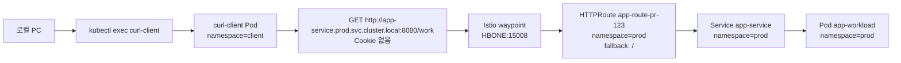
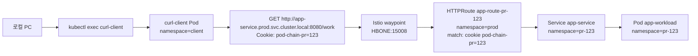
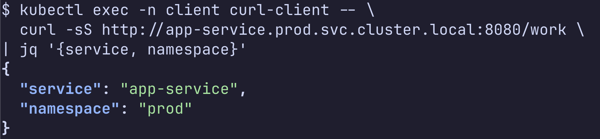
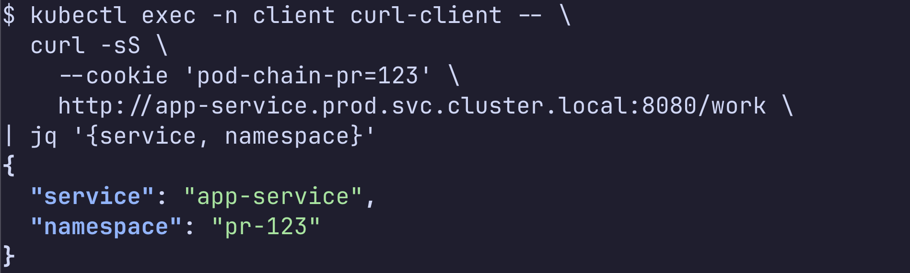

# Helm chart mesh route 테스트

## TL;DR

이 문서는 Pull Request Generator 없이 같은 app Helm chart로 prod app과 PR app을 배포합니다. prod app은 `httpRoute.enabled=false` 기본값으로 설치하고, PR app만 `httpRoute.enabled=true`로 route를 만듭니다. test client는 운영 환경처럼 `app-service.prod.svc.cluster.local`을 호출합니다. 쿠키가 없으면 waypoint의 fallback rule로 prod Service가 응답하고, 쿠키가 있으면 waypoint의 header match rule로 PR Service가 응답합니다. 샘플 애플리케이션은 로그 목적 외에는 header를 읽거나 downstream 요청에 header를 복사하지 않습니다.

## namespace 준비

prod namespace를 만들고 Istio Ambient와 shared waypoint 라벨을 붙입니다.

```bash
kubectl create namespace prod --dry-run=client -o yaml | kubectl apply -f -
kubectl label namespace prod \
  istio.io/dataplane-mode=ambient \
  istio.io/use-waypoint=waypoint \
  istio.io/use-waypoint-namespace=istio-waypoint \
  --overwrite
```

PR namespace를 만들고 같은 라벨을 붙입니다.

```bash
kubectl create namespace pr-123 --dry-run=client -o yaml | kubectl apply -f -
kubectl label namespace pr-123 \
  istio.io/dataplane-mode=ambient \
  istio.io/use-waypoint=waypoint \
  istio.io/use-waypoint-namespace=istio-waypoint \
  --overwrite
```

test client namespace를 만들고 같은 라벨을 붙입니다.

```bash
kubectl create namespace client --dry-run=client -o yaml | kubectl apply -f -
kubectl label namespace client \
  istio.io/dataplane-mode=ambient \
  istio.io/use-waypoint=waypoint \
  istio.io/use-waypoint-namespace=istio-waypoint \
  --overwrite
```

## prod app 배포

운영 기준 Service FQDN이 될 prod app을 배포합니다. `httpRoute.enabled` 기본값이 `false`라서 route는 만들지 않습니다.

```bash
helm upgrade --install prod manifests/app \
  --namespace prod \
  --set workload.image=choisunguk/pull-request-generator:v1
```

prod Service가 waypoint를 쓰도록 라벨이 붙었는지 확인합니다.

```bash
kubectl get service app-service -n prod --show-labels
```

## PR app 배포

PR app을 배포하고, `cookie: pod-chain-pr=123` 요청만 PR Service로 라우팅하는 `HTTPRoute`를 같이 만듭니다. route 리소스는 parent Service가 있는 `prod` namespace에 만들고, backend만 `pr-123/app-service`를 가리키게 합니다. header가 없는 요청은 같은 route의 fallback rule이 다시 `prod/app-service`로 보냅니다.

```bash
helm upgrade --install app-123 manifests/app \
  --namespace pr-123 \
  --set pullRequest.number=123 \
  --set workload.name=app-workload \
  --set workload.image=choisunguk/pull-request-generator:v1 \
  --set service.name=app-service \
  --set httpRoute.enabled=true \
  --set httpRoute.name=app-route-pr-123 \
  --set httpRoute.namespace=prod \
  --set httpRoute.backend.namespace=pr-123 \
  --set httpRoute.header.enabled=true \
  --set httpRoute.header.name=cookie \
  --set 'httpRoute.header.value=(^|.*; )pod-chain-pr=123(;.*|$)'
```

mesh route가 prod Service parent에 붙었는지 확인합니다.

```bash
kubectl get httproute app-route-pr-123 -n prod
kubectl describe httproute app-route-pr-123 -n prod
kubectl get referencegrant -n pr-123
```

## test client 준비

헤더 라우팅 검증은 애플리케이션 코드가 아니라 `curl-client` Pod로 수행합니다. 여기서 client는 로컬 PC가 아니라 cluster 내부 `client` namespace에 만든 Pod입니다. 로컬 PC는 `kubectl exec` 명령만 실행하고, 실제 HTTP 요청은 `curl-client` Pod가 prod Service FQDN으로 보냅니다.

`curl-client`는 Deployment로 배포하지 않고 단일 Pod로만 만듭니다. `kubectl exec`이 받은 JSON 응답은 로컬 PC stdout으로 나오므로, 파이프 뒤의 `jq`는 로컬 PC에서 실행됩니다.

curl client Pod를 생성하고 준비될 때까지 기다립니다.

```bash
kubectl run curl-client \
  -n client \
  --restart=Never \
  --image=curlimages/curl:8.8.0 \
  -- sleep 3600
kubectl wait -n client --for=condition=Ready pod/curl-client --timeout=120s
```

## parentRef 의미

`HTTPRoute`의 `parentRef`는 waypoint Pod 이름이 아닙니다. 이 실습에서 `parentRef`는 route를 붙일 대상인 `prod/app-service` Service입니다.

```yaml
parentRefs:
  - group: ""
    kind: Service
    name: app-service
```

`istio-waypoint` namespace의 `waypoint-...` Pod는 실제 L7 처리를 하는 프록시입니다. route가 어디에 붙는지는 `parentRef`가 정하고, 그 Service 트래픽을 waypoint가 처리할지는 `prod/app-service`의 `istio.io/use-waypoint` label이 정합니다.

이 실습에서는 `HTTPRoute`를 `prod` namespace에 둡니다. `HTTPRoute` status가 `Accepted=True`여도 waypoint proxy config에 header route가 내려가지 않으면 실제 트래픽은 꺾이지 않습니다. Istio 1.30.2 기준으로 PR namespace에 둔 cross-namespace Service parent route는 status가 정상처럼 보여도 `istioctl proxy-config routes`에 route가 보이지 않는 사례가 있었습니다. 정확한 버전별 동작은 확인 필요입니다.

## 호출 관계

시나리오 1은 쿠키 없이 prod Service FQDN을 호출합니다. 요청은 waypoint를 지나고, `HTTPRoute` fallback rule이 prod Service로 보냅니다.



시나리오 2는 같은 prod Service FQDN에 PR 쿠키를 붙여 호출합니다. 요청은 waypoint를 지나고, `HTTPRoute` header match rule이 PR Service로 보냅니다.



## 시나리오 1 확인

쿠키 없이 prod Service FQDN을 호출합니다.

```bash
kubectl exec -n client curl-client -- \
  curl -sS http://app-service.prod.svc.cluster.local:8080/work \
| jq '{service, namespace}'
```

응답의 `namespace`가 `prod`이면 waypoint fallback rule이 prod Service로 보낸 것입니다.

```json
{
  "service": "app-service",
  "namespace": "prod"
}
```



## 시나리오 2 확인

PR 쿠키를 붙여 prod Service FQDN을 호출합니다.

```bash
kubectl exec -n client curl-client -- \
  curl -sS \
    --cookie 'pod-chain-pr=123' \
    http://app-service.prod.svc.cluster.local:8080/work \
| jq '{service, namespace}'
```

응답의 `namespace`가 `pr-123`이면 waypoint의 Gateway API header match rule이 prod Service 호출을 PR Service로 라우팅한 것입니다.

```json
{
  "service": "app-service",
  "namespace": "pr-123"
}
```



## waypoint 디버깅

waypoint Gateway가 `HBONE` listener를 갖는지 확인합니다.

```bash
kubectl get gateway waypoint -n istio-waypoint -o yaml
```

Istio가 인식한 waypoint 목록을 확인합니다.

```bash
istioctl waypoint list -A
```

`HTTPRoute` status에서 parent가 accepted 되었는지 확인합니다.

```bash
kubectl get httproute app-route-pr-123 -n prod -o yaml
```

실제로 waypoint proxy에 header route와 prod fallback route가 내려갔는지 확인합니다. `prod.app-route-pr-123.0`은 cookie match로 `app-service.pr-123.svc.cluster.local`을 가리켜야 하고, `prod.app-route-pr-123.1`은 fallback으로 `app-service.prod.svc.cluster.local`을 가리켜야 합니다.

```bash
WAYPOINT_POD=$(kubectl get pod -n istio-waypoint \
  -l gateway.networking.k8s.io/gateway-name=waypoint \
  -o jsonpath='{.items[0].metadata.name}')

istioctl proxy-config routes "${WAYPOINT_POD}" \
  -n istio-waypoint \
  --name 'inbound-vip|8080|http|app-service.prod.svc.cluster.local' \
  -o json
```

prod app과 PR app 로그에서 어떤 namespace가 요청을 처리했는지 확인합니다.

```bash
kubectl logs -n prod deployment/app-workload
kubectl logs -n pr-123 deployment/app-workload
```

증상별로 보면 다음처럼 판단합니다.

| 증상 | 확인할 곳 | 고칠 것 |
| --- | --- | --- |
| cookie 요청도 `prod` 응답 | `istioctl proxy-config routes`에 header route가 있는지 | `HTTPRoute`를 `prod` namespace에 만들고 `backendRefs.namespace=pr-123` 지정 |
| cookie header가 app 로그에 보이는데 `prod` 응답 | proxy-config route match 누락 | route namespace와 header match 값 확인 |
| header 없는 요청이 `404` | fallback route 존재 여부 | `HTTPRoute`에 prod fallback rule 추가 |
| Service status가 `WaypointBound=False` | `kubectl get service app-service -n prod -o yaml` | waypoint `allowedRoutes.namespaces.from: All` 확인 |

시각화가 필요하면 Kiali 설치 후 graph에서 `curl-client -> waypoint -> prod/app-service 또는 pr-123/app-service` 흐름을 확인합니다. Kiali addon 설치 여부와 ambient graph 표현은 설치 버전에 따라 확인 필요입니다.

```bash
istioctl dashboard kiali
```

## 정리

실습 리소스를 삭제합니다.

```bash
kubectl delete pod -n client curl-client --ignore-not-found
helm uninstall app-123 -n pr-123
helm uninstall prod -n prod
kubectl delete namespace client pr-123 prod
```
