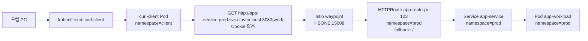
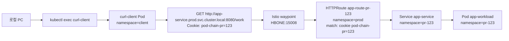

# Pull Request Generator 헤더 기반 mesh route 테스트

## TL;DR

이 문서는 ApplicationSet Pull Request Generator가 PR별 app을 만들고, waypoint의 Gateway API `HTTPRoute`가 prod Service FQDN 호출을 prod fallback 또는 PR Service로 라우팅하는지 확인합니다. prod app과 PR app은 같은 `manifests/app` chart를 사용합니다. prod app은 `httpRoute.enabled=false` 기본값으로 설치하고, PR app만 route를 켭니다. 쿠키가 없으면 waypoint의 fallback rule로 prod Service가 응답하고, 쿠키가 있으면 waypoint의 header match rule로 PR Service가 응답합니다. 샘플 애플리케이션은 로그 목적 외에는 header를 읽거나 downstream 요청에 header를 복사하지 않습니다.

## 사전 조건

[2-setup.md](./2-setup.md)의 kind, Argo CD, Istio Ambient, shared waypoint 설치가 끝나 있어야 합니다. sample image는 Docker Hub에서 pull하므로 `kind load docker-image`는 사용하지 않습니다.

사용할 image 주소입니다.

```text
choisunguk/pull-request-generator:v1
```

## prod app 준비

prod namespace를 만들고 waypoint 라벨을 붙입니다.

```bash
kubectl create namespace prod --dry-run=client -o yaml | kubectl apply -f -
kubectl label namespace prod \
  istio.io/dataplane-mode=ambient \
  istio.io/use-waypoint=waypoint \
  istio.io/use-waypoint-namespace=istio-waypoint \
  --overwrite
```

prod Service를 배포합니다. `httpRoute.enabled` 기본값이 `false`라서 route는 만들지 않습니다.

```bash
helm upgrade --install prod manifests/app \
  --namespace prod \
  --set workload.image=choisunguk/pull-request-generator:v1
```

## ApplicationSet 설정

ApplicationSet 예제를 복사합니다.

```bash
cp manifests/applicationset/pull-request-generator.example.yaml \
  manifests/applicationset/pull-request-generator.yaml
```

필수 placeholder를 채웁니다.

```yaml
owner: "<GITHUB_OWNER>"
repo: "<GITHUB_REPO>"
labels:
  - "<PULL_REQUEST_LABEL>"
repoURL: "https://github.com/<MANIFEST_OWNER>/<MANIFEST_REPO>.git"
```

PR이 close되어 Pull Request Generator 결과에서 빠지면 생성된 `Application`과 임시 리소스가 삭제되도록 설정합니다.

```yaml
syncPolicy:
  preserveResourcesOnDeletion: false
template:
  metadata:
    finalizers:
      - resources-finalizer.argocd.argoproj.io
```

Helm parameter는 다음 값으로 시작합니다.

```yaml
- name: workload.name
  value: "app-workload"
- name: workload.image
  value: "choisunguk/pull-request-generator:v1"
- name: service.name
  value: "app-service"
```

optional mesh `HTTPRoute` 주석을 해제하고 prod Service parent에 붙입니다. route 리소스는 parent Service가 있는 `prod` namespace에 만들고, PR backend는 Helm release namespace인 `pr-{{.number}}`를 사용합니다. 여러 PR이 동시에 열릴 수 있으므로 route 이름에는 PR 번호를 넣습니다.

```yaml
- name: httpRoute.enabled
  value: "true"
- name: httpRoute.name
  value: "app-route-pr-{{.number}}"
- name: httpRoute.namespace
  value: "prod"
- name: httpRoute.parentRef.kind
  value: "Service"
- name: httpRoute.parentRef.name
  value: "app-service"
- name: httpRoute.parentRef.namespace
  value: "prod"
- name: httpRoute.header.enabled
  value: "true"
- name: httpRoute.header.name
  value: "cookie"
- name: httpRoute.header.value
  value: "(^|.*; )pod-chain-pr={{.number}}(;.*|$)"
```

PR namespace는 ApplicationSet의 `managedNamespaceMetadata`로 Ambient와 waypoint 라벨을 받습니다. PR close 시 namespace까지 삭제하려면 namespace tracking annotation도 같이 둡니다.

```yaml
managedNamespaceMetadata:
  annotations:
    argocd.argoproj.io/tracking-id: "pod-chain-pr-{{.number}}:/Namespace:/pr-{{.number}}"
  labels:
    istio.io/dataplane-mode: ambient
    istio.io/use-waypoint: waypoint
    istio.io/use-waypoint-namespace: istio-waypoint
```

주의: 위 값을 쓰려면 PR에 `<PULL_REQUEST_LABEL>` label이 붙어 있어야 합니다.

route 리소스는 `prod` namespace에 만들어집니다. Argo CD `default` project처럼 대상 namespace를 넓게 허용하면 그대로 동작합니다. 별도 AppProject로 namespace를 제한했다면 PR Application이 `prod` namespace의 `HTTPRoute`를 관리할 수 있는지 확인 필요입니다.

## ApplicationSet 적용

ApplicationSet을 적용합니다.

```bash
kubectl apply -f manifests/applicationset/pull-request-generator.yaml
kubectl get applicationset -n argocd
kubectl get application -n argocd
```

PR `123`을 기준으로 리소스를 확인합니다.

```bash
kubectl get namespace pr-123 --show-labels
kubectl get deployment -n pr-123
kubectl get service -n pr-123 --show-labels
kubectl get httproute app-route-pr-123 -n prod
kubectl describe httproute app-route-pr-123 -n prod
kubectl get referencegrant -n pr-123
```

## test client 준비

test client namespace를 만들고 waypoint 라벨을 붙입니다.

```bash
kubectl create namespace client --dry-run=client -o yaml | kubectl apply -f -
kubectl label namespace client \
  istio.io/dataplane-mode=ambient \
  istio.io/use-waypoint=waypoint \
  istio.io/use-waypoint-namespace=istio-waypoint \
  --overwrite
```

헤더 라우팅 검증은 애플리케이션 코드가 아니라 `curl-client` Pod로 수행합니다. 여기서 client는 로컬 PC가 아니라 cluster 내부 `client` namespace에 만든 Pod입니다. 로컬 PC는 `kubectl exec` 명령만 실행하고, 실제 HTTP 요청은 `curl-client` Pod가 prod Service FQDN으로 보냅니다.

`curl-client`는 Deployment로 배포하지 않고 단일 Pod로만 만듭니다. `kubectl exec`이 받은 JSON 응답은 로컬 PC stdout으로 나오므로, 파이프 뒤의 `jq`는 로컬 PC에서 실행됩니다.

curl client Pod를 생성하고 준비될 때까지 기다립니다.

```bash
kubectl run curl-client \
  -n client \
  --restart=Never \
  --image=curlimages/curl:8.8.0 \
  -- sleep 3600
kubectl wait -n client --for=condition=Ready pod/curl-client --timeout=120s
```

## parentRef 의미

`HTTPRoute`의 `parentRef`는 waypoint Pod 이름이 아닙니다. 이 실습에서 `parentRef`는 route를 붙일 대상인 `prod/app-service` Service입니다.

```yaml
parentRefs:
  - group: ""
    kind: Service
    name: app-service
```

`istio-waypoint` namespace의 `waypoint-...` Pod는 실제 L7 처리를 하는 프록시입니다. route가 어디에 붙는지는 `parentRef`가 정하고, 그 Service 트래픽을 waypoint가 처리할지는 `prod/app-service`의 `istio.io/use-waypoint` label이 정합니다.

이 실습에서는 `HTTPRoute`를 `prod` namespace에 둡니다. `HTTPRoute` status가 `Accepted=True`여도 waypoint proxy config에 header route가 내려가지 않으면 실제 트래픽은 꺾이지 않습니다. Istio 1.30.2 기준으로 PR namespace에 둔 cross-namespace Service parent route는 status가 정상처럼 보여도 `istioctl proxy-config routes`에 route가 보이지 않는 사례가 있었습니다. 정확한 버전별 동작은 확인 필요입니다.

## 호출 관계

시나리오 1은 쿠키 없이 prod Service FQDN을 호출합니다. 요청은 waypoint를 지나고, `HTTPRoute` fallback rule이 prod Service로 보냅니다.



시나리오 2는 같은 prod Service FQDN에 PR 쿠키를 붙여 호출합니다. 요청은 waypoint를 지나고, `HTTPRoute` header match rule이 PR Service로 보냅니다.



## 헤더 기반 호출 확인

쿠키 없이 prod Service FQDN을 호출합니다.

```bash
kubectl exec -n client curl-client -- \
  curl -sS http://app-service.prod.svc.cluster.local:8080/work \
| jq '{service, namespace}'
```

응답의 `namespace`가 `prod`이면 waypoint fallback rule이 prod Service로 보낸 것입니다.

PR 쿠키를 붙여 prod Service FQDN을 호출합니다.

```bash
kubectl exec -n client curl-client -- \
  curl -sS \
    --cookie 'pod-chain-pr=123' \
    http://app-service.prod.svc.cluster.local:8080/work \
| jq '{service, namespace}'
```

응답의 `namespace`가 `pr-123`이면 waypoint가 `HTTPRoute` header match rule을 적용한 것입니다.

```json
{
  "service": "app-service",
  "namespace": "pr-123"
}
```

## waypoint 디버깅

waypoint가 `HBONE` listener로 준비되었는지 확인합니다.

```bash
kubectl get gateway waypoint -n istio-waypoint -o yaml
```

Istio가 waypoint를 인식했는지 확인합니다.

```bash
istioctl waypoint list -A
```

`HTTPRoute` status에서 parent가 accepted 되었는지 확인합니다.

```bash
kubectl get httproute app-route-pr-123 -n prod -o yaml
```

실제로 waypoint proxy에 header route와 prod fallback route가 내려갔는지 확인합니다. `prod.app-route-pr-123.0`은 cookie match로 `app-service.pr-123.svc.cluster.local`을 가리켜야 하고, `prod.app-route-pr-123.1`은 fallback으로 `app-service.prod.svc.cluster.local`을 가리켜야 합니다.

```bash
WAYPOINT_POD=$(kubectl get pod -n istio-waypoint \
  -l gateway.networking.k8s.io/gateway-name=waypoint \
  -o jsonpath='{.items[0].metadata.name}')

istioctl proxy-config routes "${WAYPOINT_POD}" \
  -n istio-waypoint \
  --name 'inbound-vip|8080|http|app-service.prod.svc.cluster.local' \
  -o json
```

PR app 로그에서 요청 header와 Service FQDN을 확인합니다.

```bash
kubectl logs -n pr-123 deployment/app-workload
```

prod app 로그에서 쿠키 없는 요청이 prod에 남았는지 확인합니다.

```bash
kubectl logs -n prod deployment/app-workload
```

증상별로 보면 다음처럼 판단합니다.

| 증상 | 확인할 곳 | 고칠 것 |
| --- | --- | --- |
| cookie 요청도 `prod` 응답 | `istioctl proxy-config routes`에 header route가 있는지 | `HTTPRoute`를 `prod` namespace에 만들고 `backendRefs.namespace=pr-123` 지정 |
| cookie header가 app 로그에 보이는데 `prod` 응답 | proxy-config route match 누락 | route namespace와 header match 값 확인 |
| header 없는 요청이 `404` | fallback route 존재 여부 | `HTTPRoute`에 prod fallback rule 추가 |
| Service status가 `WaypointBound=False` | `kubectl get service app-service -n prod -o yaml` | waypoint `allowedRoutes.namespaces.from: All` 확인 |
| `no matches for kind "ApplicationSet"` | `kubectl get crd applicationsets.argoproj.io` | [2-setup.md](./2-setup.md)의 Argo CD 설치 단계를 server-side apply로 다시 실행 |

시각화가 필요하면 Kiali 설치 후 graph에서 `curl-client -> waypoint -> prod/app-service 또는 pr-123/app-service` 흐름을 확인합니다. Kiali addon 설치 여부와 ambient graph 표현은 설치 버전에 따라 확인 필요입니다.

```bash
istioctl dashboard kiali
```
