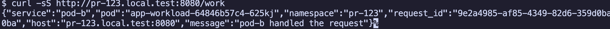

# Helm chart Gateway 호출 테스트

이 문서는 Pull Request Generator 없이 Helm chart만 배포하고 Istio Gateway로 호출되는지 확인합니다.

## image 준비

로컬 kind cluster에 샘플 image를 로드합니다.

```bash
docker build -t pull-request-generator/pod-b:local apps/pod-b
kind load docker-image pull-request-generator/pod-b:local --name argocd-pr-generator
```

## Helm chart 배포

`HTTPRoute`를 켜고 `pr-123.local.test` hostname으로 배포합니다.

```bash
helm upgrade --install app manifests/app \
  --namespace pr-123 \
  --create-namespace \
  --set pullRequest.number=123 \
  --set workload.name=app-workload \
  --set workload.image=pull-request-generator/pod-b:local \
  --set service.name=app-service \
  --set httpRoute.enabled=true \
  --set httpRoute.name=app-route \
  --set httpRoute.hostname=pr-123.local.test
```

배포 상태를 확인합니다.

```bash
kubectl get deployment -n pr-123
kubectl get service -n pr-123
kubectl get httproute -n pr-123
kubectl describe httproute app-route -n pr-123
```

## Gateway 호출

Gateway Service가 port-forward 중이어야 합니다. 실행하지 않았다면 다음 명령을 실행합니다.

```bash
GATEWAY_SERVICE=$(kubectl get service -n istio-ingress -o jsonpath='{.items[0].metadata.name}')
kubectl port-forward -n istio-ingress service/${GATEWAY_SERVICE} 8080:80
```

다른 터미널에서 호출합니다.

```bash
curl -sS http://pr-123.local.test:8080/work
```

응답의 `namespace`가 `pr-123`이면 Gateway route가 app Service로 연결된 것입니다.



```json
{
  "service": "pod-b",
  "namespace": "pr-123"
}
```

로그를 확인합니다.

```bash
kubectl logs -n pr-123 deployment/app-workload
```

## 정리

```bash
helm uninstall app -n pr-123
kubectl delete namespace pr-123
```
