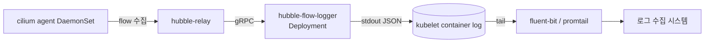

# Hubble flow를 stdout으로 수집하는 workload

- cilium networkpolicy로 egress를 제한하면, 과거 차단이력이 필요합니다. exporter를 사용하여 로그와 메트릭을 수집할 수 있습니다.
- 다만, exporter를 설치할 수 없는 환경이라면  `hubble observe --follow` 등 hubble-relay가 수집한 flow가 container stdout으로 계속 나오게 할 수 있습니다.

## 구조

아래구조에서 fluent-bit은 컨테이너 로그 수집시스템입니다.

- cilium agent가 수집한 flow를 hubble-relay가 클러스터 범위로 집계합니다.
- hubble-flow-logger pod 안의 `hubble observe`가 relay에 gRPC로 붙어 follow 모드로 flow를 계속 받습니다.
- `--output jsonpb`를 주면 한 줄에 한 flow의 JSON이 찍혀 로그 수집기가 라인 단위로 파싱하기 좋습니다.



## 전제

- hubble과 hubble-relay가 이미 설치되어 있어야 합니다. managed 환경에서는 helm 미사용 조건 때문에 공식 manifest 기반으로 별도로 올렸습니다(본 문서 범위 밖).
- `hubble-relay.kube-system.svc.cluster.local:80`으로 도달 가능해야 합니다. 기본 설치면 이 주소로 노출됩니다.

hubble-relay는 cilium CLI 또는 helm으로 활성화합니다.

cilium CLI를 사용하는 경우 아래 명령어로 hubble과 relay를 함께 활성화합니다.

```bash
cilium hubble enable --relay
cilium status --wait
```

helm으로 cilium을 관리하는 경우 values를 업데이트합니다.

```bash
helm upgrade cilium cilium/cilium \
  --namespace kube-system \
  --reuse-values \
  --set hubble.enabled=true \
  --set hubble.relay.enabled=true
```

hubble CLI로 relay 서버 연결을 확인합니다.

```bash
hubble observe \
  --server hubble-relay.kube-system.svc.cluster.local:80 \
  --follow
```

## 핸즈온

Deployment를 배포합니다.

```sh
kubectl apply -f manifests/hubble-flow-logger-deployment.yaml
kubectl -n kube-system rollout status deploy/hubble-flow-logger
```

stdout을 확인합니다. 한 줄에 한 flow가 JSON으로 찍힙니다.

```sh
kubectl -n kube-system logs -f deploy/hubble-flow-logger | head -5
```

특정 필터가 필요하면 `args`에 hubble CLI 플래그를 추가합니다.

- 예를 들어 audit flow만 보고 싶다면 `--verdict AUDIT`를 넣습니다. `--namespace`, `--to-fqdn` 같은 필터도 같은 방식으로 붙일 수 있습니다.

## 운영 시 유의사항

- **replica 1로만 둡니다.** `hubble observe --follow`는 꼬리가 살아있는 긴 stream이라 replica를 늘려도 의미가 없습니다. 오히려 같은 flow가 복제되어 로그 용량과 과금이 두 배가 됩니다.
- **flow가 매우 빠르게 쌓이면 로그 유실 가능성이 있습니다.** pod stdout은 kubelet의 파일 rotation으로 관리되고 로그 수집기가 따라가는 구조라 burst 트래픽에서 일부가 밀릴 수 있다고 판단했지만, 이번에 실측으로 유실을 확인한 것은 아닙니다. 개발 트래픽 규모에서는 문제가 되지 않았습니다. 대규모 트래픽 환경이라면 `--verdict DROPPED`, `--verdict AUDIT`처럼 필터를 좁혀 필요한 flow만 남기는 편이 안전하다고 봅니다.
- pod가 죽고 다시 뜨는 순간은 flow가 끊깁니다. 가능한 한 재시작이 적도록 resources를 넉넉히 주고, PDB는 두지 않았습니다(어차피 replica 1).

## 한계

- 이 workload는 hubble-relay와 로그 수집기의 "접착제" 역할만 합니다. 정책 모니터링 대시보드가 필요하다면 hubble UI나 Prometheus 메트릭이 더 적합합니다.
- managed 환경에서 hubble-relay 자체가 provider에 의해 꺼질 가능성은 별개 이슈이며, 이 문서의 범위가 아닙니다.

## 참고자료

- <https://docs.cilium.io/en/stable/observability/hubble/hubble-cli/>
- <https://docs.cilium.io/en/stable/observability/hubble/hubble-relay/>
