# Cilium 핸즈온

Cilium을 처음 사용하는 분들을 위한 핸즈온입니다.

## 목차

<!-- TOC -->

- [Cilium 핸즈온](#cilium-%ED%95%B8%EC%A6%88%EC%98%A8)
  - [목차](#%EB%AA%A9%EC%B0%A8)
  - [Cilium 설치](#cilium-%EC%84%A4%EC%B9%98)
  - [예제1: 공식문서 quickstart starwars demo 배포](#%EC%98%88%EC%A0%9C1-%EA%B3%B5%EC%8B%9D%EB%AC%B8%EC%84%9C-quickstart-starwars-demo-%EB%B0%B0%ED%8F%AC)
  - [예제2: IPAM IP Address Management](#%EC%98%88%EC%A0%9C2-ipam-ip-address-management)
  - [예제3: pod와 host network interface 설정](#%EC%98%88%EC%A0%9C3-pod%EC%99%80-host-network-interface-%EC%84%A4%EC%A0%95)
  - [예제4: eBPF 프로그램 조회](#%EC%98%88%EC%A0%9C4-ebpf-%ED%94%84%EB%A1%9C%EA%B7%B8%EB%9E%A8-%EC%A1%B0%ED%9A%8C)
  - [예제5: 같은 node의 pod -> pod 통신](#%EC%98%88%EC%A0%9C5-%EA%B0%99%EC%9D%80-node%EC%9D%98-pod---pod-%ED%86%B5%EC%8B%A0)
  - [예제6: 다른 node의 pod -> pod 통신](#%EC%98%88%EC%A0%9C6-%EB%8B%A4%EB%A5%B8-node%EC%9D%98-pod---pod-%ED%86%B5%EC%8B%A0)
  - [예제7: kubernetes service 통신 확인](#%EC%98%88%EC%A0%9C7-kubernetes-service-%ED%86%B5%EC%8B%A0-%ED%99%95%EC%9D%B8)
  - [예제8: observability](#%EC%98%88%EC%A0%9C8-observability)

<!-- /TOC -->

## Cilium 설치

- [설치문서 바로가기](../install/)

## 예제1: 공식문서 quickstart starwars demo 배포

cilium은 starwars 데모를 제공합니다. 이 데모를 사용하여 cilium을 테스트할 것입니다.

> 참고자료: https://docs.cilium.io/en/stable/gettingstarted/demo/

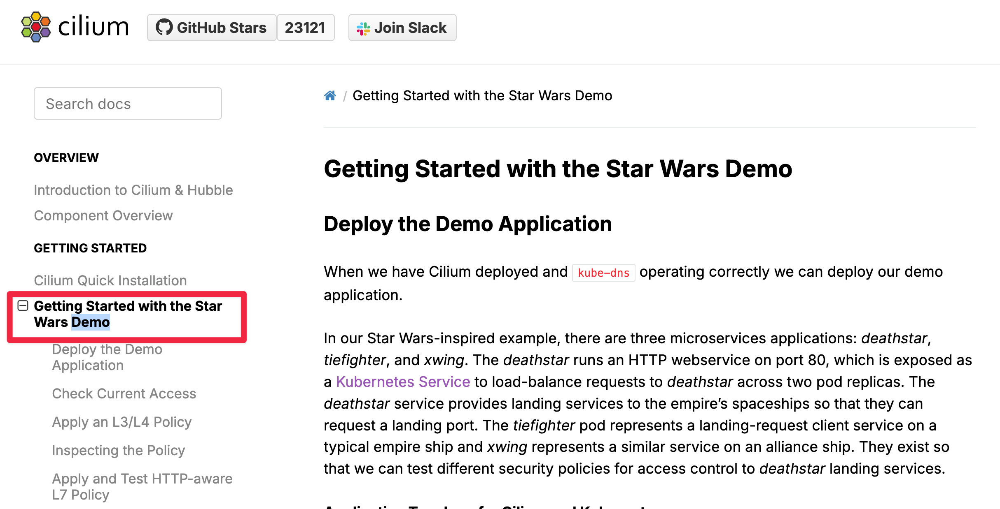

- 데모 앱 배포

```sh
kubectl apply -f https://raw.githubusercontent.com/cilium/cilium/1.18.5/examples/minikube/http-sw-app.yaml
```

- pod, service 확인

```sh
kubectl get pod,svc
```

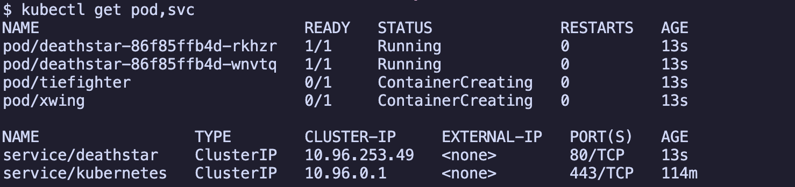

## 예제2: IPAM (IP Address Management)

> 참고자료: https://docs.cilium.io/en/stable/network/concepts/ipam/#address-management

cilium은 pod ip를 관리하는 IPAM 기능을 제공합니다. pod에 할당되는 ip는 cilium이 할당한 ip입니다.

```sh
$ kubectl get pod -owide
$ kubectl get ciliumendpoints
```

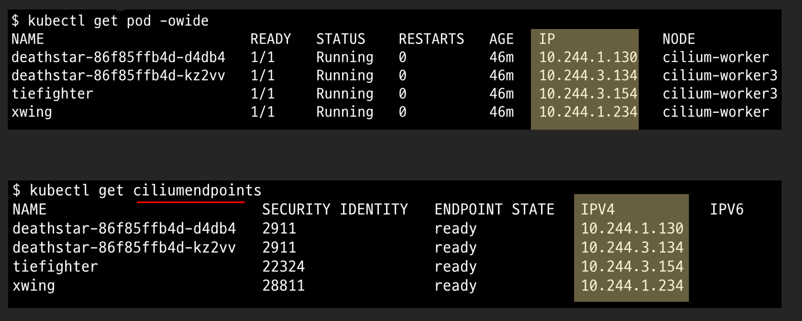

기본 cilium IPAM 모드는 cilium CLI로 조회할 수 있습니다.

```sh
cilium config view | grep ^ipam
```

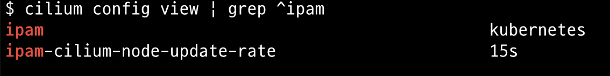

cilium CLI로 설치 시 kubernetes host scope를 사용합니다. kubernetes host scope 모드는 cilium이 node에 할당된 pod cidr을 참조하여 pod에 ip를 할당합니다.

```sh
kubectl get nodes -o jsonpath='{range .items[*]}{.metadata.name}{"\t"}{.spec.podCIDR}{"\n"}{end}'
```

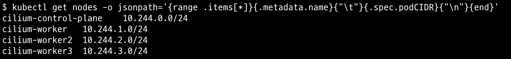

## 예제3: pod와 host network interface 설정

pod가 생성되면, pod는 통신을 위해 veth 네트워크 인터페이스를 생성합니다. cilium에서는 veth 이름이 lxc로 시작합니다. 아래 그림과 같이 `ip addr show` 명령어로 veth 네트워크 인터페이스를 확인할 수 있습니다. 네트워크 인터페이스 번호가 pod와 host에 각각 연결되어 있습니다.

```sh
# Pod 안에서 확인
kubectl exec xwing -- ip addr show | tail -6

# host에서 확인
ip addr show | grep if{xx}
```

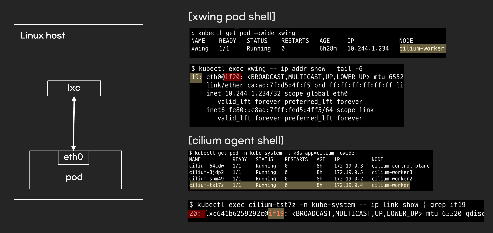

## 예제4: eBPF 프로그램 조회

lxc 네트워크 인터페이스는 pod로부터 패킷을 받을 때 실행되는 eBPF 프로그램이 연결되어 있습니다. eBPF 프로그램의 이름은 cil_from_container입니다.

```sh
kubectl exec {cilium daemonset pod} -n kube-system -- bpftool net show dev {lxc interface}
```

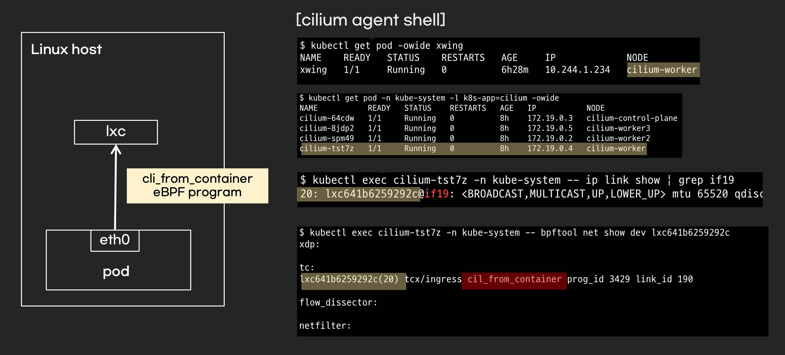

## 예제5: 같은 node의 pod -> pod 통신

같은 node에 있는 pod끼리 통신이 잘 되는지 확인해보세요!

```sh
# 1. deathstar Pod IP 조회
$ kubectl get pod -owide
NAME                         IP ...
deathstar-86f85ffb4d-d4db4   10.244.1.130

# 2. xwing Pod -> deathstar Pod 통신
kubectl exec xwing -- curl -s -XPOST 10.244.1.130/v1/request-landing
```

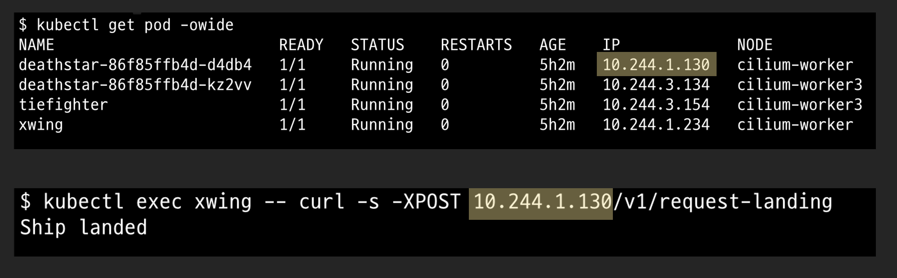

예제 4번에서 확인한 eBPF 프로그램이 pod 간의 통신을 담당합니다. eBPF 프로그램이 패킷을 어디로 보낼지 결정하는 과정을 라우팅(routing)이라고 합니다.

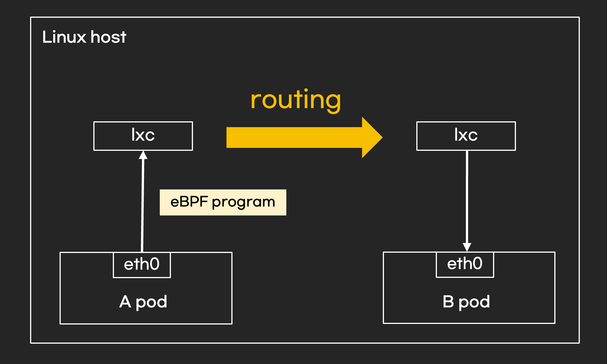

- 라우팅 규칙은 eBPF map(map)으로 관리됩니다. eBPF map은 eBPF 프로그램의 데이터를 저장하는 공간입니다. eBPF map은 목적에 따라 여러 종류가 있으며, eBPF 프로그램은 상황에 맞는 eBPF map을 참조합니다.
- ipcache map은 목적지 pod가 출발지 pod와 같은 node에 있는지 확인하고, 네트워크 policy도 검사합니다.
- xwing pod에서 deathstar-86f85ffb4d-d4db4 pod로 통신하는 시나리오에서는 두 pod가 같은 node에 있습니다. 따라서 ipcache list에서 tunnel endpoint가 0.0.0.0으로 표시됩니다.

```sh
kubectl exec {cilium daemonset pod} -n kube-system -- cilium bpf ipcache list
```

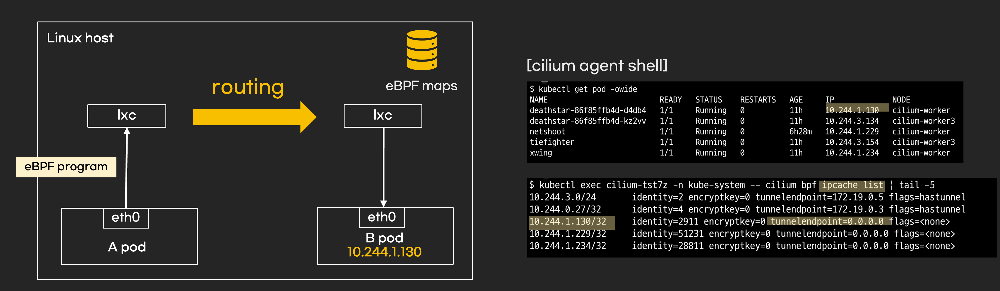

- ipcache map에서 출발지 pod와 목적지 pod가 같다는 것을 확인하면, endpoint map을 조회합니다. endpoint map에는 패킷을 전달해야 할(redirect) 네트워크 인터페이스 정보가 담겨 있습니다. 커널 버전 또는 cilium 모드 설정에 따라 패킷을 전달할 네트워크 인터페이스가 달라집니다.
- 아래 그림에서는 eBPF 프로그램이 deathstar-86f85ffb4d-d4db4 pod의 네트워크 인터페이스로 패킷을 전달합니다.

```sh
kubectl exec {cilium daemonset pod} -n kube-system -- cilium bpf endpoint list
```

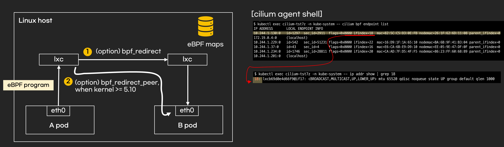

## 예제6: 다른 node의 pod -> pod 통신

예제 5번은 같은 node의 pod 간 통신이었는데요. 그렇다면 다른 node의 pod 간 통신은 어떻게 이루어질까요? cilium에 설정된 라우팅 모드에 따라 통신 방법이 다릅니다. 이 예제에서는 터널 모드(tunnel mode), 프로토콜은 vxlan을 설명합니다. 라우팅 설정은 `cilium-config` configmap에서 확인할 수 있습니다.

```sh
kubectl get cm -n kube-system cilium-config -o yaml | grep -E "tunnel|routing-mode"
```

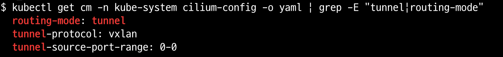

- 터널 모드(tunnel mode)는 다른 node의 pod 간 통신 시 오버레이 통신을 사용합니다. pod는 자신의 node가 아닌 다른 node의 pod와 통신하려면 node ip를 사용해야 합니다. node ip를 ip 헤더에 사용하면 pod ip를 설정하지 못해 패킷이 드롭됩니다. 오버레이 통신은 node ip와 pod ip 모두를 ip 헤더에 사용하게 합니다.
- 오버레이는 pod에 관련된 헤더를 추가합니다. 이 헤더를 이너 헤더라고 부르고 pod ip와 mac 주소가 있습니다. 패킷을 받은 node는 역으로 디캡슐화 과정에서 inner 헤더를 분석하고 패킷을 pod로 전달합니다. 이 과정을 cilium이 처리합니다.


cilium은 vxlan 네트워크 인터페이스와 eBPF 프로그램을 사용하여 인캡슐화, 디캡슐화, 라우팅을 수행합니다.

```sh
# interface에 연결된 eBPF 프로그램 확인
kubectl exec {cilium daemonset pod} -n kube-system -- bpftool net list dev {interface}
```

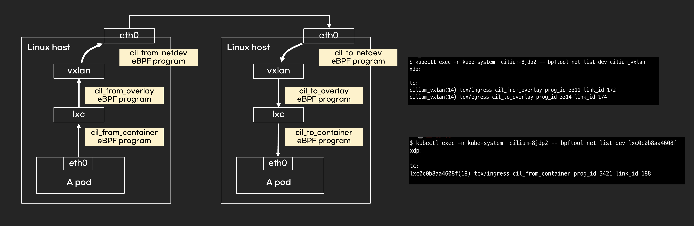


vxlan 네트워크 인터페이스에서 패킷을 덤프하면 cilium이 생성한 ip 헤더와 vxlan 헤더를 확인할 수 있습니다.

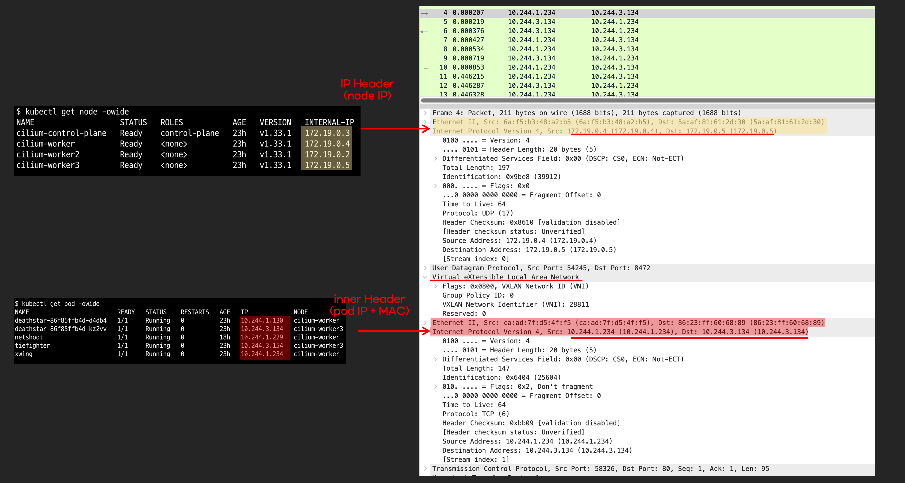


## 예제7: kubernetes service 통신 확인

kubernetes service 통신은 pod 간 통신과 거의 유사합니다. service 통신도 결국 eBPF를 사용하기 때문입니다. 사용하는 eBPF 프로그램과 eBPF map이 추가되었을 뿐, service 통신과 pod 간 통신의 큰 차이는 없습니다.

- kubernetes service를 이용한 pod 통신 예

```sh
$ kubectl exec xwing -- curl -s -XPOST deathstar.default.svc.cluster.local/v1/request-landing
Ship landed
```

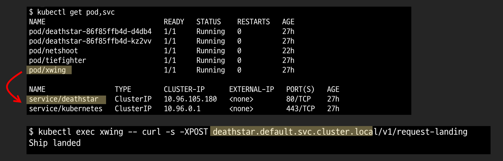

eBPF map은 lb4_services, lb4_backends 등을 사용하며, kubernetes service가 가리키는 pod IP가 eBPF map에 저장됩니다. eBPF 프로그램은 eBPF map을 참고하여 라우팅합니다.

```sh
kubectl exec {cilium daemonset pod} -n kube-system -- cilium bpf lb list
```

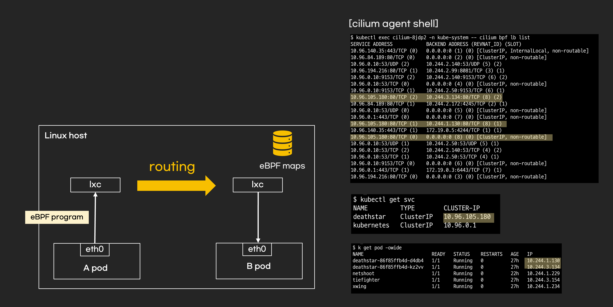

라우팅 과정에서 목적지 IP는 kubernetes service IP에서 pod IP로 DNAT됩니다. 그리고 목적지 pod에서 응답을 보내려면 conntrack 정보를 저장해야 하는데, 이 정보 또한 eBPF map에 저장됩니다.

```sh
kubectl exec {cilium daemonset pod} -n kube-system -- cilium bpf ct list global
```

cilium service 로드 밸런싱 알고리즘은 기본으로 random이고 변경 가능합니다. bpf-lb-algorithm-annotation이 false이면 로드 밸런싱 알고리즘이 설정되지 않은 것입니다.

```sh
cilium config view | grep bpf-lb-algorithm-annotation
```

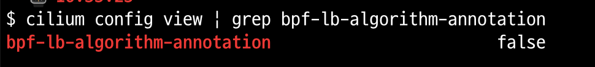

## 예제8: observability

- cilium observability도 eBPF를 사용합니다. observability는 Hubble이라는 컴퍼넌트가 담당하고 CLI, web UI 대시보드에서 확인할 수 있습니다. observability는 운영하면서 노하우가 쌓여야하는 부분입니다. 제가 아직 cilium을 업무에 사용해보지 않아서 observability는 생략합니다.

- CLI

```sh
kubectl exec {cilium daemonset pod} -n kube-system -- cilium-dbg monitor
```


- web UI 대시보드

```sh
$ cilium hubble ui
Opening "http://localhost:12000" in your browser...
```

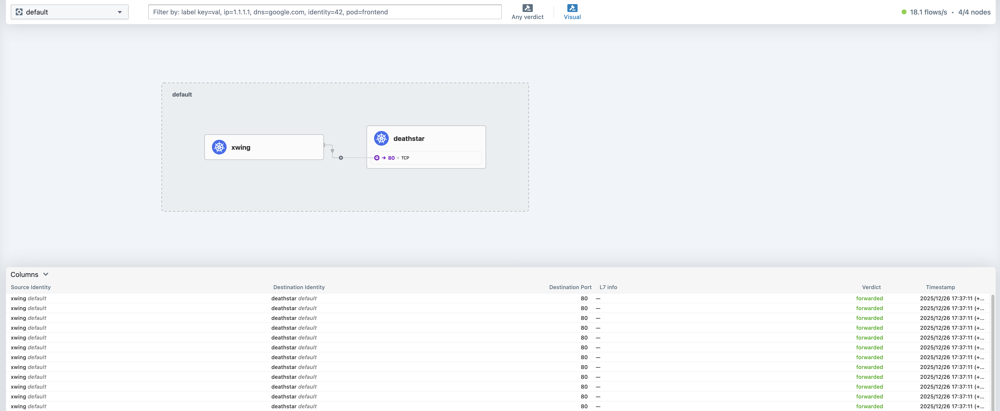
