# CiliumNetworkPolicy: egress IP/도메인 제어

## 요약

- CiliumNetworkPolicy는 cilium이 제공하는 확장된 네트워크 정책 리소스로, **eBPF 기반으로 L3/L4/L7 네트워크 정책을 적용**합니다.
- egress 정책으로 pod의 외부 통신을 IP(CIDR) 또는 도메인(FQDN) 단위로 제어할 수 있습니다.
- FQDN 기반 정책은 cilium DNS proxy가 DNS 응답을 가로채서 IP를 학습하는 방식으로 동작합니다.
- 모니터링은 Hubble CLI, eBPF map 조회, cilium-dbg monitor, Prometheus + Grafana로 할 수 있습니다.

## 목차

<!-- TOC -->

- [CiliumNetworkPolicy: egress IP/도메인 제어](#ciliumnetworkpolicy-egress-ip%EB%8F%84%EB%A9%94%EC%9D%B8-%EC%A0%9C%EC%96%B4)
  - [요약](#%EC%9A%94%EC%95%BD)
  - [목차](#%EB%AA%A9%EC%B0%A8)
  - [CiliumNetworkPolicy란?](#ciliumnetworkpolicy%EB%9E%80)
    - [kubernetes NetworkPolicy와 뭐가 다를까?](#kubernetes-networkpolicy%EC%99%80-%EB%AD%90%EA%B0%80-%EB%8B%A4%EB%A5%BC%EA%B9%8C)
  - [실습 환경](#%EC%8B%A4%EC%8A%B5-%ED%99%98%EA%B2%BD)
    - [테스트 pod 배포](#%ED%85%8C%EC%8A%A4%ED%8A%B8-pod-%EB%B0%B0%ED%8F%AC)
  - [원리 분석: CiliumNetworkPolicy는 어떻게 동작할까?](#%EC%9B%90%EB%A6%AC-%EB%B6%84%EC%84%9D-ciliumnetworkpolicy%EB%8A%94-%EC%96%B4%EB%96%BB%EA%B2%8C-%EB%8F%99%EC%9E%91%ED%95%A0%EA%B9%8C)
    - [eBPF 기반 정책 적용](#ebpf-%EA%B8%B0%EB%B0%98-%EC%A0%95%EC%B1%85-%EC%A0%81%EC%9A%A9)
    - [왜 DNS를 허용해야 할까?](#%EC%99%9C-dns%EB%A5%BC-%ED%97%88%EC%9A%A9%ED%95%B4%EC%95%BC-%ED%95%A0%EA%B9%8C)
    - [FQDN 정책은 어떻게 동작할까?](#fqdn-%EC%A0%95%EC%B1%85%EC%9D%80-%EC%96%B4%EB%96%BB%EA%B2%8C-%EB%8F%99%EC%9E%91%ED%95%A0%EA%B9%8C)
  - [예제1: egress 전체 차단](#%EC%98%88%EC%A0%9C1-egress-%EC%A0%84%EC%B2%B4-%EC%B0%A8%EB%8B%A8)
  - [예제2: egress IPCIDR 허용](#%EC%98%88%EC%A0%9C2-egress-ipcidr-%ED%97%88%EC%9A%A9)
  - [예제3: egress 도메인FQDN 허용](#%EC%98%88%EC%A0%9C3-egress-%EB%8F%84%EB%A9%94%EC%9D%B8fqdn-%ED%97%88%EC%9A%A9)
  - [예제4: egressDeny로 특정 IP 차단](#%EC%98%88%EC%A0%9C4-egressdeny%EB%A1%9C-%ED%8A%B9%EC%A0%95-ip-%EC%B0%A8%EB%8B%A8)
  - [모니터링](#%EB%AA%A8%EB%8B%88%ED%84%B0%EB%A7%81)
    - [사전준비](#%EC%82%AC%EC%A0%84%EC%A4%80%EB%B9%84)
    - [Hubble CLI](#hubble-cli)
    - [eBPF map 조회](#ebpf-map-%EC%A1%B0%ED%9A%8C)
    - [cilium-dbg monitor](#cilium-dbg-monitor)
    - [Prometheus + Grafana](#prometheus--grafana)
      - [Prometheus + Grafana 설치](#prometheus--grafana-%EC%84%A4%EC%B9%98)
      - [cilium ServiceMonitor 설정](#cilium-servicemonitor-%EC%84%A4%EC%A0%95)
      - [네트워크 정책 관련 주요 메트릭](#%EB%84%A4%ED%8A%B8%EC%9B%8C%ED%81%AC-%EC%A0%95%EC%B1%85-%EA%B4%80%EB%A0%A8-%EC%A3%BC%EC%9A%94-%EB%A9%94%ED%8A%B8%EB%A6%AD)
      - [Grafana 대시보드](#grafana-%EB%8C%80%EC%8B%9C%EB%B3%B4%EB%93%9C)
  - [정리](#%EC%A0%95%EB%A6%AC)
  - [더 공부할 것](#%EB%8D%94-%EA%B3%B5%EB%B6%80%ED%95%A0-%EA%B2%83)
  - [참고자료](#%EC%B0%B8%EA%B3%A0%EC%9E%90%EB%A3%8C)

<!-- /TOC -->

## CiliumNetworkPolicy란?

CiliumNetworkPolicy는 두 단어를 합친 용어입니다. Cilium + NetworkPolicy

1. NetworkPolicy: kubernetes에서 pod 간 네트워크 트래픽을 제어하는 리소스입니다.
2. Cilium: eBPF 기반의 CNI 플러그인입니다.
3. CiliumNetworkPolicy: **cilium이 제공하는 확장된 NetworkPolicy로, eBPF를 사용하여 L3/L4/L7 수준의 네트워크 정책을 적용합니다.**

### kubernetes NetworkPolicy와 뭐가 다를까?

kubernetes NetworkPolicy는 L3/L4(IP, 포트) 수준의 정책만 지원합니다. 반면 CiliumNetworkPolicy는 다음을 추가로 지원합니다.

| 기능 | kubernetes NetworkPolicy | CiliumNetworkPolicy |
|---|---|---|
| L3/L4 정책 (IP, 포트) | O | O |
| FQDN(도메인) 기반 정책 | X | O |
| L7(HTTP, gRPC) 정책 | X | O |
| egressDeny (명시적 차단) | X | O |
| DNS-aware 정책 | X | O |

## 실습 환경

- kind cluster에 cilium CNI를 설치한 환경에서 실습합니다.
- cilium 설치는 [설치문서](../../install/)를 참고하세요.

### 테스트 pod 배포

외부 통신을 테스트할 curl pod를 배포합니다.

```sh
kubectl apply -f test-pod.yaml
```

pod가 Running 상태가 될 때까지 기다립니다.

```sh
kubectl get pod curl-test -w
```

정책 적용 전, 외부 통신이 되는지 확인합니다. 두 명령어 모두 `200`이 출력되면 정상입니다.

```sh
# 외부 IP로 통신
kubectl exec curl-test -- curl -s -o /dev/null -w "%{http_code}" --max-time 2 https://1.1.1.1

# 외부 도메인으로 통신
kubectl exec curl-test -- curl -s -o /dev/null -w "%{http_code}" --max-time 2 https://httpbin.org/get
```

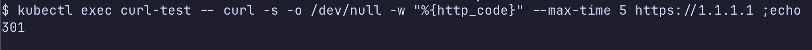

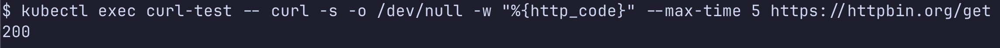

## 원리 분석: CiliumNetworkPolicy는 어떻게 동작할까?

### eBPF 기반 정책 적용

- CiliumNetworkPolicy를 적용하면 cilium agent가 eBPF 프로그램과 eBPF map을 업데이트합니다. iptables를 사용하는 기존 CNI와 달리 **cilium은 eBPF policy map에 정책 규칙을 저장하고, eBPF 프로그램이 패킷 처리 시 map을 참조하여 허용/차단을 결정합니다.**
- 정책 적용 시 cilium의 내부 동작 순서입니다.

1. kubernetes API 서버에서 CiliumNetworkPolicy CRD 변경을 감지
2. cilium agent가 정책을 파싱하여 eBPF policy map에 규칙 추가
3. pod에 연결된 lxc 네트워크 인터페이스의 eBPF 프로그램(`cil_from_container`)이 policy map 참조
4. 패킷이 정책에 매칭되면 허용, 아니면 드롭

> 참고: [라우팅 예제4: eBPF 프로그램 조회](../basic.md#예제4-ebpf-프로그램-조회)에서 `cil_from_container` eBPF 프로그램을 확인한 적이 있습니다.

정책이 적용된 후 endpoint 상태를 확인하면 policy enforcement가 활성화된 것을 확인할 수 있습니다.

```sh
kubectl exec {cilium daemonset pod} -n kube-system -- cilium endpoint list
```

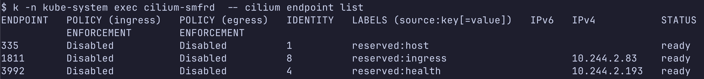

### 왜 DNS를 허용해야 할까?

egress 정책을 적용할 때 자주 실수하는 부분이 있습니다. **egress를 제한하면 DNS 통신도 차단됩니다.** DNS가 차단되면 pod에서 도메인 이름을 resolve할 수 없어 모든 도메인 기반 통신이 실패합니다.

따라서 egress 정책을 적용할 때는 kube-dns로의 통신을 별도로 허용해야 합니다.

특히 `toFQDNs`를 사용할 때는 DNS 요청/응답을 cilium DNS proxy가 관찰할 수 있도록 DNS L7 규칙(`rules.dns`)도 함께 설정해야 합니다.

```yaml
# DNS 허용 규칙 (egress 정책에 포함)
- toEndpoints:
    - matchLabels:
        io.kubernetes.pod.namespace: kube-system
        k8s-app: kube-dns
  toPorts:
    - ports:
        - port: "53"
          protocol: UDP
        - port: "53"
          protocol: TCP
      rules:
        dns:
          - matchPattern: "*"
```

### FQDN 정책은 어떻게 동작할까?

- FQDN 기반 정책은 일반 CIDR 정책보다 복잡합니다. 도메인 이름은 IP가 아니기 때문에 eBPF policy map에 직접 넣을 수 없습니다. 그렇다면 cilium은 도메인 이름을 어떻게 처리할까요?
- **cilium은 DNS proxy를 사용합니다.** DNS proxy가 DNS 응답을 가로채서 도메인에 매핑된 IP를 학습하고, 학습된 IP를 eBPF map에 추가합니다.

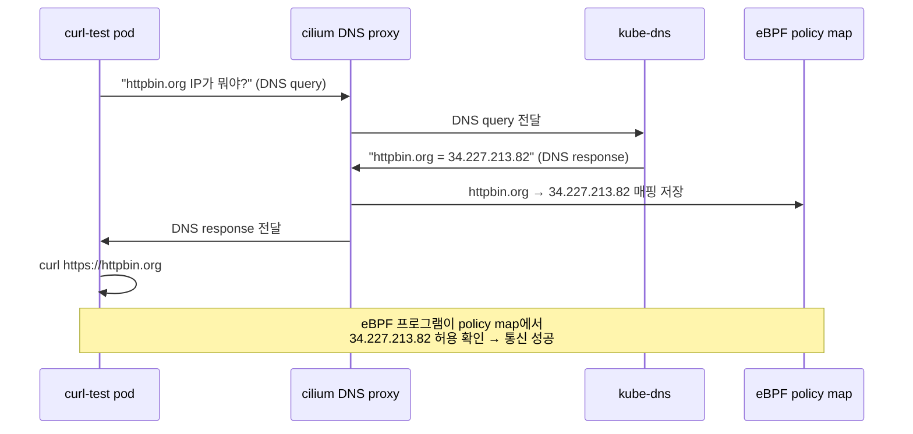

동작 과정을 정리하면 다음과 같습니다.

1. pod가 DNS 쿼리를 보냄 (예: httpbin.org)
2. cilium DNS proxy가 DNS 쿼리를 가로챔
3. DNS proxy가 실제 DNS 서버로 쿼리를 전달하고 응답을 받음
4. DNS 응답에서 IP 주소를 추출하여 FQDN → IP 매핑을 학습
5. 학습된 IP를 eBPF policy map에 추가
6. 이후 해당 IP로의 통신은 eBPF 프로그램이 허용

따라서 **FQDN 정책을 사용할 때는 반드시 DNS(kube-dns) 통신을 허용해야 합니다.** DNS 통신이 차단되면 도메인 IP를 학습할 수 없어 모든 FQDN 기반 통신이 실패합니다.

DNS proxy가 학습한 FQDN → IP 매핑은 아래 명령어로 확인할 수 있습니다.

```sh
kubectl exec {cilium daemonset pod} -n kube-system -- cilium fqdn cache list
```

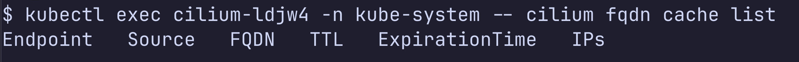

## 예제1: egress 전체 차단

모든 외부 통신을 차단하는 정책입니다. **`egressDeny`에 `0.0.0.0/0`을 지정하면 선택된 pod의 모든 egress 통신이 차단됩니다.**

```sh
kubectl apply -f deny-all-egress.yaml
```

```yaml
# deny-all-egress.yaml
apiVersion: cilium.io/v2
kind: CiliumNetworkPolicy
metadata:
  name: deny-all-egress
spec:
  endpointSelector:
    matchLabels:
      app: curl-test
  egressDeny:
    - toCIDR:
        - 0.0.0.0/0
```

정책 적용 후, 외부 통신이 차단되는지 확인합니다.

```sh
# 외부 IP 통신 시도 → 실패해야 함
kubectl exec curl-test -- curl -s -o /dev/null -w "%{http_code}" --max-time 2 https://1.1.1.1

# 외부 도메인 통신 시도 → 실패해야 함
kubectl exec curl-test -- curl -s -o /dev/null -w "%{http_code}" --max-time 2 https://httpbin.org/get
```

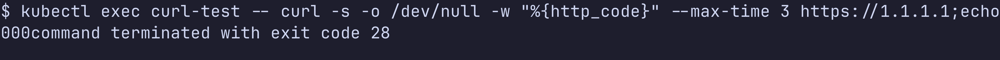

확인이 끝나면 정책을 삭제합니다.

```sh
kubectl delete ciliumnetworkpolicy deny-all-egress
```

## 예제2: egress IP(CIDR) 허용

특정 IP만 허용하는 egress 정책입니다. 이 예제에서는 1.1.1.1(Cloudflare DNS)로의 HTTPS 통신만 허용합니다.

> 주의: `egress` 필드에 규칙을 설정하면 **명시적으로 허용한 트래픽만 통과**하고 나머지는 모두 차단됩니다. iptables의 whitelist 방식과 마찬가지로 허용 목록만 열어주는 방식입니다.

```sh
kubectl apply -f allow-egress-cidr.yaml
```

```yaml
# allow-egress-cidr.yaml
apiVersion: cilium.io/v2
kind: CiliumNetworkPolicy
metadata:
  name: allow-egress-cidr
spec:
  endpointSelector:
    matchLabels:
      app: curl-test
  egress:
    - toCIDR:
        - 1.1.1.1/32
    - toEndpoints:
        - matchLabels:
            io.kubernetes.pod.namespace: kube-system
            k8s-app: kube-dns
      toPorts:
        - ports:
            - port: "53"
              protocol: UDP
            - port: "53"
              protocol: TCP
          rules:
            dns:
              - matchPattern: "*"
```

- 허용된 IP로 통신 → 성공

```sh
kubectl exec curl-test -- curl -s -o /dev/null -w "%{http_code}" --max-time 2 https://1.1.1.1
```

- 허용되지 않은 IP로 통신 → 실패

```sh
kubectl exec curl-test -- curl -s -o /dev/null -w "%{http_code}" --max-time 2 https://8.8.8.8
```

확인이 끝나면 정책을 삭제합니다.

```sh
kubectl delete ciliumnetworkpolicy allow-egress-cidr
```

## 예제3: egress 도메인(FQDN) 허용

특정 도메인만 허용하는 egress 정책입니다. **`toFQDNs`를 사용하면 도메인 이름으로 egress를 제어할 수 있습니다.** 이것이 CiliumNetworkPolicy의 가장 강력한 기능 중 하나입니다.

- `matchName`: 정확한 도메인 매칭 (예: `httpbin.org`)
- `matchPattern`: 와일드카드 패턴 매칭 (예: `*.googleapis.com`)

```sh
kubectl apply -f allow-egress-fqdn.yaml
```

```yaml
# allow-egress-fqdn.yaml
apiVersion: cilium.io/v2
kind: CiliumNetworkPolicy
metadata:
  name: allow-egress-fqdn
spec:
  endpointSelector:
    matchLabels:
      app: curl-test
  egress:
    - toFQDNs:
        - matchName: httpbin.org
      toPorts:
        - ports:
            - port: "443"
              protocol: TCP
            - port: "80"
              protocol: TCP
    - toEndpoints:
        - matchLabels:
            io.kubernetes.pod.namespace: kube-system
            k8s-app: kube-dns
      toPorts:
        - ports:
            - port: "53"
              protocol: UDP
            - port: "53"
              protocol: TCP
          rules:
            dns:
              - matchPattern: "*"
```

- 허용된 도메인으로 통신 → 성공

```sh
kubectl exec curl-test -- curl -s -o /dev/null -w "%{http_code}" --max-time 2 https://httpbin.org/get
```

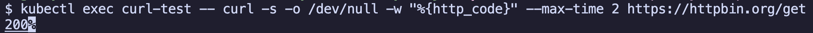


- 허용되지 않은 도메인으로 통신 → 실패

```sh
kubectl exec curl-test -- curl -s -o /dev/null -w "%{http_code}" --max-time 2 https://google.com
```

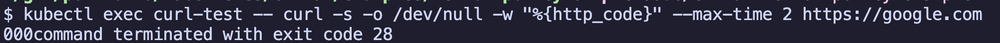

FQDN 캐시에서 학습된 IP를 확인합니다.

```sh
kubectl exec {cilium daemonset pod} -n kube-system -- cilium fqdn cache list | grep httpbin
```

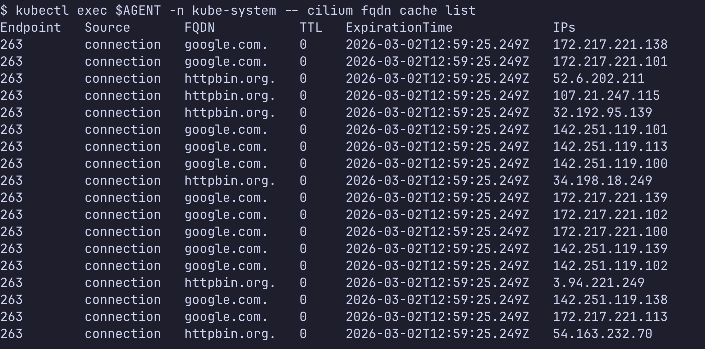

확인이 끝나면 정책을 삭제합니다.

```sh
kubectl delete ciliumnetworkpolicy allow-egress-fqdn
```

## 예제4: egressDeny로 특정 IP 차단

예제2, 3은 "허용 목록"을 설정하는 whitelist 방식입니다. 반면 `egressDeny`는 "차단 목록"을 설정하는 blacklist 방식입니다. **기본적으로 모든 통신을 허용하되, 특정 IP만 차단하고 싶을 때 `egressDeny`를 사용합니다.**

> 주의: `egressDeny` 기반 blacklist 정책에서는 `enableDefaultDeny.egress: false`를 반드시 명시하세요.
> 이 설정이 없으면 선택된 endpoint가 egress default deny 상태가 되어, 차단 대상 외의 트래픽도 함께 막힐 수 있습니다.

설정 기준은 아래처럼 기억하면 헷갈리지 않습니다.

- whitelist (`egress` + `toCIDR`/`toFQDNs`) : `enableDefaultDeny.egress`를 보통 명시하지 않음
- blacklist (`egressDeny` 중심) : `enableDefaultDeny.egress: false` 명시

그런데, egress와 egressDeny가 동시에 적용되면 어떻게 될까요? **egressDeny가 egress보다 우선순위가 높습니다.** 즉, egress에서 허용하더라도 egressDeny에서 차단하면 통신이 차단됩니다.

```sh
kubectl apply -f deny-egress-cidr.yaml
```

```yaml
# deny-egress-cidr.yaml
apiVersion: cilium.io/v2
kind: CiliumNetworkPolicy
metadata:
  name: deny-egress-cidr
spec:
  endpointSelector:
    matchLabels:
      app: curl-test
  enableDefaultDeny:
    egress: false
  egressDeny:
    - toCIDR:
        - 1.1.1.1/32
```

- 차단된 IP로 통신 → 실패

```sh
kubectl exec curl-test -- curl -s -o /dev/null -w "%{http_code}" --max-time 2 https://1.1.1.1
```

- 차단되지 않은 IP로 통신 → 성공

```sh
kubectl exec curl-test -- curl -s -o /dev/null -w "%{http_code}" --max-time 2 https://8.8.8.8
```

확인이 끝나면 정책을 삭제합니다.

```sh
kubectl delete ciliumnetworkpolicy deny-egress-cidr
```

## 모니터링

네트워크 정책이 의도한 대로 동작하는지 확인하려면 모니터링이 필수입니다. cilium은 여러 모니터링 방법을 제공합니다.

### 사전준비

`hubble observe`는 로컬 `127.0.0.1:4245`로 gRPC 연결을 시도합니다. 이 포트는 기본적으로 열려 있지 않으므로, 먼저 `hubble-relay` 서비스로 port-forward를 열어야 합니다.

`hubble-relay`는 각 노드의 cilium agent가 수집한 flow 이벤트를 모아서 Hubble CLI에 전달하는 집계/중계 역할을 합니다. 즉, relay 연결이 없으면 `hubble observe`는 `connection refused` 오류가 발생합니다.

```sh
# 터미널 1: relay 포트포워드 (실행 중 유지)
kubectl port-forward -n kube-system svc/hubble-relay 4245:80
```

```sh
# 터미널 2: 연결 확인 후 observe 실행
hubble status
hubble observe --pod default/curl-test
```

### Hubble CLI

Hubble은 cilium의 observability 컴포넌트입니다. 실시간 트래픽 흐름과 정책 적용 결과를 확인할 수 있습니다.

```sh
# 특정 pod의 트래픽 모니터링
hubble observe --pod default/curl-test

# DROPPED 패킷만 필터링 (정책에 의해 차단된 트래픽)
hubble observe --pod default/curl-test --verdict DROPPED

# FORWARDED 패킷만 필터링 (허용된 트래픽)
hubble observe --pod default/curl-test --verdict FORWARDED

# 특정 목적지 도메인 필터링
hubble observe --pod default/curl-test --to-fqdn httpbin.org
```

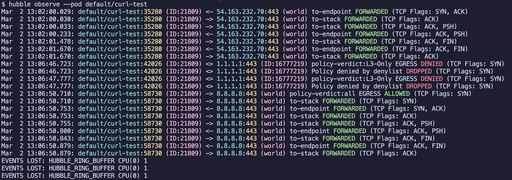


### eBPF map 조회

[라우팅 예제](../basic.md)에서 eBPF map을 조회했던 것처럼, 네트워크 정책도 eBPF map으로 관리됩니다.

```sh
# endpoint별 정책 적용 상태 확인
kubectl exec {cilium daemonset pod} -n kube-system -- cilium endpoint list
```

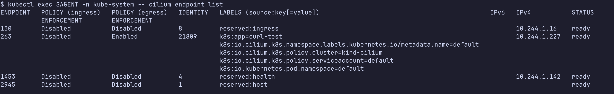

```sh
# 정책 상세 조회
kubectl exec {cilium daemonset pod} -n kube-system -- cilium policy get
```

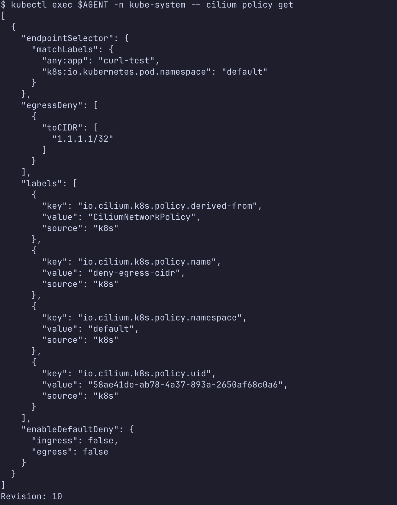

```sh
# endpoint에 적용된 policy map 조회
kubectl exec {cilium daemonset pod} -n kube-system -- cilium bpf policy get {endpoint-id}
```

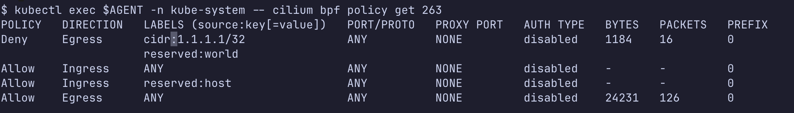

```sh
# FQDN 캐시 조회 (DNS proxy가 학습한 도메인 → IP 매핑)
kubectl exec {cilium daemonset pod} -n kube-system -- cilium fqdn cache list
```

### cilium-dbg monitor

패킷 단위의 상세 로그를 확인할 수 있습니다. 정책에 의해 drop된 패킷이나 policy verdict를 실시간으로 확인할 때 유용합니다.

```sh
# drop된 패킷 모니터링
kubectl exec {cilium daemonset pod} -n kube-system -- cilium-dbg monitor --type drop
```

```sh
# policy verdict 모니터링
kubectl exec {cilium daemonset pod} -n kube-system -- cilium-dbg monitor --type policy-verdict
```

### Prometheus + Grafana

cilium은 Prometheus 메트릭을 기본으로 제공합니다. Hubble이 수집하는 메트릭을 Prometheus에 저장하고 Grafana로 시각화할 수 있습니다.

#### Prometheus + Grafana 설치

```sh
helm repo add prometheus-community https://prometheus-community.github.io/helm-charts
helm repo update

helm install prometheus prometheus-community/kube-prometheus-stack \
  --namespace monitoring \
  --create-namespace \
  --set prometheus.prometheusSpec.serviceMonitorSelectorNilUsesHelmValues=false
```

#### cilium ServiceMonitor 설정

Prometheus가 cilium 메트릭을 수집하려면 ServiceMonitor가 필요합니다. cilium 설치 시 Prometheus 메트릭을 활성화하면 자동으로 생성됩니다.

```sh
# cilium prometheus 메트릭 활성화 확인
kubectl get servicemonitor -n kube-system
```

#### 네트워크 정책 관련 주요 메트릭

| 메트릭 | 설명 |
|---|---|
| `hubble_drop_total` | 정책에 의해 드롭된 패킷 수 |
| `hubble_flows_processed_total` | 처리된 네트워크 flow 수 |
| `cilium_policy_verdict_total` | 정책 판정 결과 (allowed/denied) |
| `cilium_forward_count_total` | 포워딩된 패킷 수 |
| `hubble_dns_queries_total` | DNS 쿼리 수 |
| `hubble_dns_responses_total` | DNS 응답 수 |

#### Grafana 대시보드

cilium 공식 Grafana 대시보드를 import하면 네트워크 정책 모니터링을 바로 시작할 수 있습니다.

```sh
# Grafana 포트 포워딩
kubectl port-forward -n monitoring svc/prometheus-grafana 3000:80
```

Grafana 접속 후 Import Dashboard에서 아래 Dashboard ID를 입력합니다.

- Cilium 대시보드: `16611`
- Hubble 대시보드: `16613`

## 정리

```sh
# 테스트 리소스 전체 삭제
kubectl delete pod curl-test
kubectl delete ciliumnetworkpolicy --all

# monitoring 삭제 (설치한 경우)
helm uninstall prometheus -n monitoring
kubectl delete namespace monitoring
```

## 더 공부할 것

- CiliumNetworkPolicy L7 정책 (HTTP method, path 기반 필터링)
- CiliumClusterwideNetworkPolicy (namespace 범위가 아닌 cluster 범위 정책)
- egress gateway (특정 node의 IP로 egress 트래픽을 집중시키는 기능)
- Network Policy Editor (https://editor.networkpolicy.io/) 시각화 도구

## 참고자료

- https://docs.cilium.io/en/stable/security/policy/
- https://docs.cilium.io/en/stable/security/policy/language/#egress
- https://docs.cilium.io/en/stable/security/dns/
- https://docs.cilium.io/en/stable/observability/hubble/
- https://docs.cilium.io/en/stable/observability/grafana/
