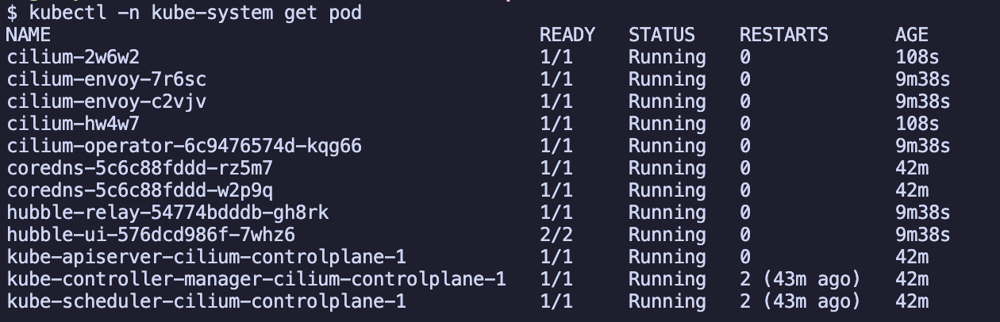

# 개요

- kind cluster에 cilium 설치

## 목차

- [개요](#%EA%B0%9C%EC%9A%94)
- [목차](#%EB%AA%A9%EC%B0%A8)
- [준비물](#%EC%A4%80%EB%B9%84%EB%AC%BC)
- [kind kubernetes 설치](#kind-kubernetes-%EC%84%A4%EC%B9%98)
- [Cilium 설치](#cilium-%EC%84%A4%EC%B9%98)
  - [helm repo 추가](#helm-repo-%EC%B6%94%EA%B0%80)
  - [Cilium 설치](#cilium-%EC%84%A4%EC%B9%98)
  - [Cilium 설치 상태 확인](#cilium-%EC%84%A4%EC%B9%98-%EC%83%81%ED%83%9C-%ED%99%95%EC%9D%B8)
- [참고자료](#%EC%B0%B8%EA%B3%A0%EC%9E%90%EB%A3%8C)

## 준비물

- docker
- kind

## kind kubernetes 설치

```sh
kind create cluster --config kind-config.yaml
```

Cilium이 설치되지 않았기 때문에 노드가 `NotReady` 상태가 됩니다.

```sh
kubectl get node
```


## Cilium 설치

### 1. helm repo 추가

```sh
helm repo add cilium https://helm.cilium.io/
helm repo update
```

### 2. Cilium 설치

```sh
helm upgrade --install cilium cilium/cilium \
  --version 1.18.5 \
  --namespace kube-system \
  --values cilium-values.yaml
```

### 3. Cilium 설치 상태 확인

```sh
$ cilium status
$ kubectl -n kube-system get pod
```



- 노드 상태 확인

```sh
kubectl get nodes
```


## 참고자료

- https://docs.cilium.io/en/stable/gettingstarted/k8s-install-default/
