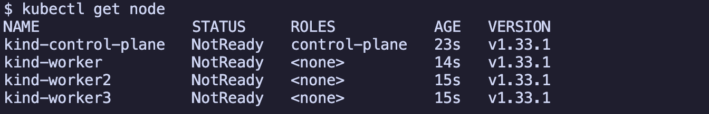
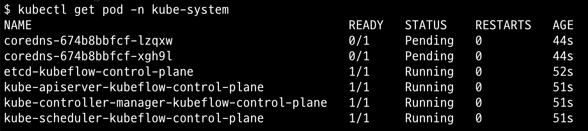
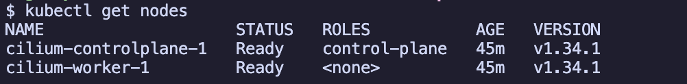

# 개요

- kind cluster에 cilium 설치

## 목차

<!-- TOC -->

- [개요](#%EA%B0%9C%EC%9A%94)
  - [목차](#%EB%AA%A9%EC%B0%A8)
  - [준비물](#%EC%A4%80%EB%B9%84%EB%AC%BC)
  - [kind kubernetes 설치](#kind-kubernetes-%EC%84%A4%EC%B9%98)
  - [Cilium 설치](#cilium-%EC%84%A4%EC%B9%98)
  - [Cilium 설치 상태 확인](#cilium-%EC%84%A4%EC%B9%98-%EC%83%81%ED%83%9C-%ED%99%95%EC%9D%B8)
  - [kind cluster 삭제](#kind-cluster-%EC%82%AD%EC%A0%9C)
  - [참고자료](#%EC%B0%B8%EA%B3%A0%EC%9E%90%EB%A3%8C)

<!-- /TOC -->

## 준비물

- docker
- kind
- cilium CLI

```sh
brew install kind
brew install cilium-cli
```

## kind kubernetes 설치

```sh
kind create cluster --config kind-config.yaml
```

- Cilium이 설치되지 않았기 때문에 node 상태가 'NotReady'가 됩니다.

```sh
kubectl get node
```



- kube-proxy pod가 없는지 확인합니다.

```sh
kubectl get pod -n kube-system
```



## Cilium 설치

- Cilium CLI를 사용하여 Cilium을 설치합니다.

```sh
cilium install \
  --version 1.18.5 \
  --set kubeProxyReplacement=true \
  --set hubble.enabled=true \
  --set hubble.relay.enabled=true \
  --set hubble.ui.enabled=true \
  --set ingressController.enabled=true
  --set ingressController.loadbalancerMode=dedicated
```

## Cilium 설치 상태 확인

- node 상태를 확인합니다.

```sh
kubectl get node
```



- pod 상태를 확인합니다.

```sh
kubectl get pod -n kube-system
```


## kind cluster 삭제

```sh
kind delete cluster --name cilium
```

## 참고자료

- https://docs.cilium.io/en/stable/gettingstarted/k8s-install-default/
