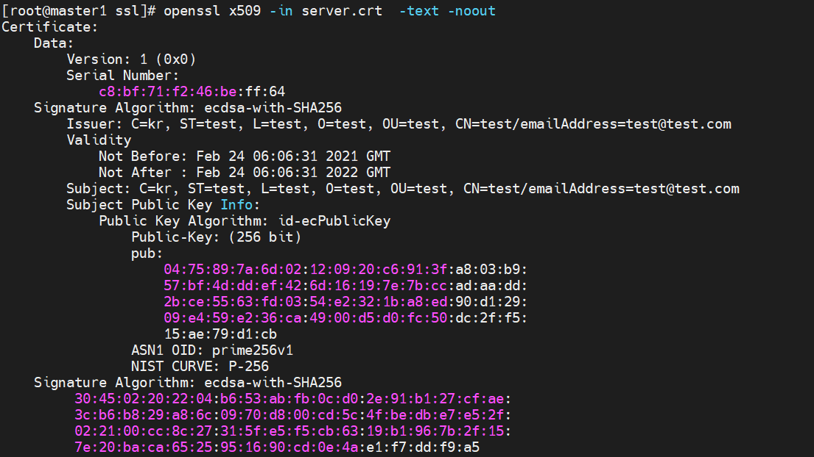

# 자체서명 인증서 생성
## ROOT CA 인증서 생성
* CA 비밀키 생성
```sh
openssl ecparam -out ca.key -name prime256v1 -genkey
```

* CA 요청 인증서와 자체서명 생성
```
openssl req -new -sha256 -key ca.key -out ca.csr
openssl x509 -req -sha256 -days 365 -in ca.csr -signkey ca.key -out ca.crt
```

## 서버 인증서 생성
* 서버 비밀키 생성
```sh
openssl ecparam -out server.key -name prime256v1 -genkey
```

* 서버 요청 인증서 생성
```sh
openssl req -new -sha256 -key server.key -out server.csr
```

* 서버 요청 인증서 생성
```sh
openssl x509 -req -in server.csr -CA  ca.crt -CAkey ca.key -CAcreateserial -out server.crt -days 365 -sha256
```

* 서버 인증서 확인
```
openssl x509 -in server.crt  -text -noout
```



<br>

# ingress-controller

## ssl secret 설정

```yaml
apiVersion: v1
kind: Secret
metadata:
  name: server-tls
type: kubernetes.io/tls
data:
  tls.crt: <base64 encoded cert>
  tls.key: <base64 encoded key>
```

## ingress resource 생성
```yaml
apiVersion: networking.k8s.io/v1beta1
kind: Ingress
metadata:
annotations:
  kubernetes.io/ingress.class: nginx
name: example
namespace: foo
spec:
rules:
- host: www.example.com
http:
    paths:
    - backend:
        serviceName: exampleService
        servicePort: 80
        path: /
# This section is only required if TLS is to be enabled for the Ingress
tls:
    - hosts:
        - www.example.com
        secretName: example-tls
```

<br>

# 참고자료
* [1] [블로그-자체서명키 생성 과정](https://blusky10.tistory.com/352)
* [2] [유투브-자체서명키 생성 과정](https://youtu.be/T4Df5_cojAs)
* [3] [마이크로소프트 문서-자체서명키 생성 과정](https://docs.microsoft.com/ko-kr/azure/application-gateway/self-signed-certificates#create-a-server-certificate)
* [4] [sonatype 공식문서-ssl docker](https://blog.sonatype.com/kubernetes-recipe-sonatype-nexus-3-as-a-private-docker-registry)
* [5] [쿠버네티스 공식문서-tls secret](https://kubernetes.io/ko/docs/concepts/configuration/secret/)
* [6] [쿠버네티스 공식문서-ingress](https://kubernetes.io/ko/docs/concepts/services-networking/ingress/)