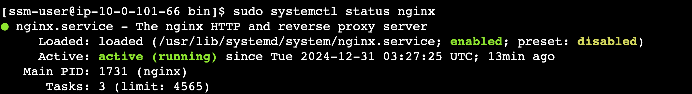

## 개요
* EKS에서 userdata를 설정하는 방법
* **AL2023 EKS AMI 기준** 으로 설명

## 실습환경
* [EKS 1.30](./terraform/)

## Managed Node group 예제

* Managed NodeGroup은 EKS managed node group의 launch template에서 user data를 설정합니다.

### userdata 확인

* [userdata 파일](./terraform/userdata.tpl)을 확인합니다. user data는 EC2인스턴스가 실행 될 때, nginx를 설치하고 실행합니다. user data는 MIME포맷으로 작성되어 있습니다.

```sh
MIME-Version: 1.0
Content-Type: multipart/mixed; boundary="==MYBOUNDARY=="

--==MYBOUNDARY==
Content-Type: text/x-shellscript; charset="us-ascii"

#!/bin/bash
dnf update -y
dnf install -y nginx

systemctl start nginx
systemctl enable nginx

--==MYBOUNDARY==--
```

### kubectl get node

user data가 설정된 EC2 인스턴스가 EKS 클러스터에 조인되었는지 확인합니다.

```sh
kubectl get node
```


### AWS console에서 EC2 인스턴스 user data 확인

* EC2인스턴스 콘솔에서 이전 단계에서 확인한 user data가 설정되었는지 확인합니다.


### EC2 인스턴스에서 nginx 실행 확인

* EC2 인스턴스 쉘에서 nginx가 실행되고 있는지 확입합니다.

```sh
systemctl status nginx
```



## karpenter 예제

### 실습환경

* [karpenter 1.1](./helmfile.md)

### nodeclass, nodepool 배포

```sh
kubectl apply -f ./manifests/karpenter_config
```

### nodeclass, nodepool 배포 배포 확인

```sh
$ kubectl get EC2NodeClass,nodepool
NAME                                     READY   AGE
ec2nodeclass.karpenter.k8s.aws/example   True    63s

NAME                            NODECLASS   NODES   READY   AGE
nodepool.karpenter.sh/example   example     1       True    5m27s
```

### user data 확인

```sh
cat ./manifests/karpenter_config/nodeclass.yaml
...생략
  userData: |
    #!/bin/bash
    dnf update -y
    dnf install -y nginx
    systemctl start nginx
    systemctl enable nginx
```

### 더미 pod 배포

* karpenter node를 생성하기 위한 더미 pod 배포

```sh
kubectl apply -f ./manifests/inflate_deployment.yaml
```

### karpenter node 생성확인

```sh
$ kubectl get nodeclaims
NAME            TYPE          CAPACITY   ZONE              NODE                                             READY   AGE
example-hbs97   t3a.2xlarge   spot       ap-northeast-2c   ip-10-0-101-53.ap-northeast-2.compute.internal   True    2m44s
```

### EKS 노드 상태 확인

* karpenter node가 Ready인지 확인

```sh
$ kubectl get node
NAME                                             STATUS   ROLES    AGE     VERSION
ip-10-0-101-53.ap-northeast-2.compute.internal   Ready    <none>   2m15s   v1.30.6-eks-94953ac
```

### AWS console에서 user data 확인


### EC2 인스턴스에서 nginx 실행 확인

* EC2 인스턴스 쉘에서 nginx가 실행되고 있는지 확입합니다.

```sh
systemctl status nginx
```


## 참고자료
* https://docs.aws.amazon.com/ko_kr/eks/latest/userguide/launch-templates.html
* https://docs.aws.amazon.com/ko_kr/eks/latest/userguide/eks-optimized-ami.html
* https://youtu.be/lHYiew91iHY?feature=shared
