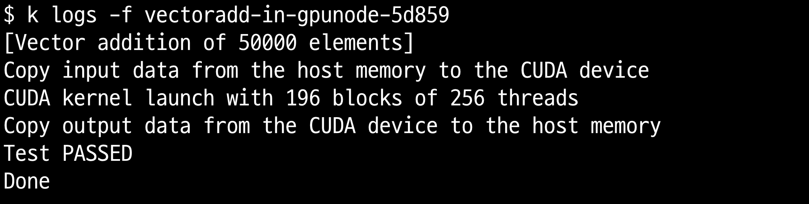
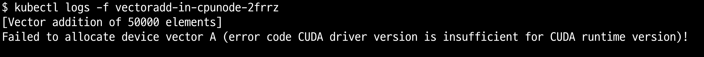

## 개요

* EKS에서 nvidia GPU 노드를 생성하고 cuda 샘플 실행
* 실습 영상: https://youtube.com/shorts/5UToQbNvEdw?si=3JyVz3OaoMrShUXc

## 실습환경

* [EKS 1.32](./terraform/)
* 인스턴스 g6.xlarge

## 실습환경 구축

1. EKS와 managed node group 배포

* [EKS](./terraform/)는 테라폼으로 구축했습니다. 테라폼 모듈은 저의 EKS 모듈을 사용했습니다. EKS blueprint 또는 편한 방법으로 EKS를 배포하시면 됩니다.
* 저의 테라폼 모듈에는 g6.xlarge gpu 노드와 EKS 최적화 가속 AMI를 사용합니다.

```sh
$ cat ./terraform/terraform.tfvars
managed_node_groups = {
  ...
  # GPU 노드 예제
  "managed-node-group-gpu-a" = {
    node_group_name = "managed-node-group-gpu-a",
    instance_types  = ["g6.xlarge"],
    capacity_type   = "ON_DEMAND",
    # EKS nvidia GPU optimized AMI
    release_version = "1.32.3-20250501",
    ami_type      = "AL2023_x86_64_NVIDIA",
    disk_size       = 20,
    desired_size    = 1,
    max_size        = 1,
    min_size        = 1,
    labels = {
      "nvidia.com/gpu" = "true",
      "node-type" = "managed-node-group-gpu-a"
    }
    taints = [
      {
        key    = "nvidia.com/gpu"
        value  = "true"
        effect = "NO_SCHEDULE"
      }
    ]
  },
}
```

2. kubernetes nvidia device plugin 배포

* 쿠버네티스가 nvidia 디바이스를 인식하기 위해 위해 nvidia device plugin을 배포합니다.
* 저는 helmfile을 사용하여 nvidia device plugin helm chart를 릴리즈합니다.

```sh
helmfile apply
```

```sh
kubectl get pod -n nvidia-device-plugin
```

## 실습

1. gpu node에 cuda sample job(kubernets)배포

* nvidia device plugin이 잘 설치되었더라면, job은 성공합니다.

```sh
kubectl apply -f ./manifests/cuda_sample/cuda_sample_job_in_gpunode.yaml
```



2. gpu node에 cuda sample job(kubernets)배포

* cpu node는 gpu가 없으므로 kubernetes job 실행을 실패합니다.



## 참고자료

* https://catalog.ngc.nvidia.com/orgs/nvidia/teams/k8s/containers/cuda-sample
