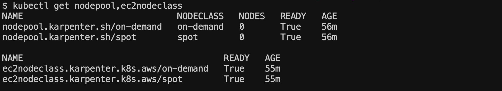

<!-- TOC -->

- [개요](#%EA%B0%9C%EC%9A%94)
- [실습환경](#%EC%8B%A4%EC%8A%B5%ED%99%98%EA%B2%BD)
- [실습환경 구축](#%EC%8B%A4%EC%8A%B5%ED%99%98%EA%B2%BD-%EA%B5%AC%EC%B6%95)
- [on-demand,spot 비율 설정시 주의사항](#on-demandspot-%EB%B9%84%EC%9C%A8-%EC%84%A4%EC%A0%95%EC%8B%9C-%EC%A3%BC%EC%9D%98%EC%82%AC%ED%95%AD)
- [테스트 결과](#%ED%85%8C%EC%8A%A4%ED%8A%B8-%EA%B2%B0%EA%B3%BC)
  - [karpenter nodepool, nodeclass 배포](#karpenter-nodepool-nodeclass-%EB%B0%B0%ED%8F%AC)
  - [deployment replica 5개](#deployment-replica-5%EA%B0%9C)
  - [deployment replica 20개](#deployment-replica-20%EA%B0%9C)
- [참고자료](#%EC%B0%B8%EA%B3%A0%EC%9E%90%EB%A3%8C)

<!-- /TOC -->

## 개요
* pod의 nodeAffinity설정으로, karpenter가 생성하는 노드 on-demand,spot 비율을 조절

## 실습환경
* [EKS 1.30](./terraform/)
* [karpenter 1.11](./helmfile.yaml)

## 실습환경 구축
* [EKS](./terraform/)는 테라폼으로 구축했습니다. 테라폼 모듈은 저의 EKS 모듈을 사용했습니다.
* [karpenter](./helmfile.md)는 helm으로 배포 했습니다. helm 배포는 helmfile 도구를 사용했습니다.

## on-demand,spot 비율 설정시 주의사항
1. consolidation 효율이 떨어진다.
* on-demand, spot을 분리했기 때문에 각 노드에 대해서만 consolidation이 설정됨
2. pod replica 개수가 적으면 서비스 장애 확률이 증가
* consoliation, drift로 on-demand 노드가 교체될 때, spot 노드가 죽으면 서비스 장애 발생
* pod replica개수가 많을 수록 노드 개수가 많아지므로 안전성이 증가

## 테스트 결과

### karpenter nodepool, nodeclass 배포

1. 배포

```sh
kubectl applyf ./manifests/karepnter_config
```

2. 확인

```sh
$ kubectl get nodepool,ec2nodeclass
```



### deployment replica 5개

1. deployment 배포

```sh
kubectl applyf ./manifests/inflate_deployment.yaml
```

2. 노드 조회: **노드 labels에서 capacity-spread를 주목**

```sh
kubectl get node -L capacity-spread -L karpenter.sh/capacity-type -L node.kubernetes.io/instance-type
```


3. 파편화 확인

```sh
eks-node-viewer
```


### deployment replica 20개

1. deployment replica를 20개로 설정

```sh
kubectl edit deploy inflate
---
replica: 20
```

2. 노드 조회: replica 5일때 노드 상황과 같음

```sh
kubectl get node -L capacity-spread -L karpenter.sh/capacity-type -L node.kubernetes.io/instance-type
```


3. 파편화 확인

```sh
eks-node-viewer
```


## 참고자료
* https://medium.com/@talhakhalid101/karpenter-the-future-of-worker-management-and-autoscaling-on-kubernetes-b564d393dea4
