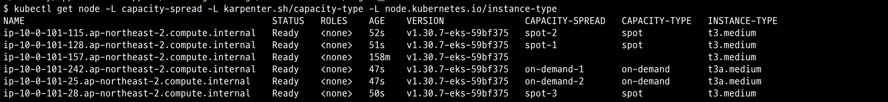
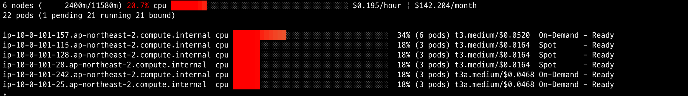
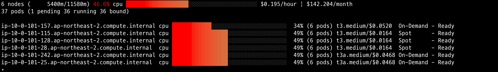

## 개요
* pod의 nodeAffinity설정으로, karpenter가 생성하는 노드 on-demand,spot 비율을 조절

## 실습환경
* [EKS 1.30](./terraform/)
* [karpenter 1.11](./helmfile.yaml)

## 실습환경 구축
* [EKS](./terraform/)는 테라폼으로 구축했습니다. 테라폼 모듈은 저의 EKS 모듈을 사용했습니다.
* [karpenter](./helmfile.md)는 helm으로 배포 했습니다. helm 배포는 helmfile 도구를 사용했습니다.

## 주의사항
1. consolidation 효율이 떨어진다.
* on-demand, spot을 분리했기 때문에 각 노드에 대해서만 consolidation이 설정됨
2. pod replica 개수가 적으면 서비스 장애 확률이 증가
* consoliation, drift로 on-demand 노드가 교체될 때, spot 노드가 죽으면 서비스 장애 발생
* pod replica개수가 많을 수록 노드 개수가 많아지므로 안전성이 증가

## 테스트 결과

### deployment replica 5개

* 노드 조회: **노드 labels에서 capacity-spread를 주목**

```sh
kubectl get node -L capacity-spread -L karpenter.sh/capacity-type -L node.kubernetes.io/instance-type
```



* 파편화 확인

```sh
eks-node-viewer
```



### deployment replica 20개

> deployment replica를 20개로 설정

* 노드 조회: replica 5일때 노드 상황과 같음

```sh
kubectl get node -L capacity-spread -L karpenter.sh/capacity-type -L node.kubernetes.io/instance-type
```


* 파편화 확인

```sh
eks-node-viewer
```



## 참고자료
* https://medium.com/@talhakhalid101/karpenter-the-future-of-worker-management-and-autoscaling-on-kubernetes-b564d393dea4
