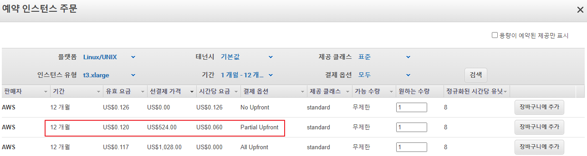
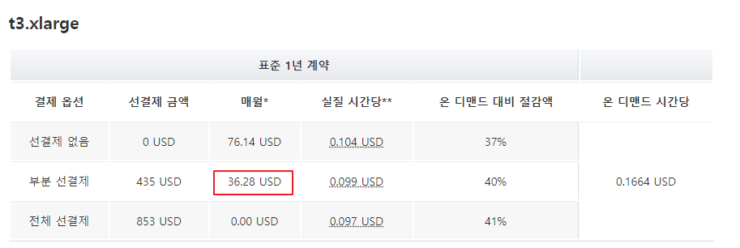
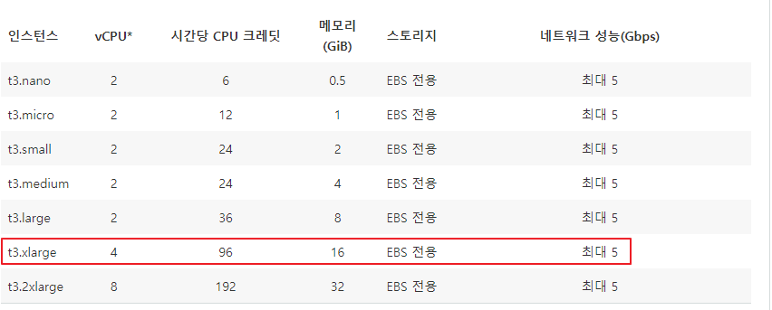

# EC2 인스턴스 비용 계산

## 부분결제 비용
* 인스턴스 유형: t3.xlarge
* 기간: 1년
* 선결제: $524
* 월요금: $36 

출처: aws 예약 인스턴스 주문 시 나오는 창

[출처: aws 공식문서-예약 인스턴스 요금](https://aws.amazon.com/ko/ec2/pricing/reserved-instances/pricing/)

 

## EC2 인스턴스 사양
* CPU: 4 core
* 메모리: 16GB

[출처: aws 공식문서-ec2 instance](https://aws.amazon.com/ko/ec2/instance-types/)