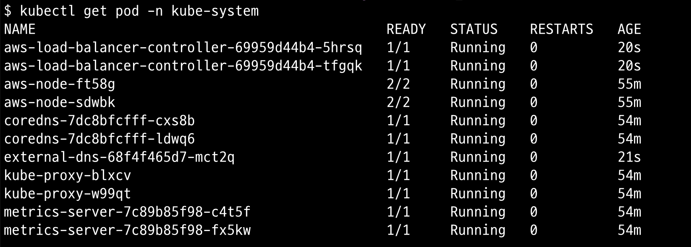

# helmfile

helmfile을 사용하여 EKS 환경에 helm chart를 자동으로 배포합니다.

## 목차

<!-- TOC -->

- [helmfile](#helmfile)
  - [목차](#%EB%AA%A9%EC%B0%A8)
  - [준비](#%EC%A4%80%EB%B9%84)
  - [helmfile apply](#helmfile-apply)
  - [helmfile destroy](#helmfile-destroy)

<!-- /TOC -->

## 준비

1. helmfile을 설치합니다.

```sh
brew install helmfile
```

2. helmfile 플러그인을 설치합니다.

```sh
helmfile init
```

## helmfile apply

1. helmfile.yaml 파일에서 환경변수 값을 수정합니다.
2. helmfile apply 명령어로 helm Chart를 배포합니다.

```sh
helmfile apply
```

3. 배포된 리소스의 상태를 확인합니다.

```sh
$ kubectl -n kube-system get pod
```



## helmfile destroy

실습이 끝나면 배포한 helm 릴리스를 삭제합니다.

```sh
helmfile destroy
```
