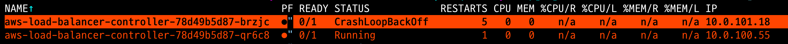
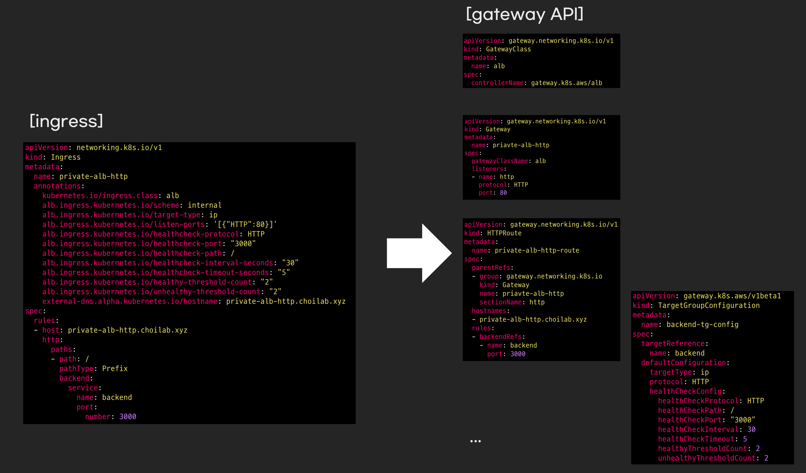
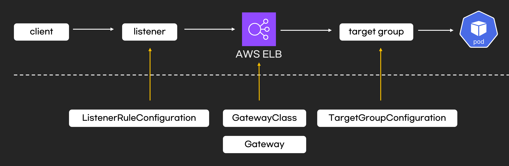

# EKS Gateway API Hands-on

AWS EKS에서 ALB Controller를 사용하여 Kubernetes Gateway API를 실습합니다.

## 목차

<!-- TOC -->

- [EKS Gateway API Hands-on](#eks-gateway-api-hands-on)
  - [목차](#%EB%AA%A9%EC%B0%A8)
  - [EKS에서 Gateway API](#eks%EC%97%90%EC%84%9C-gateway-api)
  - [실습 환경 구축](#%EC%8B%A4%EC%8A%B5-%ED%99%98%EA%B2%BD-%EA%B5%AC%EC%B6%95)
    - [사전 요구사항](#%EC%82%AC%EC%A0%84-%EC%9A%94%EA%B5%AC%EC%82%AC%ED%95%AD)
    - [ALB Controller: v2.17.0 사용](#alb-controller-v2170-%EC%82%AC%EC%9A%A9)
    - [ALB Controller Feature Flag 확인](#alb-controller-feature-flag-%ED%99%95%EC%9D%B8)
    - [ExternalDNS v0.19.0 사용](#externaldns-v0190-%EC%82%AC%EC%9A%A9)
    - [ExternalDNS에서 gateway API호환 설정](#externaldns%EC%97%90%EC%84%9C-gateway-api%ED%98%B8%ED%99%98-%EC%84%A4%EC%A0%95)
    - [Gateway API CRD 설치](#gateway-api-crd-%EC%84%A4%EC%B9%98)
  - [실습](#%EC%8B%A4%EC%8A%B5)
    - [시나리오1. Public/Private ALB + TLS](#%EC%8B%9C%EB%82%98%EB%A6%AC%EC%98%A41-publicprivate-alb--tls)

<!-- /TOC -->

## EKS에서 Gateway API

EKS환경에서 Gateway API를 사용하려면 2025.12기준으로 VPC Lattice만 stable입니다. AWS ALC 또는 ALB controller는 실험단계 입니다. 제가 ALB controller로 gateway API를 사용해보니 설정이 많이 없고 불안정했습니다. 불안정하다는 뜻은 제가 설정을 잘못하면 ALB controller pod가 Crashloopbackoff가 발생하면서 계속 pod가 재부팅되었습니다.



ALB controller의 설정 원리는 아래 그림과 같습니다. ingress와 비교한다면, ingress 또는 service annotations의 설정을 전부 kubernetes CRD로 옮겨야 합니다.



kubernetes와 AWS layer를 매핑시키면 아래 구조가 됩니다.



## 실습 환경 구축

### 사전 요구사항

ALB controller에서 gateway API를 테스트하기 위해 아래버전과 설정을 했습니다.

### 1. ALB Controller: v2.17.0 사용

### 2. ALB Controller Feature Flag 확인

2025년 12월 기준, ALB Controller에서 Gateway API를 사용하려면 feature flag를 활성화해야 합니다.

```sh
kubectl get deployment -n kube-system aws-load-balancer-controller \
  -o jsonpath='{.spec.template.spec.containers[0].args}' | jq -r '.[]' | grep -i feature
```


### 3. ExternalDNS v0.19.0 사용

### 4. ExternalDNS에서 gateway API호환 설정

externalDNS args의 source부분에 gateway를 설정해야, gateway API에 설정된 hostname을 도메인으로 만듭니다.

```yaml
containers:
  - name: external-dns
    image: registry.k8s.io/external-dns/external-dns:v0.20.0
    args:
    # Add desired Gateway API Route sources.
    - --source=gateway-httproute
    - --source=gateway-grpcroute
    - --source=gateway-tlsroute
    - --source=gateway-tcproute
    - --source=gateway-udproute
```

### 5. Gateway API CRD 설치

Kubernetes Gateway API CRD를 설치합니다.

```sh
# Standard Gateway API CRDs
kubectl apply -f https://github.com/kubernetes-sigs/gateway-api/releases/download/v1.2.0/standard-install.yaml
# Experimental Gateway API CRDs, Used for L4 Routes
kubectl apply -f https://github.com/kubernetes-sigs/gateway-api/releases/download/v1.2.0/experimental-install.yaml
```

CRD 설치 확인:

```sh
kubectl get crd gatewayclasses.gateway.networking.k8s.io
kubectl get crd gateways.gateway.networking.k8s.io
kubectl get crd httproutes.gateway.networking.k8s.io
```

## 실습

1. [internal ALB 생성](./manifests/eks/01_private_alb_http_simple/)
