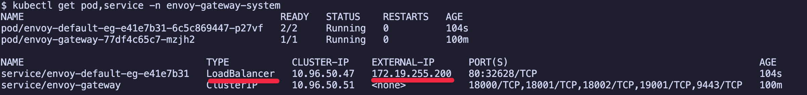
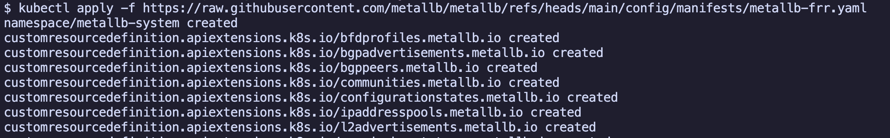
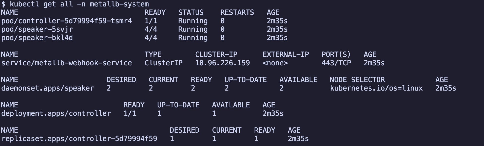
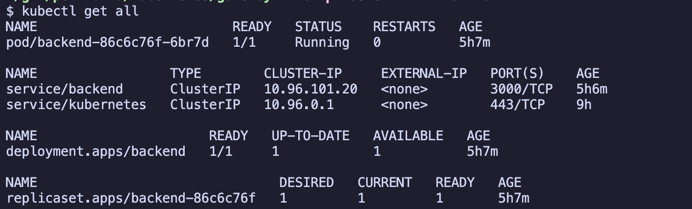
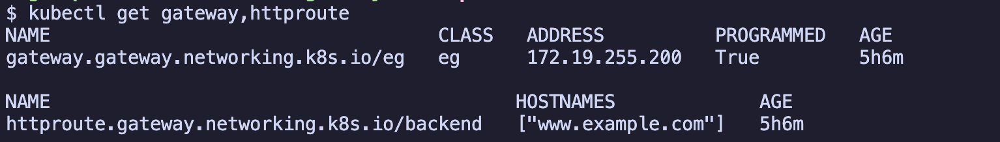
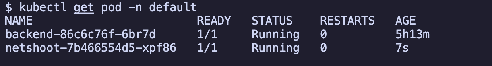
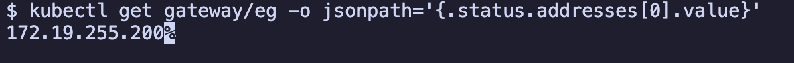
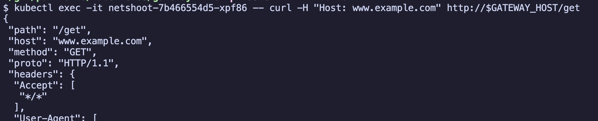

# Kubernetes Gateway API 실습 (Kind cluster)

* Kind cluster에서 Kubernetes Gateway API 실습

## 목차

<!-- TOC -->

- [Kubernetes Gateway API 실습 Kind cluster](#kubernetes-gateway-api-%EC%8B%A4%EC%8A%B5-kind-cluster)
  - [목차](#%EB%AA%A9%EC%B0%A8)
  - [환경구축](#%ED%99%98%EA%B2%BD%EA%B5%AC%EC%B6%95)
  - [실습](#%EC%8B%A4%EC%8A%B5)

<!-- /TOC -->

## 환경구축

1. Kind cluster 생성

```sh
cd kind-cluster
kind create cluster --config kind-config.yaml
```

2. MetalLB 설치

Envoy Gateway는 envoy proxy pod와 service를 생성하는데, service는 LoadBalancer 타입입니다. Kind cluster에서는 LoadBalancer 타입을 인식하지 못하기 때문에 MetalLB를 사용하여 LoadBalancer 타입을 활성화했습니다.



```sh
kubectl apply -f https://raw.githubusercontent.com/metallb/metallb/refs/heads/main/config/manifests/metallb-frr.yaml
```



```sh
kubectl get all -n metallb-system
```



3. MetalLB VIP 생성

MetalLB는 LoadBalancer external IP 할당을 위해 VIP(Virtual IP, 가상 IP)를 설정합니다. LoadBalancer 타입을 사용하는 service는 MetalLB에 설정된 VIP 중 하나를 사용합니다.

```yaml
# 설정 예시:
apiVersion: metallb.io/v1beta1
kind: IPAddressPool
metadata:
  name: first-pool
  namespace: metallb-system
spec:
  addresses:
  - 172.19.255.200-172.19.255.250
```

```sh
kubectl apply -f ./manifests/metallb
```

## 실습

1. Envoy Gateway 설치

- helm을 사용하여 Envoy Gateway를 설치합니다.

```sh
helm install eg oci://docker.io/envoyproxy/gateway-helm \
  --version v1.6.1 \
  -n envoy-gateway-system --create-namespace
```


2. quickstart 예제 배포

[Envoy Gateway에서 제공하는 quickstart 공식 예제를](https://gateway.envoyproxy.io/docs/tasks/quickstart/) 배포합니다.

```sh
kubectl apply -f ./manifests/envoy_gateway/quickstart
```

quickstart 예제는 backend pod와 service를 포함합니다.

```sh
kubectl get all
```



그리고 Gateway API를 통해 pod를 호출하기 위해 gateway 및 httproute 설정도 배포됩니다.

```sh
kubectl get gateway,httproute
```




gateway 리소스는 envoy-gateway-system namespace에 envoy proxy pod와 LoadBalancer 타입 service를 생성합니다. envoy proxy는 backend pod로 들어오는 요청을 받아 backend pod로 라우팅합니다.

```sh
kubectl get pod,service -n envoy-gateway-system
```

3. 로컬 환경에서는 Kind cluster에 생성된 LoadBalancer 타입 service를 직접 호출할 수 없습니다. 따라서 netshoot pod를 통해 LoadBalancer 타입 service 호출 테스트를 진행했습니다.

```sh
kubectl apply ./manifests/netshoot
kubectl get pod
```




```sh
# 1. LoadBalancer 타입 service의 external IP 조회
GATEWAY_HOST=$(kubectl get gateway/eg -o jsonpath='{.status.addresses[0].value}')

# 2. netshoot pod에서 (envoy) gateway로 요청
kubectl exec -it {netshoot pod} -- curl -H "Host: www.example.com" http://$GATEWAY_HOST/get
```




