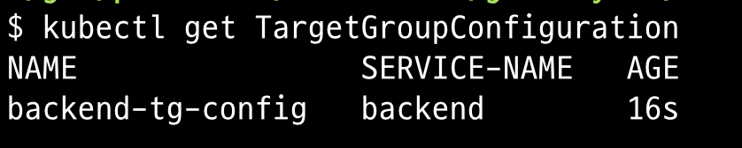
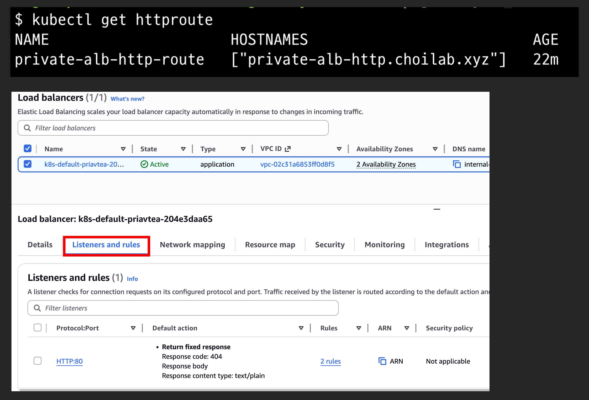
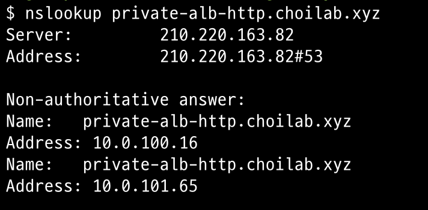
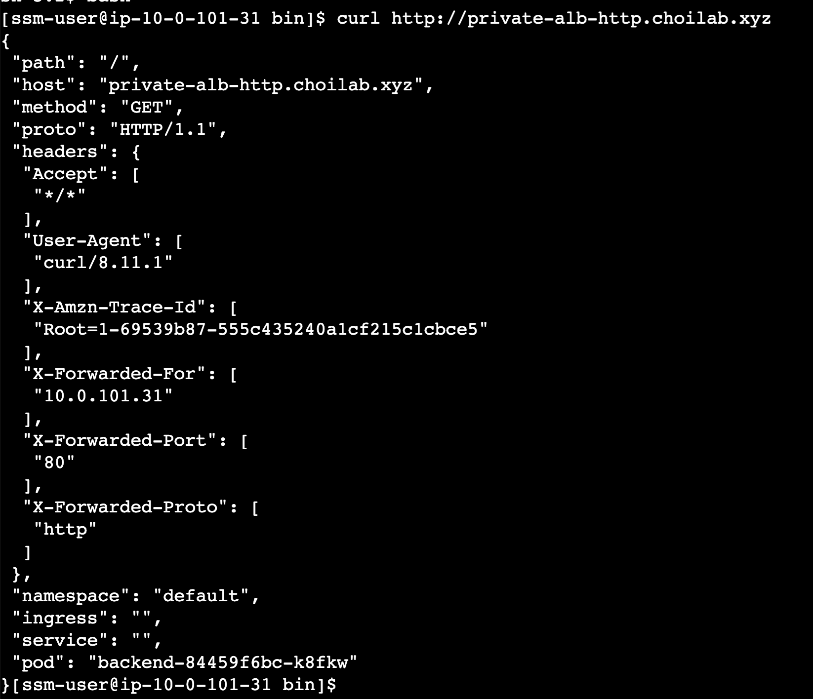

# Private ALB HTTP (Simple)

가장 기본적인 Gateway API 예제입니다. LoadBalancerConfiguration 없이 기본 설정으로 Private ALB를 생성합니다.

## 특징

- LoadBalancerConfiguration: 사용 안 함
- Scheme: 기본값 (internal) - 서브넷 태그에 따라 결정됨
- Subnet: 자동 선택 (kubernetes.io/role/internal-elb 태그 기반)
- Protocol: HTTP:80
- Target Type: IP mode (TargetGroupConfiguration 사용)
- Route53: private-alb-http.choilab.xyz

## 배포 순서

### 1. GatewayClass 생성

```sh
kubectl apply -f gatewayclass.yaml
```

### 2. Gateway 생성

```sh
kubectl apply -f gateway.yaml
```

### 3. Backend 배포

```sh
kubectl apply -f backend.yaml
```

### 4. TargetGroupConfiguration 생성


```sh
kubectl apply -f targetgroupconfig.yaml
```

```sh
kubectl get TargetGroupConfiguration
```



중요: TargetGroupConfiguration은 Service의 Target Type을 IP mode로 설정합니다. 이를 통해 pod IP가 직접 ALB target group에 등록됩니다.

```yaml
apiVersion: gateway.k8s.aws/v1beta1
kind: TargetGroupConfiguration
metadata:
  name: backend-tg-config
spec:
  targetReference:
    name: backend
  defaultConfiguration:
    targetType: ip
    protocol: HTTP
... 이하 생략
```

### 5. HTTPRoute 생성

```sh
kubectl apply -f httproute.yaml
```

```sh
kubectl get httproute
```



### 6. Route53 레코드 생성 확인

httproute HOSTNAMES 필드에 설정된 도메인은 externalDNS가 Route53 레코드로 생성합니다. 따라서 nslookup으로 DNS 질의가 가능합니다.

```sh
nslookup private-alb-http.choilab.xyz
```



## 검증

Private ALB는 VPC 내부에서만 접근 가능합니다. 따라서 EC2 인스턴스에서 테스트를 진행했습니다.

```sh
# EC2 인스턴스에서 실행
curl http://private-alb-http.choilab.xyz
```



## 정리

```sh
kubectl delete -f httproute.yaml
kubectl delete -f targetgroupconfig.yaml
kubectl delete -f backend.yaml
kubectl delete -f gateway.yaml
kubectl delete -f gatewayclass.yaml
```
