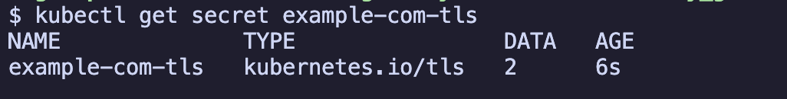
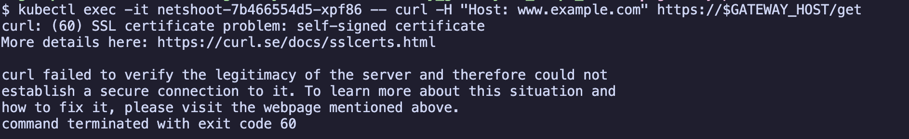
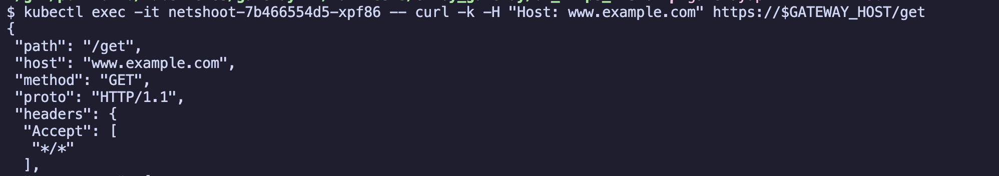
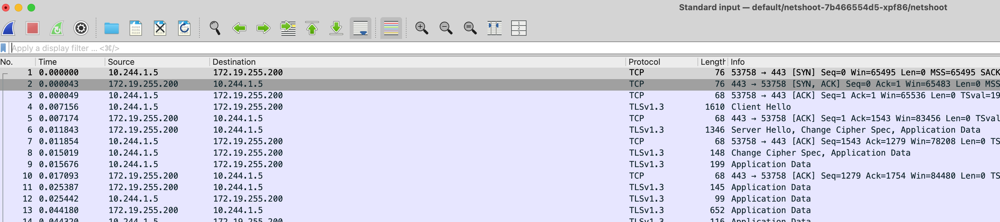

# HTTPS/TLS 설정

- Envoy Gateway에서 HTTPS/TLS 인증서를 설정하여 암호화된 통신을 구성하는 실습입니다.

## 개요

프로덕션 환경에서는 HTTP 대신 HTTPS를 사용하여 안전한 통신을 보장해야 합니다. 이 예제에서는 self-signed certificate를 사용하여 Gateway에 TLS를 설정합니다.

## 목차

<!-- TOC -->

- [HTTPS/TLS 설정](#httpstls-%EC%84%A4%EC%A0%95)
  - [개요](#%EA%B0%9C%EC%9A%94)
  - [목차](#%EB%AA%A9%EC%B0%A8)
  - [사전 준비](#%EC%82%AC%EC%A0%84-%EC%A4%80%EB%B9%84)
  - [실습](#%EC%8B%A4%EC%8A%B5)
  - [주요 설정 포인트](#%EC%A3%BC%EC%9A%94-%EC%84%A4%EC%A0%95-%ED%8F%AC%EC%9D%B8%ED%8A%B8)
    - [Gateway의 TLS 설정](#gateway%EC%9D%98-tls-%EC%84%A4%EC%A0%95)
  - [정리](#%EC%A0%95%EB%A6%AC)
  - [참고자료](#%EC%B0%B8%EA%B3%A0%EC%9E%90%EB%A3%8C)

<!-- /TOC -->

## 사전 준비

- kind cluster 및 Envoy Gateway가 설치되어 있어야 합니다.
- [Envoy Gateway 실습 가이드](../../../example_envoy_gateway.md)를 먼저 완료하세요.

## 실습

1. self-signed certificate 생성

openssl을 사용하여 테스트용 인증서를 생성합니다.

```sh
# 1. 개인키 생성
openssl genrsa -out tls.key 2048

# 2. 인증서 서명 요청(CSR) 생성
openssl req -new -key tls.key -out tls.csr -subj "/CN=www.example.com/O=example"

# 3. 자체 서명 인증서 생성 (유효기간 365일)
openssl x509 -req -days 365 -in tls.csr -signkey tls.key -out tls.crt
```

2. kubernetes secret 생성

생성한 인증서와 개인 키를 Kubernetes secret으로 저장합니다.

```sh
kubectl create secret tls example-com-tls \
  --cert=tls.crt \
  --key=tls.key
```

확인:

```sh
kubectl get secret example-com-tls
```



3. backend 애플리케이션 배포

테스트용 backend 애플리케이션을 배포합니다.

```sh
kubectl apply -f backend.yaml
```

확인:

```sh
kubectl get pod,service
```

4. gateway 리소스 배포

HTTPS(443 포트)를 사용하는 gateway를 생성합니다. 이 gateway는 앞서 생성한 TLS secret을 참조합니다.

```sh
kubectl apply -f gateway.yaml
```

확인:

```sh
kubectl get gateway
```

5. HTTPRoute 배포

HTTPS 요청을 backend service로 라우팅하는 HTTPRoute를 생성합니다.

```sh
kubectl apply -f httproute.yaml
```

확인:

```sh
kubectl get httproute
```

6. 테스트

netshoot pod를 사용하여 HTTPS 요청을 테스트합니다.

```sh
# 1. gateway의 external IP 확인
GATEWAY_HOST=$(kubectl get gateway/eg-https -o jsonpath='{.status.addresses[0].value}')
echo $GATEWAY_HOST

# 2. netshoot pod가 없다면 배포
kubectl apply -f ../../../manifests/netshoot

# 3. netshoot pod 이름 가져오기
NETSHOOT_POD=$(kubectl get pod -l app=netshoot -o jsonpath='{.items[0].metadata.name}')
echo $NETSHOOT_POD

# 4. netshoot pod에서 HTTPS 요청 테스트 (자체 서명 인증서이므로 -k 옵션 사용)
kubectl exec -it $NETSHOOT_POD -- curl -k -H "Host: www.example.com" https://$GATEWAY_HOST/get
```

정상적으로 응답을 받으면 TLS가 정상 작동하는 것입니다.





7. TLS 핸드셰이크 확인

netshoot pod에서 tcpdump를 실행하면 TLS 핸드셰이크 과정을 볼 수 있습니다. kubectx sniff 플러그인을 사용하여 패킷을 캡처했습니다.

```sh
kubectl sniff $NETSHOOT_POD -n default
```



## 주요 설정 포인트

### Gateway의 TLS 설정

```yaml
listeners:
- name: https
  protocol: HTTPS
  port: 443
  tls:
    mode: Terminate  # TLS termination
    certificateRefs:
    - kind: Secret
      name: example-com-tls  # secret 참조
```

- `mode: Terminate`: Gateway에서 TLS termination을 수행하고, backend로는 평문(HTTP)으로 전달합니다.
- `certificateRefs`: TLS 인증서가 저장된 secret을 참조합니다.

## 리소스 정리

```sh
kubectl delete -f .
kubectl delete secret example-com-tls
```

## 참고자료

- https://gateway.envoyproxy.io/docs/tasks/security/tls-termination/
- https://kubernetes.io/docs/concepts/configuration/secret/#tls-secrets
