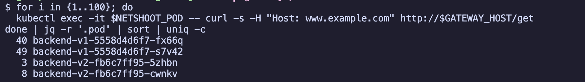
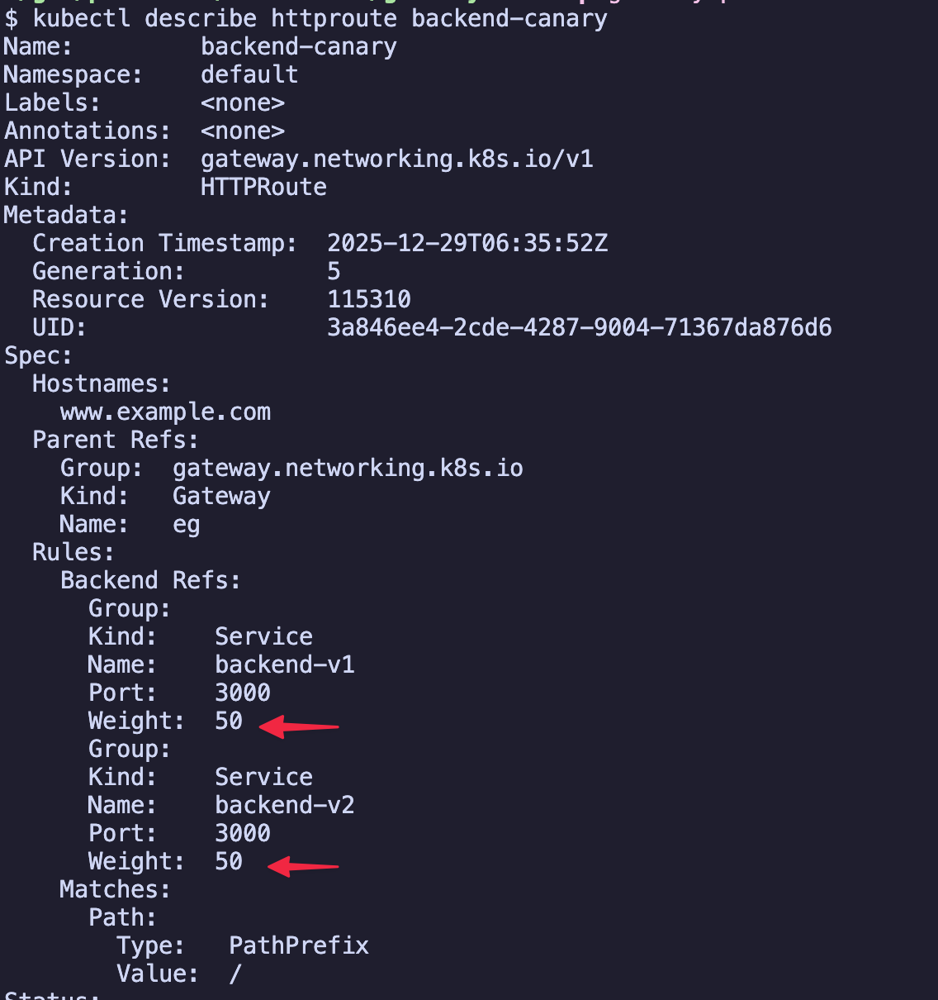
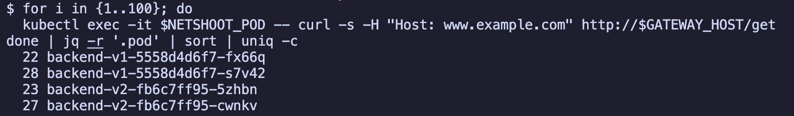
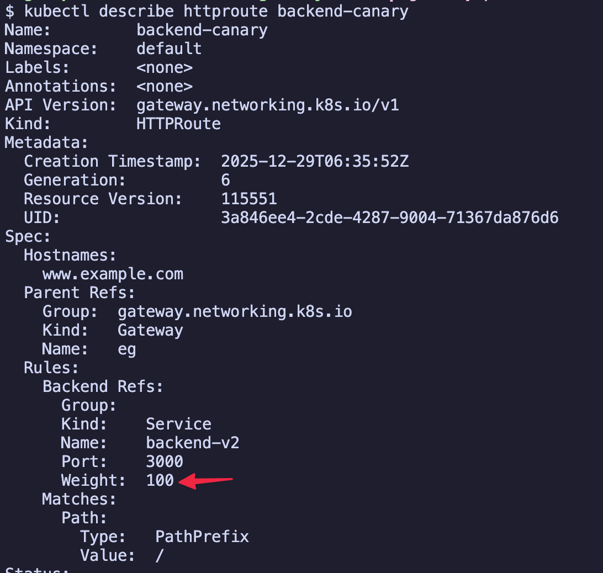
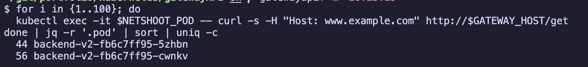

# canary 배포 (Canary Deployment)

- 트래픽 가중치에 따라 새 버전을 점진적으로 배포하는 실습입니다.

## 개요

이 예제에서는 HTTPRoute의 weight 설정을 사용하여 v1과 v2 버전 간 트래픽을 분산합니다. canary 배포는 새 버전에 트래픽 일부를 먼저 보내고, 문제가 없으면 점진적으로 트래픽 비율을 늘려가는 전략입니다.

## 목차

<!-- TOC -->

- [canary 배포 Canary Deployment](#canary-%EB%B0%B0%ED%8F%AC-canary-deployment)
  - [개요](#%EA%B0%9C%EC%9A%94)
  - [목차](#%EB%AA%A9%EC%B0%A8)
  - [사전 준비](#%EC%82%AC%EC%A0%84-%EC%A4%80%EB%B9%84)
  - [실습](#%EC%8B%A4%EC%8A%B5)
    - [백엔드 애플리케이션 배포 v1, v2](#%EB%B0%B1%EC%97%94%EB%93%9C-%EC%95%A0%ED%94%8C%EB%A6%AC%EC%BC%80%EC%9D%B4%EC%85%98-%EB%B0%B0%ED%8F%AC-v1-v2)
    - [gateway resource 배포](#gateway-resource-%EB%B0%B0%ED%8F%AC)
    - [초기 HTTPRoute 배포 90% v1, 10% v2](#%EC%B4%88%EA%B8%B0-httproute-%EB%B0%B0%ED%8F%AC-90%25-v1-10%25-v2)
    - [초기 트래픽 분산 테스트](#%EC%B4%88%EA%B8%B0-%ED%8A%B8%EB%9E%98%ED%94%BD-%EB%B6%84%EC%82%B0-%ED%85%8C%EC%8A%A4%ED%8A%B8)
    - [canary 트래픽 비율 증가 50% v1, 50% v2](#canary-%ED%8A%B8%EB%9E%98%ED%94%BD-%EB%B9%84%EC%9C%A8-%EC%A6%9D%EA%B0%80-50%25-v1-50%25-v2)
    - [50:50 트래픽 분산 테스트](#5050-%ED%8A%B8%EB%9E%98%ED%94%BD-%EB%B6%84%EC%82%B0-%ED%85%8C%EC%8A%A4%ED%8A%B8)
    - [완전 전환 100% v2](#%EC%99%84%EC%A0%84-%EC%A0%84%ED%99%98-100%25-v2)
    - [100% v2 트래픽 테스트](#100%25-v2-%ED%8A%B8%EB%9E%98%ED%94%BD-%ED%85%8C%EC%8A%A4%ED%8A%B8)
  - [주요 설정 포인트](#%EC%A3%BC%EC%9A%94-%EC%84%A4%EC%A0%95-%ED%8F%AC%EC%9D%B8%ED%8A%B8)
    - [HTTPRoute의 가중치 설정](#httproute%EC%9D%98-%EA%B0%80%EC%A4%91%EC%B9%98-%EC%84%A4%EC%A0%95)
  - [canary 배포 전략](#canary-%EB%B0%B0%ED%8F%AC-%EC%A0%84%EB%9E%B5)
  - [리소스 정리](#%EB%A6%AC%EC%86%8C%EC%8A%A4-%EC%A0%95%EB%A6%AC)

<!-- /TOC -->

## 사전 준비

- kind cluster 및 envoy gateway가 설치되어 있어야 합니다.
- [envoy gateway 실습 가이드](../../../example_envoy_gateway.md)를 먼저 완료하세요.

## 실습

### 1. 백엔드 애플리케이션 배포 (v1, v2)

두 가지 버전의 백엔드 애플리케이션을 배포합니다.

```sh
kubectl apply -f backend-v1.yaml
kubectl apply -f backend-v2.yaml
```

확인:
```sh
kubectl get pod,service -l app=backend
```

### 2. gateway resource 배포

HTTP 트래픽을 받을 gateway를 생성합니다.

```sh
kubectl apply -f gateway.yaml
```

확인:
```sh
kubectl get gateway
```

### 3. 초기 HTTPRoute 배포 (90% v1, 10% v2)

초기에는 트래픽의 90%를 기존 v1으로, 10%만 새 버전 v2로 라우팅합니다.

```sh
kubectl apply -f httproute-canary-10.yaml
```

확인:
```sh
kubectl get httproute
kubectl describe httproute backend-canary
```

### 4. 초기 트래픽 분산 테스트

여러 번 요청을 보내서 v1과 v2로 트래픽이 분산되는지 확인합니다.

```sh
# 1. gateway의 external IP 확인
GATEWAY_HOST=$(kubectl get gateway/eg -o jsonpath='{.status.addresses[0].value}')
echo $GATEWAY_HOST

# 2. netshoot pod가 없다면 배포
kubectl apply -f ../../../manifests/netshoot

# 3. netshoot pod 이름 가져오기
NETSHOOT_POD=$(kubectl get pod -l app=netshoot -o jsonpath='{.items[0].metadata.name}')
echo $NETSHOOT_POD

# 4. 100번 요청을 보내서 pod별 응답 비율 확인
for i in {1..100}; do
  kubectl exec -it $NETSHOOT_POD -- curl -s -H "Host: www.example.com" http://$GATEWAY_HOST/get
done | jq -r '.pod' | sort | uniq -c
```

출력 예시: v1과 v2의 응답 비율이 대략 9:1 정도로 나타나야 합니다.

```sh
90 backend-v1-5558d4d6f7-fx66q
10 backend-v2-7d8f9c5b4a-abc12
```




### 5. canary 트래픽 비율 증가 (50% v1, 50% v2)

v2에 문제가 없다고 판단되면, 트래픽 비율을 50:50으로 조정합니다.

```sh
kubectl apply -f httproute-canary-50.yaml
```

확인:

```sh
kubectl describe httproute backend-canary
```



### 6. 50:50 트래픽 분산 테스트

```sh
# 100번 요청을 보내서 pod별 응답 비율 확인
for i in {1..100}; do
  kubectl exec -it $NETSHOOT_POD -- curl -s -H "Host: www.example.com" http://$GATEWAY_HOST/get
done | jq -r '.pod' | sort | uniq -c
```

출력 예시: v1과 v2가 대략 5:5 비율로 응답해야 합니다.

```sh
50 backend-v1-5558d4d6f7-fx66q
50 backend-v2-7d8f9c5b4a-abc12
```



### 7. 완전 전환 (100% v2)

v2가 안정적이라고 판단되면, 모든 트래픽을 v2로 전환합니다.

```sh
kubectl apply -f httproute-canary-100.yaml
```

확인:

```sh
kubectl describe httproute backend-canary
```



### 8. 100% v2 트래픽 테스트

```sh
# 100번 요청을 보내서 pod별 응답 비율 확인
for i in {1..100}; do
  kubectl exec -it $NETSHOOT_POD -- curl -s -H "Host: www.example.com" http://$GATEWAY_HOST/get
done | jq -r '.pod' | sort | uniq -c
```

출력 예시: 모든 응답이 v2에서 와야 합니다.

```
100 backend-v2-7d8f9c5b4a-abc12
```



## 주요 설정 포인트

### HTTPRoute의 가중치 설정

- weight: 각 백엔드로 보낼 트래픽의 상대적 비율을 의미합니다.
- weight의 합계는 임의의 숫자가 될 수 있으며, 상대적인 비율로 계산됩니다.

```yaml
rules:
- backendRefs:
  - name: backend-v1
    port: 3000
    weight: 90  # 90% 트래픽
  - name: backend-v2
    port: 3000
    weight: 10  # 10% 트래픽
```

## canary 배포 전략

1. **초기 배포 (10%)**: 새 버전에 소량의 트래픽만 보내서 문제를 확인합니다.
2. **점진적 증가 (25%, 50%, 75%)**: 문제가 없으면 트래픽 비율을 점진적으로 증가시킵니다.
3. **완전 전환 (100%)**: 최종적으로 모든 트래픽을 새 버전으로 전환합니다.
4. **롤백**: 문제가 발생하면 weight를 다시 조정하여 즉시 이전 버전으로 롤백합니다.

## 리소스 정리

```sh
kubectl delete -f .
```
