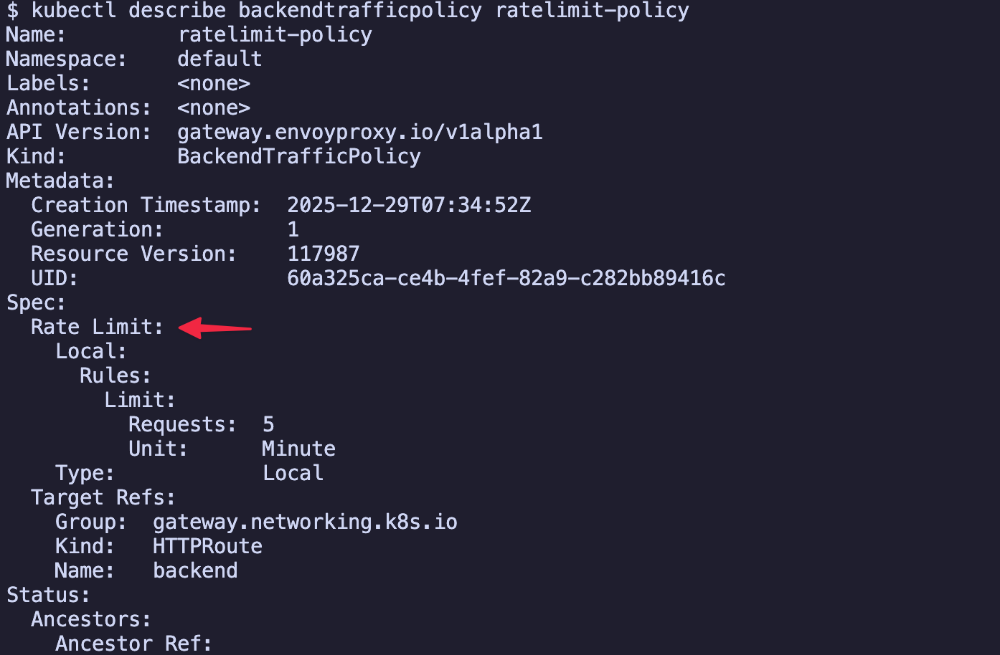
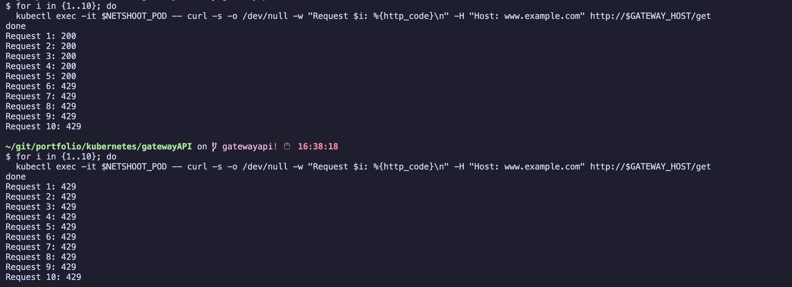
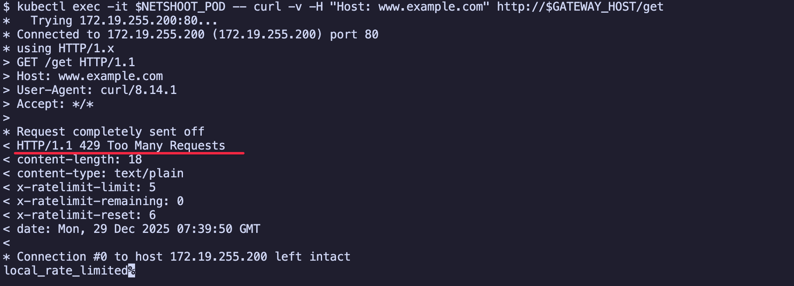

# 요청 속도 제한 (Rate Limiting)

- envoy gateway에서 요청 속도를 제한하여 과도한 트래픽으로부터 서비스를 보호하는 실습입니다.

## 개요

프로덕션 환경에서는 DDoS 공격이나 과도한 요청으로부터 서비스를 보호해야 합니다. Rate Limiting은 특정 시간 동안 허용되는 요청 수를 제한하여 서비스의 안정성을 보장합니다. envoy gateway에서는 BackendTrafficPolicy 리소스를 사용하여 Rate Limiting을 설정할 수 있습니다.

## 목차

<!-- TOC -->

- [요청 속도 제한 Rate Limiting](#%EC%9A%94%EC%B2%AD-%EC%86%8D%EB%8F%84-%EC%A0%9C%ED%95%9C-rate-limiting)
  - [개요](#%EA%B0%9C%EC%9A%94)
  - [목차](#%EB%AA%A9%EC%B0%A8)
  - [사전 준비](#%EC%82%AC%EC%A0%84-%EC%A4%80%EB%B9%84)
  - [실습](#%EC%8B%A4%EC%8A%B5)
    - [백엔드 애플리케이션 배포](#%EB%B0%B1%EC%97%94%EB%93%9C-%EC%95%A0%ED%94%8C%EB%A6%AC%EC%BC%80%EC%9D%B4%EC%85%98-%EB%B0%B0%ED%8F%AC)
    - [gateway 리소스 배포](#gateway-%EB%A6%AC%EC%86%8C%EC%8A%A4-%EB%B0%B0%ED%8F%AC)
    - [HTTPRoute 배포](#httproute-%EB%B0%B0%ED%8F%AC)
    - [Rate Limiting 정책 없이 테스트](#rate-limiting-%EC%A0%95%EC%B1%85-%EC%97%86%EC%9D%B4-%ED%85%8C%EC%8A%A4%ED%8A%B8)
    - [BackendTrafficPolicy 배포 Rate Limiting 적용](#backendtrafficpolicy-%EB%B0%B0%ED%8F%AC-rate-limiting-%EC%A0%81%EC%9A%A9)
    - [Rate Limiting 적용 후 테스트](#rate-limiting-%EC%A0%81%EC%9A%A9-%ED%9B%84-%ED%85%8C%EC%8A%A4%ED%8A%B8)
    - [Rate Limiting 상세 응답 확인](#rate-limiting-%EC%83%81%EC%84%B8-%EC%9D%91%EB%8B%B5-%ED%99%95%EC%9D%B8)
    - [1분 후 재테스트](#1%EB%B6%84-%ED%9B%84-%EC%9E%AC%ED%85%8C%EC%8A%A4%ED%8A%B8)
  - [주요 설정 포인트](#%EC%A3%BC%EC%9A%94-%EC%84%A4%EC%A0%95-%ED%8F%AC%EC%9D%B8%ED%8A%B8)
    - [BackendTrafficPolicy의 Rate Limiting 설정](#backendtrafficpolicy%EC%9D%98-rate-limiting-%EC%84%A4%EC%A0%95)
    - [HTTPRoute와 연결](#httproute%EC%99%80-%EC%97%B0%EA%B2%B0)
  - [Rate Limiting 전략](#rate-limiting-%EC%A0%84%EB%9E%B5)
    - [Local vs Global](#local-vs-global)
    - [단위 시간 설정](#%EB%8B%A8%EC%9C%84-%EC%8B%9C%EA%B0%84-%EC%84%A4%EC%A0%95)
  - [프로덕션 환경에서 고려사항](#%ED%94%84%EB%A1%9C%EB%8D%95%EC%85%98-%ED%99%98%EA%B2%BD%EC%97%90%EC%84%9C-%EA%B3%A0%EB%A0%A4%EC%82%AC%ED%95%AD)
  - [정리](#%EC%A0%95%EB%A6%AC)
  - [참고자료](#%EC%B0%B8%EA%B3%A0%EC%9E%90%EB%A3%8C)

<!-- /TOC -->

## 사전 준비

- kind cluster 및 envoy gateway가 설치되어 있어야 합니다.
- [envoy gateway 실습 가이드](../../../example_envoy_gateway.md)를 먼저 완료하세요.

## 실습

### 1. 백엔드 애플리케이션 배포

테스트용 백엔드 애플리케이션을 배포합니다.

```sh
kubectl apply -f backend.yaml
```

확인:

```sh
kubectl get pod,service
```

### 2. gateway 리소스 배포

HTTP 트래픽을 받을 gateway를 생성합니다.

```sh
kubectl apply -f gateway.yaml
```

확인:

```sh
kubectl get gateway
```

### 3. HTTPRoute 배포

백엔드 서비스로 라우팅하는 HTTPRoute를 생성합니다.

```sh
kubectl apply -f httproute.yaml
```

확인:

```sh
kubectl get httproute
```

### 4. Rate Limiting 정책 없이 테스트

Rate Limiting을 적용하기 전에 정상적으로 요청이 처리되는지 확인합니다.

```sh
# 1. gateway의 external IP 확인
GATEWAY_HOST=$(kubectl get gateway/eg -o jsonpath='{.status.addresses[0].value}')
echo $GATEWAY_HOST

# 2. netshoot pod가 없다면 배포
kubectl apply -f ../../../manifests/netshoot

# 3. netshoot pod 이름 가져오기
NETSHOOT_POD=$(kubectl get pod -l app=netshoot -o jsonpath='{.items[0].metadata.name}')
echo $NETSHOOT_POD

# 4. 10번 연속 요청
for i in {1..10}; do
  kubectl exec -it $NETSHOOT_POD -- curl -s -o /dev/null -w "%{http_code}\n" -H "Host: www.example.com" http://$GATEWAY_HOST/get
done
```

모든 요청이 200 OK로 응답해야 합니다.

### 5. BackendTrafficPolicy 배포 (Rate Limiting 적용)

1분에 5개 요청으로 제한하는 Rate Limiting 정책을 적용합니다.

```sh
kubectl apply -f ratelimit.yaml
```

확인:

```sh
kubectl get backendtrafficpolicy
kubectl describe backendtrafficpolicy ratelimit-policy
```



### 6. Rate Limiting 적용 후 테스트

이제 연속으로 요청을 보내면 일부 요청이 429(Too Many Requests) 코드로 거부됩니다.

```sh
# 10번 연속 요청 (1분 내)
for i in {1..10}; do
  kubectl exec -it $NETSHOOT_POD -- curl -s -o /dev/null -w "Request $i: %{http_code}\n" -H "Host: www.example.com" http://$GATEWAY_HOST/get
done
```

처음 5개 요청은 200 OK로, 이후 요청들은 429 Too Many Requests로 응답해야 합니다.



### 7. Rate Limiting 상세 응답 확인

429 응답의 상세 내용을 확인합니다. 응답 헤더에 x-envoy-ratelimited가 포함되어 있어야 합니다.

```sh
kubectl exec -it $NETSHOOT_POD -- curl -v -H "Host: www.example.com" http://$GATEWAY_HOST/get
```



### 8. 1분 후 재테스트

1분이 지나면 Rate Limit이 초기화되어 다시 요청을 보낼 수 있습니다. 다시 처음 5개 요청이 200 OK로 응답해야 합니다.

```sh
# 1분 대기
sleep 60

# 다시 요청
for i in {1..5}; do
  kubectl exec -it $NETSHOOT_POD -- curl -s -o /dev/null -w "Request $i: %{http_code}\n" -H "Host: www.example.com" http://$GATEWAY_HOST/get
done
```

## 주요 설정 포인트

### BackendTrafficPolicy의 Rate Limiting 설정

- type: Local: gateway 인스턴스별로 Rate Limit을 적용합니다. (글로벌 Rate Limit도 가능)
- requests: 5: 허용할 요청의 수
- unit: Minute: 시간 단위 (Second, Minute, Hour가 가능합니다)

```yaml
apiVersion: gateway.envoyproxy.io/v1alpha1
kind: BackendTrafficPolicy
metadata:
  name: ratelimit-policy
spec:
  targetRefs:
  - group: gateway.networking.k8s.io
    kind: HTTPRoute
    name: backend
  rateLimit:
    type: Local
    local:
      rules:
      - limit:
          requests: 5
          unit: Minute
```

### HTTPRoute와 연결

BackendTrafficPolicy는 targetRefs를 통해 특정 HTTPRoute에 적용됩니다.

## Rate Limiting 전략

### 1. Local vs Global

- **Local**: 각 gateway 인스턴스별로 독립적으로 Rate Limit을 적용합니다.
- **Global**: 모든 gateway 인스턴스가 공유하는 중앙 집중식 Rate Limit을 적용합니다. (Redis 등 필요)

### 2. 단위 시간 설정

- **Second**: 짧은 시간 동안의 급격한 트래픽을 제한합니다.
- **Minute**: 중간 수준의 트래픽을 제어합니다.
- **Hour**: 장기적인 API 쿼터를 관리합니다.

## 프로덕션 환경에서 고려사항

1. **IP 기반 Rate Limiting**: 클라이언트 IP별로 Rate Limit을 적용합니다.
2. **사용자별 Rate Limiting**: JWT 토큰이나 API 키를 기반으로 사용자별 제한을 적용합니다.
3. **동적 Rate Limiting**: 시간대나 서비스 상태에 따라 동적으로 조정합니다.
4. **우선순위 트래픽**: VIP 사용자나 중요한 요청에 대해서는 Rate Limit을 완화합니다.
5. **적절한 응답**: 429 응답과 함께 Retry-After 헤더를 제공합니다.

## 정리

```sh
kubectl delete -f .
```

## 참고자료

- https://gateway.envoyproxy.io/docs/tasks/traffic/local-rate-limit/
- https://www.envoyproxy.io/docs/envoy/latest/configuration/http/http_filters/local_rate_limit_filter
