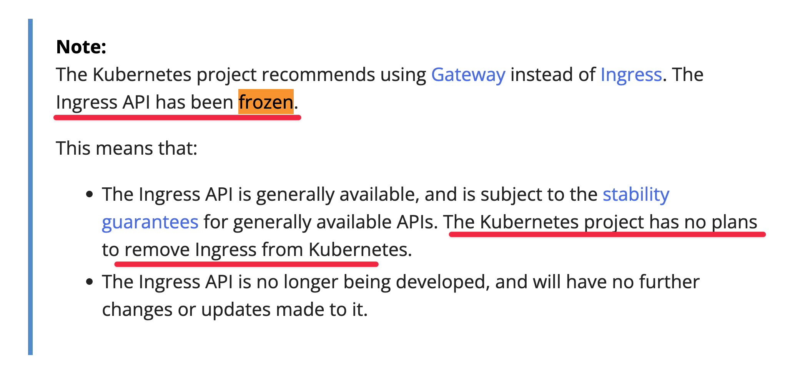
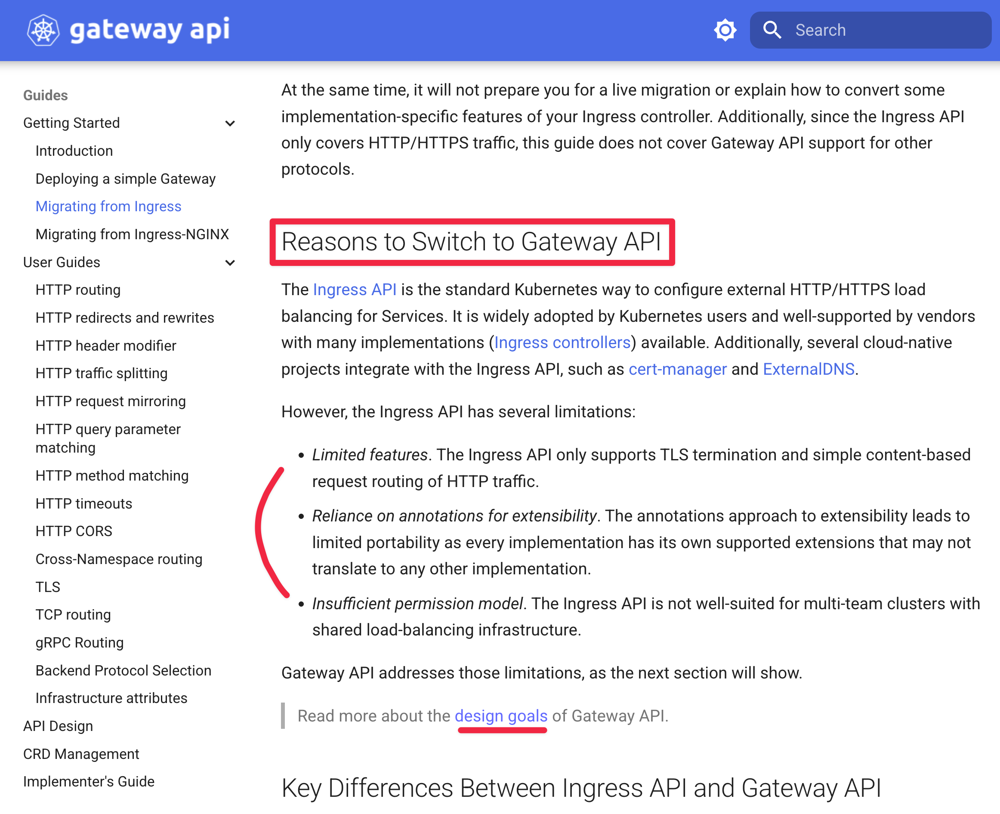
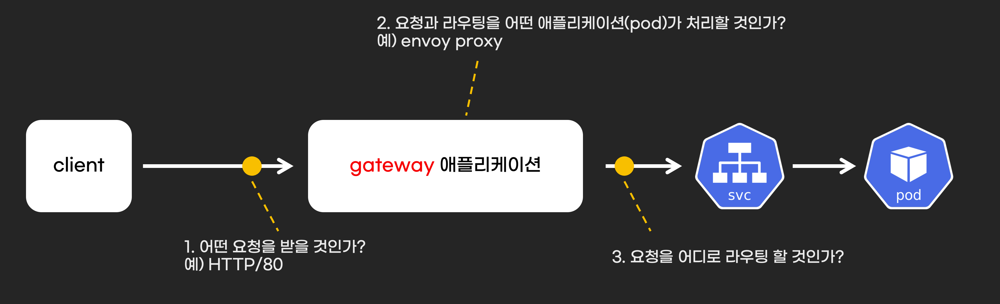
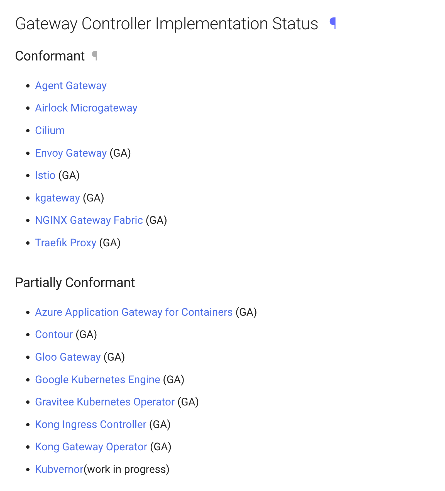
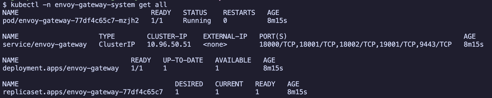
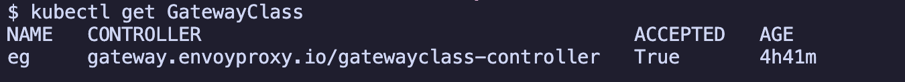
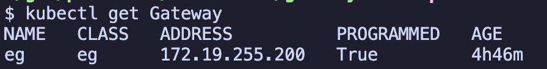
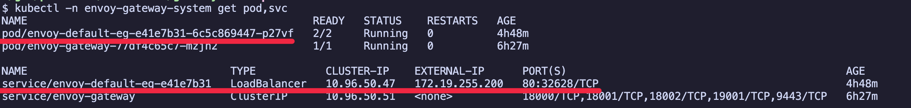
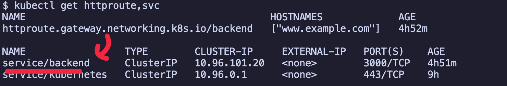

# Gateway API Hands-on

kubernetes Gateway API의 개념을 이해하고 핸즈온을 진행합니다.

## 목차

<!-- TOC -->

- [Gateway API Hands-on](#gateway-api-hands-on)
  - [목차](#%EB%AA%A9%EC%B0%A8)
  - [개발 중단된 ingress](#%EA%B0%9C%EB%B0%9C-%EC%A4%91%EB%8B%A8%EB%90%9C-ingress)
  - [ingress 개발을 중단하고 Gateway API를 만든 이유는?](#ingress-%EA%B0%9C%EB%B0%9C%EC%9D%84-%EC%A4%91%EB%8B%A8%ED%95%98%EA%B3%A0-gateway-api%EB%A5%BC-%EB%A7%8C%EB%93%A0-%EC%9D%B4%EC%9C%A0%EB%8A%94)
  - [설정 방법](#%EC%84%A4%EC%A0%95-%EB%B0%A9%EB%B2%95)
    - [누가 또는 어떤 pod가 Gateway API 작업을 수행할 것인가 gateway controller?](#%EB%88%84%EA%B0%80-%EB%98%90%EB%8A%94-%EC%96%B4%EB%96%A4-pod%EA%B0%80-gateway-api-%EC%9E%91%EC%97%85%EC%9D%84-%EC%88%98%ED%96%89%ED%95%A0-%EA%B2%83%EC%9D%B8%EA%B0%80-gateway-controller)
    - [어떤 요청을 받을 것인가?](#%EC%96%B4%EB%96%A4-%EC%9A%94%EC%B2%AD%EC%9D%84-%EB%B0%9B%EC%9D%84-%EA%B2%83%EC%9D%B8%EA%B0%80)
    - [요청을 받으면 어떤 pod로 라우팅할 것인가?](#%EC%9A%94%EC%B2%AD%EC%9D%84-%EB%B0%9B%EC%9C%BC%EB%A9%B4-%EC%96%B4%EB%96%A4-pod%EB%A1%9C-%EB%9D%BC%EC%9A%B0%ED%8C%85%ED%95%A0-%EA%B2%83%EC%9D%B8%EA%B0%80)
  - [예제](#%EC%98%88%EC%A0%9C)
  - [참고자료](#%EC%B0%B8%EA%B3%A0%EC%9E%90%EB%A3%8C)

<!-- /TOC -->

## 개발 중단된 ingress

kubernetes ingress는 개발이 중단되고 신규 기능은 Gateway API에서 진행됩니다. 하지만 ingress가 없어진다는 의미는 아닙니다.

참고: https://kubernetes.io/docs/concepts/services-networking/ingress/



## ingress 개발을 중단하고 Gateway API를 만든 이유는?

Gateway API 문서에서 Gateway API를 만들게 된 3가지 이유를 설명합니다.

참고: https://gateway-api.sigs.k8s.io/guides/getting-started/migrating-from-ingress/#reasons-to-switch-to-gateway-api

1. ingress는 HTTP, HTTPS만 처리할 수 있습니다.
2. ingress 설정을 annotations로만 하기에는 확장성 제약이 있습니다.
3. ingress 설정을 여러 팀과 협력할 때 어렵습니다.



## 설정 방법

Gateway API의 설정은 최소 3가지입니다. 최소 3가지가 필요한 이유는 요청을 받고 처리하는 작업에 필수적인 요소이기 때문입니다. 요청을 처리하는 것 이외에 TLS처럼 보안 옵션, 요청을 제한하는 등 트래픽 관리 등 여러 옵션이 있습니다.

1. 누가 또는 어떤 pod가 Gateway API 작업을 수행할 것인가 (gateway controller)?
2. 어떤 요청을 받을 것인가?
3. 요청을 받으면 어떤 pod로 라우팅할 것인가?



### 누가 또는 어떤 pod가 Gateway API 작업을 수행할 것인가 (gateway controller)?

Gateway API는 kubernetes가 정한 인터페이스일 뿐입니다. 인터페이스는 다르게 말하면 규격을 의미하며, 이 규격에 맞게 작업을 수행하는 실행 주체가 필요합니다. 이 실행 주체를 Gateway API controller라고 합니다. Gateway API 문서에 사용할 수 있는 Gateway API controller 목록이 있습니다.

참고: https://gateway-api.sigs.k8s.io/implementations/#gateway-controller-implementation-status



예를 들어 envoy gateway controller는 아래에서 보듯이 helm으로 설치할 수 있습니다.

```sh
helm install eg oci://docker.io/envoyproxy/gateway-helm \
  --version v1.6.1 \
  -n envoy-gateway-system --create-namespace
```



설치한 Gateway API controller는 GatewayClass로 kubernetes에 등록해야 Gateway API controller가 Gateway API 설정을 처리합니다.

```yaml
# envoy gateway를 GatewayClass에 등록한 예시
apiVersion: gateway.networking.k8s.io/v1
kind: GatewayClass
metadata:
  name: eg
spec:
  controllerName: gateway.envoyproxy.io/gatewayclass-controller
```



### 어떤 요청을 받을 것인가?

Gateway API controller를 설정했다면 어떤 요청을 받을지 설정해야 합니다.
어떤 요청을 받을지에 대한 용어는 listener입니다.
아래 예제는 HTTP 프로토콜 요청을 받고 80/tcp를 사용합니다.

```yaml
apiVersion: gateway.networking.k8s.io/v1
kind: Gateway
metadata:
  name: eg
spec:
  gatewayClassName: eg
  listeners:
  - name: http
    protocol: HTTP
    port: 80
```



gateway가 생성되면 Gateway API controller에 따라 kubernetes 리소스를 생성합니다. 이는 요청을 받기 위한 gateway 애플리케이션(pod)이 필요하기 때문입니다. envoy Gateway API controller는 envoy proxy pod와 LoadBalancer 타입 service를 생성합니다.



### 요청을 받으면 어떤 pod로 라우팅할 것인가?

gateway pod가 요청을 받으면, 해당 요청을 어떤 pod에게 라우팅할지 설정해야 합니다. 이 예제에서는 HTTP 프로토콜 요청을 받도록 설정했으므로 HTTPRoute로 라우팅을 설정합니다. 아래 예제는 www.example.com host에 대해 backend 이름을 갖는 service로 라우팅합다.

```yaml
apiVersion: gateway.networking.k8s.io/v1
kind: HTTPRoute
metadata:
  name: backend
spec:
  parentRefs:
  - name: eg
  hostnames:
  - "www.example.com"
  rules:
  - backendRefs:
    - group: ""
      kind: Service
      name: backend
      port: 3000
      weight: 1
    matches:
    - path:
        type: PathPrefix
        value: /
```



## 예제

1. 로컬에서 envoy gateway를 사용한 예제: ./example_envoy_gateway.md

## 참고자료

- https://gateway.envoyproxy.io/docs/tasks/quickstart/
- https://aws.amazon.com/ko/blogs/containers/kubernetes-gateway-api-in-action/
