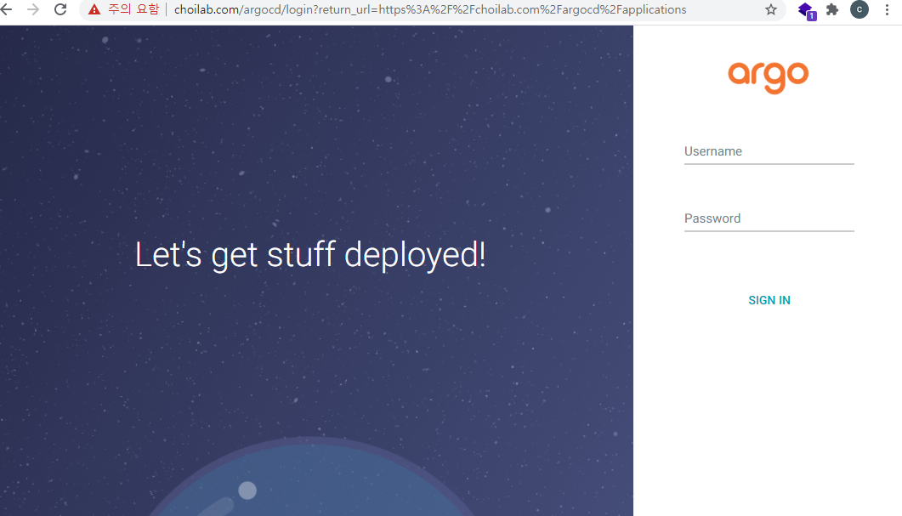

- [개요](#개요)
- [helm 다운로드](#helm-다운로드)
- [설정](#설정)
  - [ingress](#ingress)
- [설치](#설치)
- [삭제](#삭제)
- [로그인 계정/비밀번호](#로그인-계정비밀번호)
- [참고자료](#참고자료)

# 개요
* argocd helm

<br>

# helm 다운로드
```
git clone https://github.com/argoproj/argo-helm.git
cd charts/argo-cd
```

<br>

# 설정
## ingress

```sh
touch override_value.yaml
```

```yaml
server:
  extraArgs:
    - --rootpath
    - /argocd
  ingress:
    # change here
    hosts:
      - "helloworld.com"
    # change here
    paths:
      - "/argocd"
```

<br>

# 설치
* argocd 네임스페이스에 설치
```sh
helm install argocd -n argocd -f override_value.yaml --dependency-update --create-namespace ./
```



<br>

# 삭제
```sh
helm uninstall argocd -n argocd
kubectl delete ns argocd
```

<br>

# 로그인 계정/비밀번호
* 계정: admin
* 비밀번호 argocd-srever pod이름 또는 아래 쉘 스크립트 실행
```sh
kubectl get pods -n argocd -l app.kubernetes.io/name=argocd-server -o name | cut -d'/' -f 2
```

<br>

# 참고자료
* [1] ingress 설정 공식문서: https://argoproj.github.io/argo-cd/operator-manual/ingress/
* [2] 중국 블로그: https://blog.csdn.net/weixin_37546425/article/details/105137539