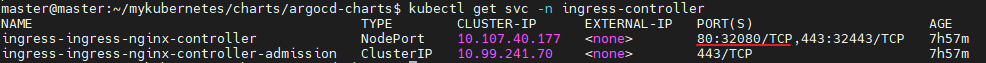

# 개요
* argocd helm
* https://github.com/argoproj/argo-helm/tree/master/charts/argo-cd 에서 가져왔습니다.

# 설정
## ingress
* http 프로토콜 사용하고 자동으로 https리다이렉트
    * 설정 안할지 https포트만 접속
```yaml
extraArgs:
    - --insecure
annotations:
    nginx.ingress.kubernetes.io/backend-protocol: HTTP
```
## ingress path
```yaml
server:
  extraArgs:
    - --rootpath
    - /argocd
  ingress:
    # change here
    hosts:
      - "helloworld.com"
    # change here
    paths:
      - "/argocd"
```

# 설치
* argocd 네임스페이스에 설치
```sh
helm install argocd -n argocd -f values.yaml --dependency-update --create-namespace ./charts
```

# 삭제
```sh
helm uninstall argocd -n argocd
kubectl delete ns argocd
```

# 실행확인
* ingres-controller 서비스 포트 확인


* argocd 접속


# 로그인 계정/비밀번호
* 계정: admin
* 비밀번호 argocd-srever pod이름

# 참고자료
* [1] ingress 설정 공식문서: https://argoproj.github.io/argo-cd/operator-manual/ingress/
* [2] 중국 블로그: https://blog.csdn.net/weixin_37546425/article/details/105137539