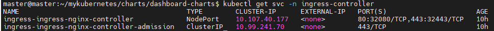
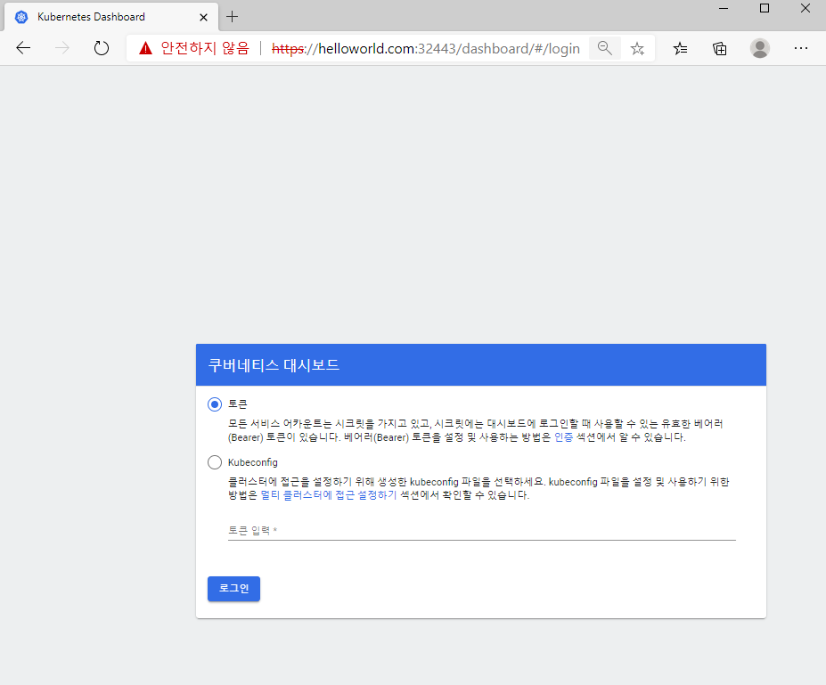

# 1. 개요
* 쿠버네티스 helm chart
* https://github.com/kubernetes/dashboard/tree/master/aio/deploy/helm-chart/kubernetes-dashboard 에서 가져왔습니다.

<br>

# 2. 수정
## 2.1 cluster-admin serviceaccount 생성과 clusterrole binding
* serviceaccount-admin.yaml
```yaml
apiVersion: v1
kind: ServiceAccount
metadata:
  name: admin-user
  namespace: {{ .Release.Namespace }}
```

<br>

* clusterrolebinding-admin
```yaml
piVersion: rbac.authorization.k8s.io/v1
kind: ClusterRoleBinding
metadata:
  name: admin-user
roleRef:
  apiGroup: rbac.authorization.k8s.io
  kind: ClusterRole
  name: cluster-admin
subjects:
- kind: ServiceAccount
  name: admin-user
  namespace: {{ .Release.Namespace }}
```
## 2.2 토큰 인증시간 제거
* deployment.yaml
```yaml
  containers:
  - name: {{ .Chart.Name }}
    image: "{{ .Values.image.repository }}:{{ .Values.image.tag }}"
    imagePullPolicy: {{ .Values.image.pullPolicy }}
    args:
      - --token-ttl=0
```

# 4. values.yaml
## ingress
* ingress.path, ingress.hosts
## service
* type: nodePort

<br>

# 4. 실행
## 4.1 인자 설명
* -n: namespace
* --create-namespace: namespace없을 때 자동 생성
* --dependency-update: 디펜더시 자동 설치
* --set=service.type=NodePort: 포트타입을 NodePort로 변경
```sh
helm install dashboard -n dashboard -f values.yaml --dependency-update --create-namespace ./charts
```

## 4.2 대시보드 주소
* namespace가 dashabord인 경우만 동작
```sh
export NODE_PORT=$(kubectl get -n dashboard -o jsonpath="{.spec.ports[0].nodePort}" services dashboard-kubernetes-dashboard)
export NODE_IP=$(kubectl get nodes -o jsonpath="{.items[0].status.addresses[0].address}")
echo https://$NODE_IP:$NODE_PORT/
```

## 4.3 접속
* ingress https 포트 확인


* 웹페이지 접속



## 4.4 접속토큰 출력
```
kubectl describe secret admin-user-token-xxxx -n dashboard
```