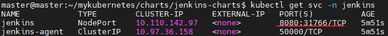
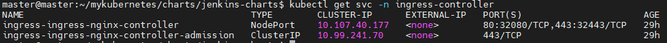
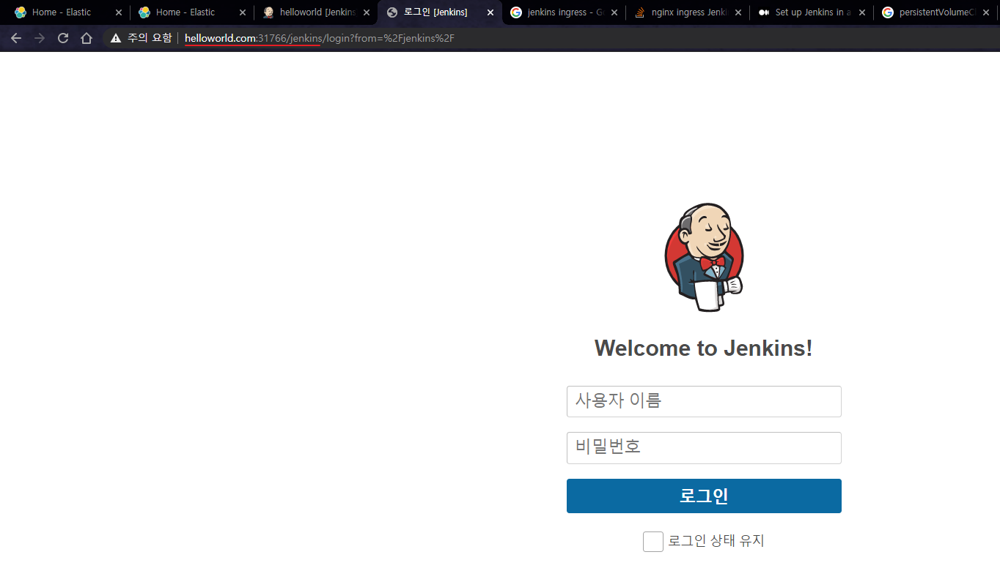
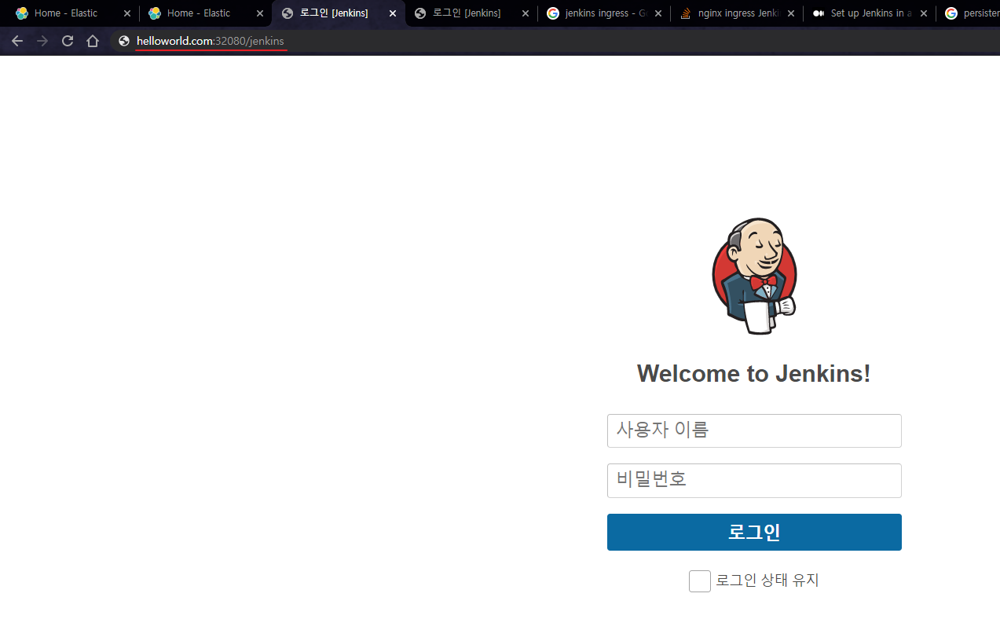

# 1. 개요
* jenkins helm

<br>

# 2. 설정
## 2.1 namespace 생성
```sh
kubectl create ns jenkins
```
## 2.2 persistentvolume, persistentvolumeclaim 생성
```sh
kubectl create -f ./volume.yaml
```
## 2.3 values.yaml설정
* persistentvolume
* ingress
```yaml
persistence:
  storageClass: nfs
  size: 20Gi
  existingClaim: jenkins-pvc
```

<br>

# 3. 실행방법
* 실행
```sh
helm install -n jenkins jenkins -f values.yaml  --create-namespace ./charts
```
* pasword 출력
```
kubectl exec --namespace jenkins -it svc/jenkins -c jenkins -- /bin/cat /run/secrets/chart-admin-password && echo
```

# 4. 실행확인
* 서비스


* nginx-ingress-controller


* 젠킨스-nodeport 접속


* 젠킨스-ingress 접속


<br>

# 5. 참고자료
* [1] 젠킨스 설치 공식문서: https://www.jenkins.io/doc/book/installing/kubernetes/
* [2] 젠킨스 공식 helm chart: https://github.com/jenkinsci/helm-charts
* [3] [gitIssue-docker.sock]: https://github.com/helm/charts/issues/7002