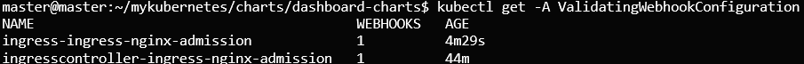

# 상황
* ingress webhook이 여러 개 존재하여 ingress-controller 작동오류

```sh
kubectl get -A ValidatingWebhookConfiguration
```




# 원인
* values.yaml을 수정하고 helm install을 명령어를 실행할 때마다 wehbook 생성

# 해결
* 1개만 제외한 모든 webhook삭제
    * webhook이름과 생성시간을 확인하고 

# 참고자료
* https://stackoverflow.com/questions/61365202/nginx-ingress-service-ingress-nginx-controller-admission-not-found