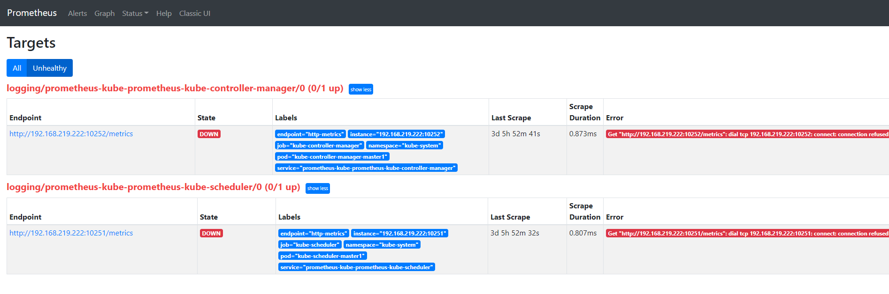
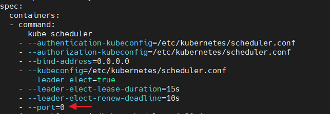

- [connection refused](#connection-refused)
  - [kube-proxy](#kube-proxy)
  - [kube-scheduler, kube-controller-manager](#kube-scheduler-kube-controller-manager)
- [참고자료](#참고자료)

# connection refused
> 상단메뉴 > Status > Unhealthy

* 원인: 기존 kube-system pod의 bindaddress가 localhost로 설정
* 해결: bindaddress를 0.0.0.0으로 수정



<br>

## kube-proxy
* yaml 수정
```yaml
kubectl edit cm/kube-proxy -n kube-system
---
kind: KubeProxyConfiguration
metricsBindAddress: 0.0.0.0:10249
```
* kubeproxy pod 재실행
```sh
kubectl delete po -l k8s-app=kube-proxy -n kube-system
```

<br>

## kube-scheduler, kube-controller-manager
* port 설정 삭제(마스터노드)
```yaml
vi /etc/kubernetes/manifests/kube-scheduler.yaml
vi /etc/kubernetes/manifests/kube-controller-manager.yaml

---
...
- --port=0 <-- 삭제
```



* kubelet 재실행(마스터노드)
```sh
sudo systemctl restart kubelet.service
```

<br>

# 참고자료
* [1] [stackoverflow: kube-proxy connection refused 해결](https://stackoverflow.com/questions/60734799/all-kubernetes-proxy-targets-down-prometheus-operator)
* [2] [stackoverflow: kube-scheduler, kube-controller-manager](https://stackoverflow.com/questions/64296491/how-to-resolve-scheduler-and-controller-manager-unhealthy-state-in-kubernetes)