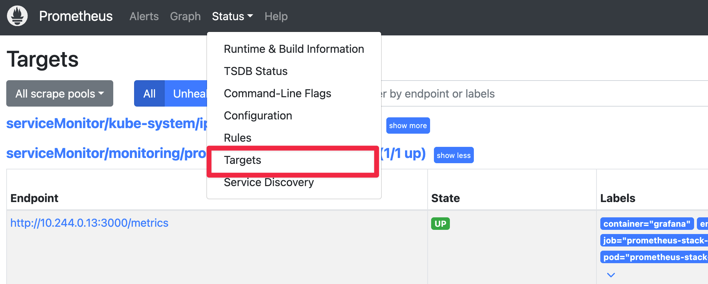
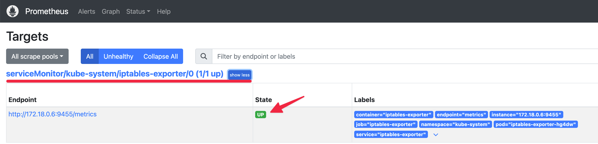
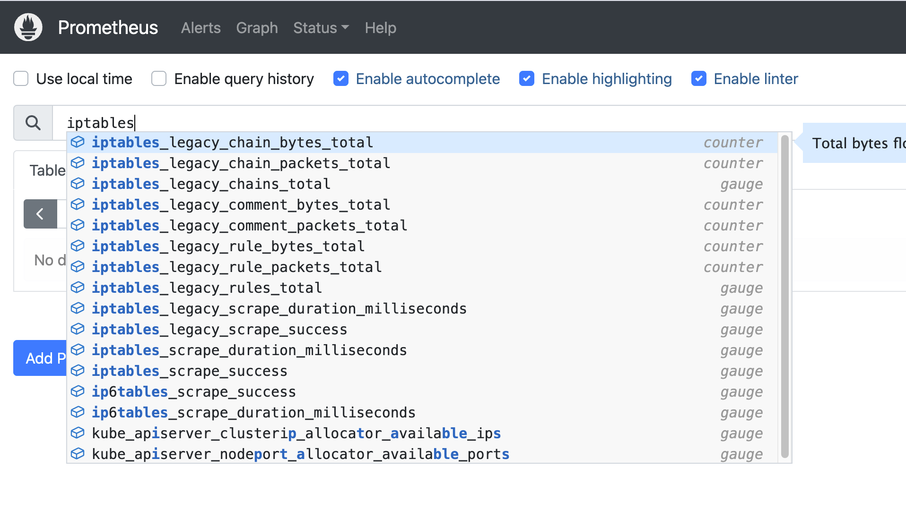

# 개요
* kind cluster에서 iptables 시각화

# 실습환경 구축
* [환경 구축 문서 바로가기](./install/README.md)

# iptables-exporter

* manifest 배포

```sh
kubectk apply ./manifests/iptables-exporter/
```

* pod 실행상태 확인

```sh
$ kubectl -n kube-system get pod -l app=iptables-exporter
NAME                      READY   STATUS    RESTARTS   AGE
iptables-exporter-hg4dw   1/1     Running   0          8h
```

* prometheus targets 확인






# 실습
* prometheus에서 iptables-exporter metrics 조회

> iptables_로 시작




# 참고자료
* https://github.com/madron/iptables-exporter
* https://openai.com/index/scaling-kubernetes-to-7500-nodes/
* https://popappend.tistory.com/140
* https://iximiuz.com/en/posts/laymans-iptables-101/
* https://kschoi728.tistory.com/261
