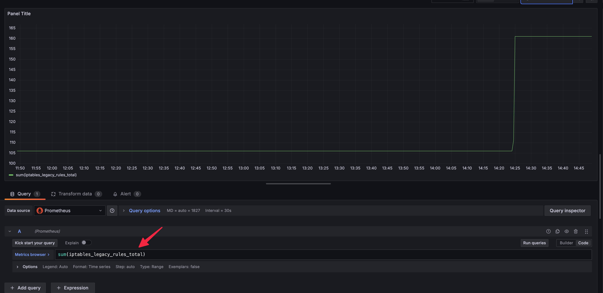
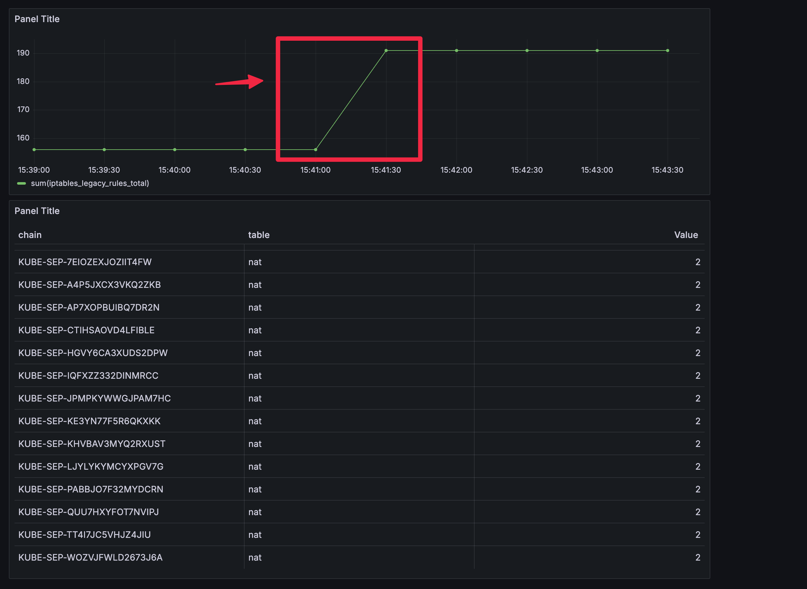
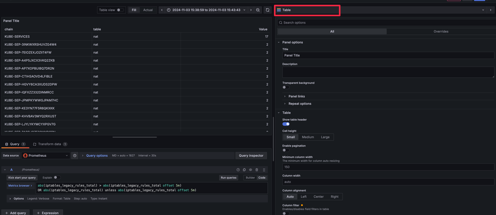
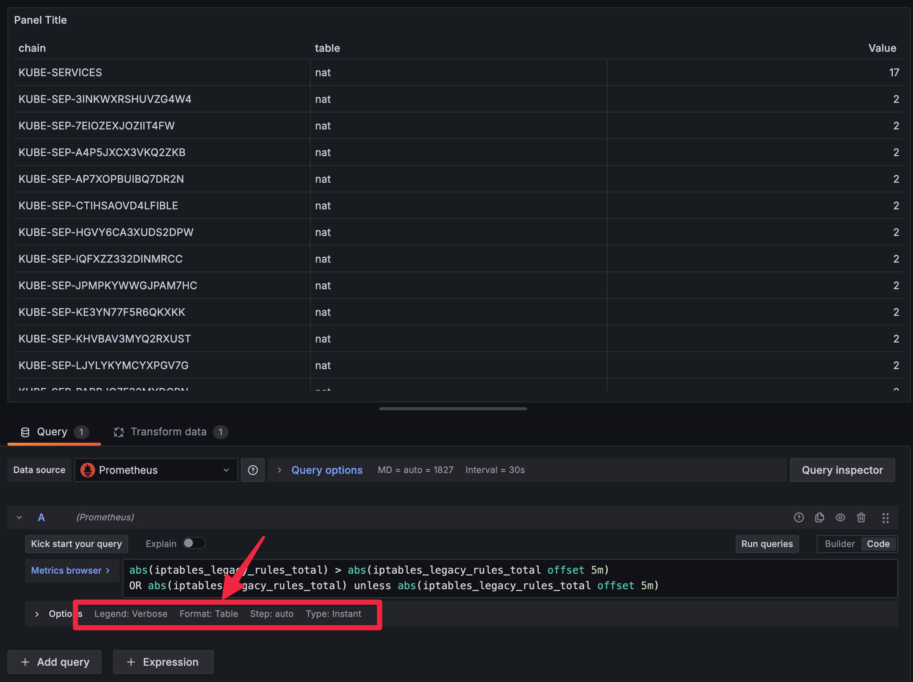
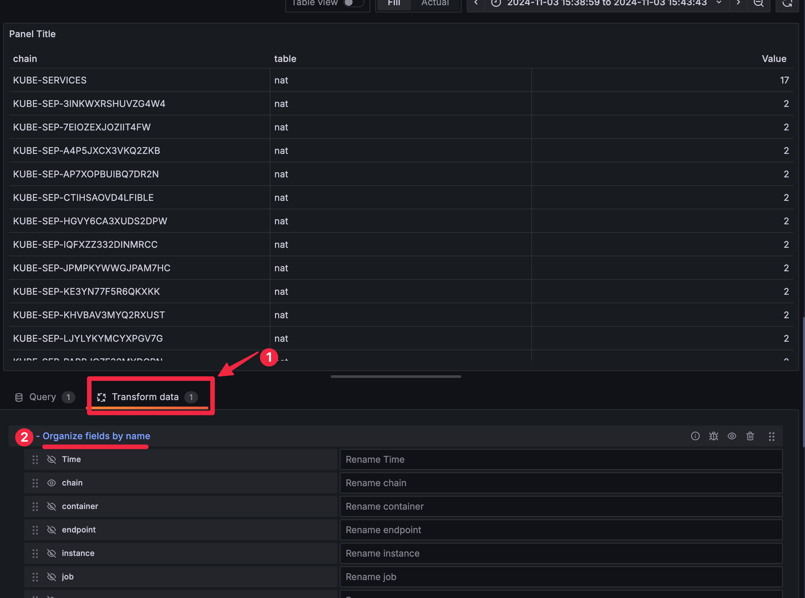

# 개요
이 문서는 쿠버네티스에서 iptables 예제를 설명합니다.

# 실습환경
* [실습환경 구축 문서 바로가기](./install/README.md)

# control-plane 컨테이너 쉘 접속

* kind 도커 컨테이너 조회

```sh
$ docker ps
CONTAINER ID   IMAGE
d786a5a23ebf   kindest/node:v1.30.4
```

* controlplane 쉘 접속
```sh
docker exec -it iptables-exporter-control-plane /bin/bash
```

# iptables 조회

* controlplane 쉘에서 iptables 명령어로 조회

> [예시파일](./iptables-save.txt)

```sh
iptables save
```

# 시간대별 iptables 증가/감소를 확인

* grafana에서 time seriese 패널을 추가

```sql
sum(iptables_legacy_rules_total)
```



# 쿠버네티스가 service 생성될 때 추가된 iptables chain확인

* controlplane shell에서 보니터링

```sh
iptables -v --numeric --table nat --list PREROUTING; echo && \
  iptables -v --numeric --table nat --list KUBE-SERVICES; echo && \
  iptables -v --numeric --table nat --list  | grep KUBE-SEP | egrep -v "references"; echo && \
  iptables -v --numeric --table nat --list KUBE-POSTROUTING
```

```sh
watch 'iptables -v --numeric --table nat --list PREROUTING; echo && \
  iptables -v --numeric --table nat --list KUBE-SERVICES; echo && \
  iptables -v --numeric --table nat --list  | grep KUBE-SEP | egrep -v "references"; echo && \
  iptables -v --numeric --table nat --list KUBE-POSTROUTING; echo'
```

* 그라파나에 패널을 생성하고 promql 설정

> kind cluster 컨테이너가 iptables legacy여서 메트릭 이름이 legacy로 표시됩니다.

```sql
abs(iptables_legacy_rules_total) > abs(iptables_legacy_rules_total offset 5m)
OR abs(iptables_legacy_rules_total) unless abs(iptables_legacy_rules_total offset 5m)
```

* 패널타입은 table로 변경









# netshoot 테스트


* netshoot pod 배포

```sh
kubectl apply -f ./manifests/netshoot-deployment.yaml
```

```sh
$ kubectl exec -it {netshot pod} -- /bin/zsh
$ (netshoot pod) while true; do curl -o /dev/null -s -w "%{http_code}\n" --max-time 2 http://nginx-service-2000; sleep 0.2; done

```

# 속도 측정


```sh
curl -o /dev/null -s -w "Time: %{time_total} s, Speed: %{speed_download} bytes/sec\n" http://http-echo
```
