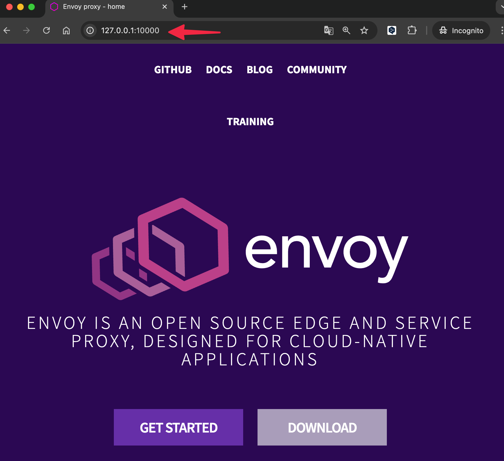

## 개요
* envoy quick start 예제

## 전제조건
* docker가 필요합니다.

## 실행방법

1. envoy 도커 컨테이너 실행

```sh
$ docker run --rm -it envoyproxy/envoy:v1.31.4 --version
envoy  version: d045f4201477d50bc64a3bd38c28cfec67c272ca/1.31.4/Clean/RELEASE/BoringSSL
```

2. envoy 설정파일 확인

```sh
cat ./config.yaml
```

3. envoy 설정 파일을 마운트하여 envoy 도커 컨테이너 실행

```sh
docker run --rm -d \
  -v $(pwd)/config.yaml:/etc/envoy/envoy.yaml \
  -p 10000:10000 \
  --name envoy \
  envoyproxy/envoy:v1.31.4 \
  envoy -c /etc/envoy/envoy.yaml
```

4. curl을 사용하여 envoy 도커 컨테이너 호출

```sh
$ curl 127.0.0.1:10000
<!DOCTYPE html>
<html lang="en">
  <head>
    <title>Envoy proxy - home</title>

... 이하생략
```

5. 웹 브라우저에서 envoy 도커 컨테이너 호출




6. envoy 도커 컨테이너에서 액세스 로그 확인

```sh
$ docker logs envoy
[2024-12-14T13:29:55.112Z] "GET / HTTP/1.1" 200 - 0 15795 586 513 "-" "curl/8.7.1" "403ab333-031f-4fff-99ee-2837404dd4e3" "www.envoyproxy.io" "52.74.232.59:443"
```

## 실습환경 정리
* 실습을 마치고 도커 컨테이너 종료

```sh
docker kill envoy
```

## 참고자료
* https://www.envoyproxy.io/docs/envoy/latest/start/quick-start/run-envoy
