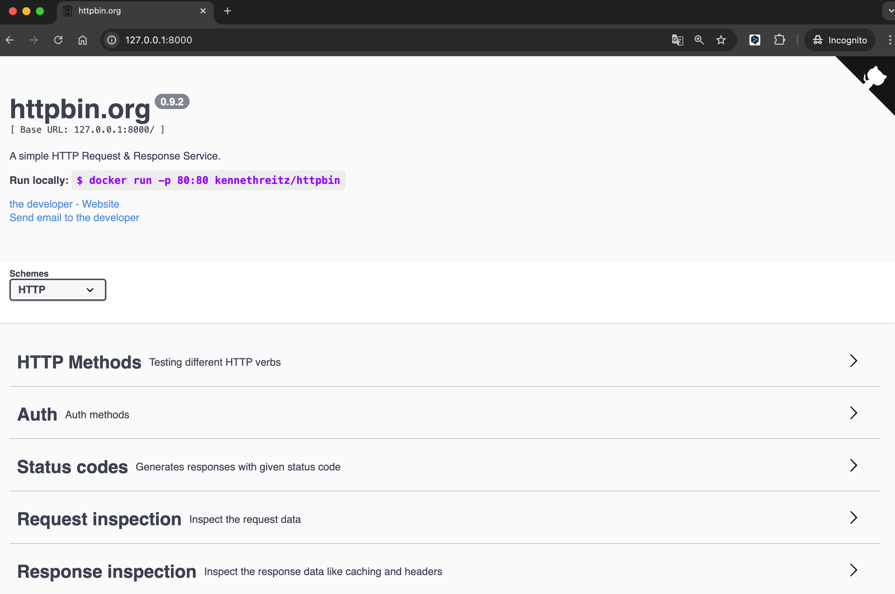

## 개요
* envoy proxy가 httpbin 도커 컨테이너를 호출할 수 있도록 envoy 설정파일을 수정합니다.
* envoy 설정파일은 [예제 2](../example2_set_host_from_example/)를 사용합니다.

## 전제조건
* docker, docker-compose가 필요합니다.

## 실행방법

1. docker-compose 실행: envoy, httpbin 도커 컨테이너가 실행됩니다.

```sh
$ docker compose up -d
[+] Running 3/3
 ✔ Network example3_httpbin_default  Created
 ✔ Container httpbin                 Started
 ✔ Container envoy                   Started
```

2. 도커 컨테이너 실행 확인

```sh
$ docker compose ps
NAME      IMAGE                      COMMAND                  SERVICE   CREATED          STATUS          PORTS
envoy     envoyproxy/envoy:v1.31.4   "envoy -c /etc/envoy…"   envoy     38 seconds ago   Up 38 seconds   0.0.0.0:10000->10000/tcp
httpbin   kong/httpbin:0.2.1         "pipenv run gunicorn…"   httpbin   38 seconds ago   Up 38 seconds   0.0.0.0:8000->80/tcp
```

3. envoy proxy 설정 확인

```sh
$ cat ./config.yaml
# 23번째 줄
route_config:
  name: local_route
  virtual_hosts:
  - name: envoyproxy_io
    domains: [ "httpbin.local" ]
    routes:
    - match:
        prefix: "/"
      route:
        auto_host_rewrite: true
        cluster: httpbin_service

## 62번째 줄
clusters:
  - name: httpbin_service
    type: LOGICAL_DNS
    # Comment out the following line to test on v6 networks
    dns_lookup_family: V4_ONLY
    load_assignment:
      cluster_name: httpbin
      endpoints:
      - lb_endpoints:
        - endpoint:
            address:
              socket_address:
                address: httpbin
                port_value: 8000
```

4. 웹 브라우저에서 httpbin 호출



5. curl을 사용하여 envoy 도커 컨테이너 호출

```sh
$ curl -H "Host: httpbin.local" 127.0.0.1:10000
<!DOCTYPE html>
<!DOCTYPE html>
<html lang="en">

<head>
    <meta charset="UTF-8">
    <title>httpbin.org</title>

... 이하생략
```

6. envoy 도커 컨테이너에서 액세스 로그 확인

```sh
$ docker logs envoy
envoy  | [2024-12-14T15:02:46.954Z] "GET / HTTP/1.1" 200 - 0 9593 3 2 "-" "curl/8.7.1" "e82af3ac-eb01-4833-86e5-8e82c986d0c6" "httpbin" "172.21.0.2:80"
```

## 실습환경 정리
* 실습을 마치고 도커 컨테이너 종료

```sh
docker compose down
```

## 참고자료
* https://www.envoyproxy.io/docs/envoy/latest/start/quick-start/run-envoy
