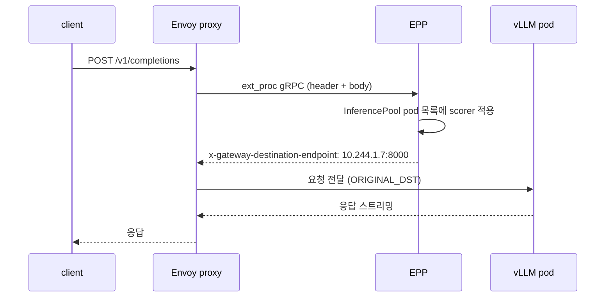

# llm-d 구성요소와 요청 흐름

## llm-d가 푸는 문제

- vLLM은 노드 하나에서 모델 하나를 잘 돌린다. replica가 여러 개가 되는 순간부터는 "어느 replica로 보낼 것인가"가 성능을 결정한다.
- llm-d는 이 선택을 하는 계층이다. 추론 엔진을 새로 만들지 않고 vLLM, SGLang, TensorRT-LLM 앞에 붙는다.

일반적인 Kubernetes Service 로드밸런싱이 LLM에서 잘 안 맞는 이유는 세 가지다.

- 요청마다 처리 시간이 수십 배 차이 난다. prompt 100 token과 100k token이 같은 큐를 쓴다.
- 직전 요청의 KV cache가 그 pod에 남아 있다. 같은 prefix를 가진 요청은 그 pod에서 prefill을 건너뛴다. 다른 pod으로 보내면 처음부터 다시 계산한다.
- pod마다 대기 큐 길이와 KV cache 사용률이 다르다. round-robin은 이 상태를 모른다.

## 구성요소

| 구성요소 | 역할 | 실체 |
|---|---|---|
| model server | 실제 추론 | vLLM 등의 Deployment |
| InferencePool | 하나의 모델을 서빙하는 pod 집합 정의 | Gateway API Inference Extension CRD |
| EPP (Endpoint Picker) | 요청마다 어느 pod으로 보낼지 결정 | gRPC ext_proc 서버 |
| proxy | EPP가 고른 pod으로 요청 전달 | Envoy |

- InferencePool은 `selector.matchLabels`로 pod을 고르고 `targetPorts`로 포트를 지정한다. Service가 아니라 CRD다.
- EPP는 pod을 직접 watch하고 각 pod의 `/metrics`를 주기적으로 긁어 큐 길이와 KV cache 사용률을 안다.
- proxy는 Envoy의 ORIGINAL_DST cluster를 쓴다. 목적지를 EPP가 응답 헤더 `x-gateway-destination-endpoint`로 알려 주고 Envoy가 그 주소로 그대로 보낸다. 그래서 pod 앞에 Service가 필요 없다.

## 요청 흐름

curl 한 번이 지나가는 경로다.

- EPP는 트래픽을 직접 나르지 않는다. 판단만 하고 주소를 돌려준다. EPP가 죽어도 `failureMode: FailOpen`이면 Envoy가 그냥 흘린다.
- 그래서 EPP 장애가 서비스 장애로 바로 이어지지 않는다. 대신 그 시간 동안 라우팅 품질만 떨어진다.

## 배포 모드

- standalone 모드: Envoy가 EPP pod 안에 sidecar로 들어간다. Gateway 리소스가 필요 없다. 이 핸즈온이 쓰는 모드다.
- gateway 모드: 클러스터의 Gateway(kgateway, Istio, agentgateway 등)에 InferencePool을 붙인다. 이미 Gateway API를 쓰고 있으면 이쪽이다.

standalone 모드를 먼저 보는 이유는 Gateway 구현체 설치라는 변수를 빼고 EPP 동작만 보기 위해서다.

## scorer

EPP는 플러그인 여러 개의 점수를 가중합해 pod을 고른다. 이 핸즈온이 쓰는 조합은 llm-d v0.8.1의 optimized-baseline과 같다.

| plugin | weight | 무엇을 본다 |
|---|---|---|
| prefix-cache-scorer | 3 | prompt를 블록 단위로 해시해 그 prefix를 최근에 처리한 pod을 추정 |
| queue-scorer | 2 | pod의 대기 큐 길이 |
| kv-cache-utilization-scorer | 2 | pod의 KV cache 사용률 |
| no-hit-lru-scorer | 2 | prefix hit이 없을 때 가장 오래 안 쓴 pod으로 분산 |

- prefix-cache-scorer의 weight가 가장 크다. prefill을 건너뛰는 이득이 큐를 조금 더 기다리는 손해보다 크다는 판단이다.
- 이 가중치는 정답이 아니라 upstream이 H100 기준으로 벤치마크한 출발점이다. 요청 길이 분포가 다르면 값도 달라진다.
- 여기 쓴 prefix-cache-scorer는 근사값이다. EPP가 자기가 보낸 요청을 기억해 추정한다. vLLM의 실제 KV cache 상태를 ZMQ 이벤트로 받아 정확히 아는 방식은 별도 가이드(precise prefix cache routing)다.

## 다음 문서

- 맥에서 GPU 없이 시작: [2-setup-kind-mac.md](./2-setup-kind-mac.md)
- GPU 1장짜리 노드: [3-setup-gpu-node.md](./3-setup-gpu-node.md)
- 라우팅 동작 관찰: [4-routing.md](./4-routing.md)
