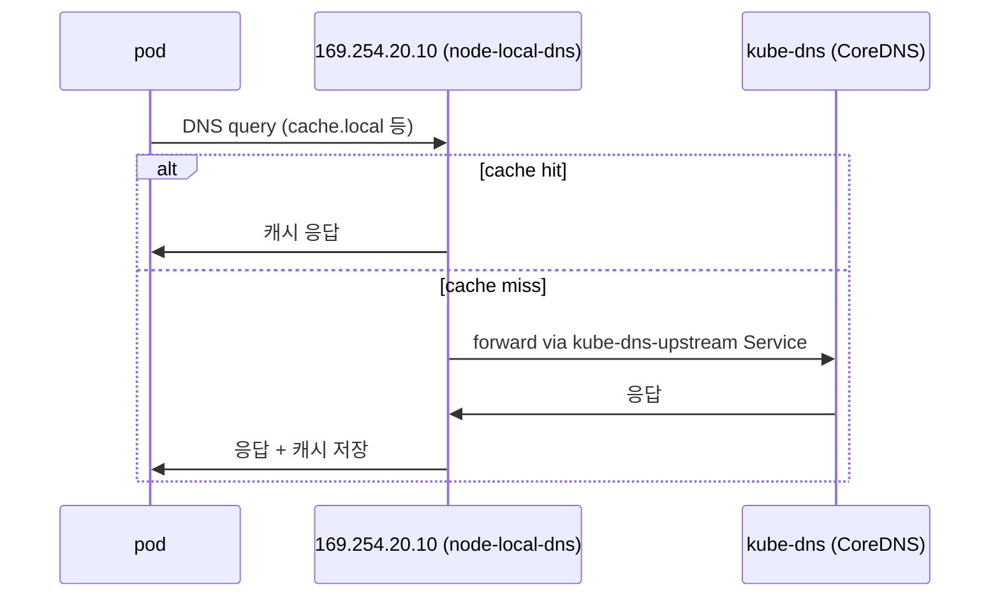

# NodeLocal DNSCache 핸즈온

같은 nodelocaldns라도 클러스터의 데이터플레인이 무엇이냐(iptables vs cilium eBPF)에 따라 가로채기 방식이 다르고, 운영 리스크도 달라집니다. 이 디렉터리는 그 차이를 직접 비교해보려고 두 환경으로 나눠둔 핸즈온입니다.

## NodeLocal DNS란?

- NodeLocal DNSCache는 각 노드에 DNS caching agent를 DaemonSet으로 띄워서 cluster DNS 지연과 kube-dns로의 트래픽 집중을 줄이는 쿠버네티스 애드온입니다.
- pod의 DNS 쿼리는 노드의 링크로컬 IP(`169.254.20.10`)로 먼저 흘러가고, cache miss일 때만 kube-dns로 forward됩니다.

## 실습 환경

| 디렉터리 | 데이터플레인 | pod `/etc/resolv.conf` | nodelocaldns 삭제 시 |
|---|---|---|---|
| [iptables/](./iptables/README.md) | kind 기본 CNI(kindnet) + kube-proxy(iptables) | kube-dns ClusterIP 그대로 | kube-dns로 fallback. DNS 동작 |
| [cilium/](./cilium/README.md) | cilium + `kubeProxyReplacement=true` (iptables 미사용) | `169.254.20.10`을 직접 가리킴 | **DNS 즉시 장애** |

## 어떤 순서로 보면 좋은가

저는 [iptables/](./iptables/README.md) 버전을 먼저 보는 것을 권합니다. nodelocaldns의 dummy interface + iptables NOTRACK이라는 표준 메커니즘을 먼저 이해해야, [cilium/](./cilium/README.md) 버전에서 "kubelet `--cluster-dns`로 우회하는 이유"가 자연스럽게 와닿습니다. 두 디렉터리 모두 docs 하위에 pod `/etc/resolv.conf` 검증 문서를 한 개씩 두었고, 같은 질문에 환경별로 정반대 결론이 나오는 구조라서 비교해 읽으면 더 흥미롭습니다.

## 참고자료

- 공식 nodelocaldns 문서: <https://kubernetes.io/docs/tasks/administer-cluster/nodelocaldns/>
- 공식 nodelocaldns YAML: <https://github.com/kubernetes/kubernetes/blob/master/cluster/addons/dns/nodelocaldns/nodelocaldns.yaml>
- KEP-1024 NodeLocal DNSCache: <https://github.com/kubernetes/enhancements/tree/master/keps/sig-network/1024-nodelocal-cache-dns>
