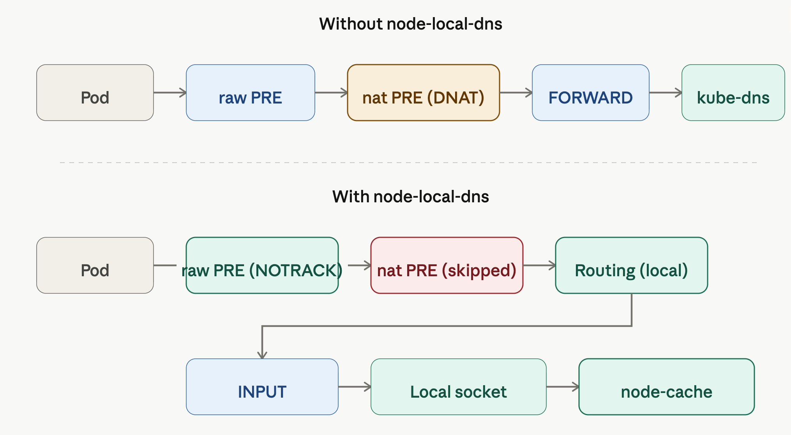

# NodeLocal DNSCache 핸즈온 (iptables 환경)

## 실습 환경

이 핸즈온은 가장 단순한 조합인 **kind 기본 CNI(kindnet) + kube-proxy**에서 진행합니다. 이 조합이어야 kube-proxy가 `169.254.20.10`으로 향하는 iptables 규칙을 자동으로 만들어줍니다. cilium + `kubeProxyReplacement=true` 환경에서는 가로채기 방식이 달라져서 별도로 [../cilium/README.md](../cilium/README.md)에 분리해두었습니다.

- kind-config.yaml을 사용해 `localdns` 클러스터를 생성

```sh
kind create cluster --config kind-config.yaml
```

## 핸즈온

공식 nodelocaldns YAML을 받습니다. ServiceAccount, ConfigMap, `kube-dns-upstream` Service, DaemonSet이 한 파일에 모두 들어 있습니다.

```sh
wget https://github.com/kubernetes/kubernetes/raw/master/cluster/addons/dns/nodelocaldns/nodelocaldns.yaml
```

placeholder 치환에 쓸 환경변수를 잡습니다. `kubedns`는 kube-dns Service의 ClusterIP, `domain`은 클러스터 도메인 기본값, `localdns`는 nodelocaldns가 listen할 링크로컬 IP입니다(사실상 `169.254.20.10` 고정).

```sh
kubedns=$(kubectl get svc -n kube-system kube-dns -o jsonpath='{.spec.clusterIP}')
domain=cluster.local
localdns=169.254.20.10
```

YAML 안의 placeholder를 의미와 매핑해두면 다음과 같습니다.

- `__PILLAR__DNS__SERVER__`: kube-dns Service ClusterIP
- `__PILLAR__DNS__DOMAIN__`: 클러스터 도메인. 기본값 `cluster.local`
- `__PILLAR__LOCAL__DNS__`: nodelocaldns가 listen할 링크로컬 IP. `169.254.20.10` 고정
- `__PILLAR__CLUSTER__DNS__`, `__PILLAR__UPSTREAM__SERVERS__`: kube-proxy iptables 모드 표준 절차에서는 sed로 치환하지 않습니다. `kube-dns-upstream` Service가 만들어준 `KUBE_DNS_UPSTREAM_SERVICE_HOST` 환경변수로 nodelocaldns 컨테이너 안에서 런타임에 해석됩니다.

Linux에서는 GNU sed로 치환합니다.

```sh
sed -i "s/__PILLAR__LOCAL__DNS__/$localdns/g; s/__PILLAR__DNS__DOMAIN__/$domain/g; s/__PILLAR__DNS__SERVER__/$kubedns/g" nodelocaldns.yaml
```

macOS에서는 BSD sed라서 `-i` 다음에 빈 문자열 인자가 필요합니다.

```sh
sed -i '' "s|__PILLAR__LOCAL__DNS__|$localdns|g; s|__PILLAR__DNS__DOMAIN__|$domain|g; s|__PILLAR__DNS__SERVER__|$kubedns|g" nodelocaldns.yaml
```

치환된 YAML을 배포합니다. DaemonSet은 hostNetwork로 뜨고 `NET_ADMIN` capability를 사용합니다.

```sh
kubectl apply -f nodelocaldns.yaml
```

## 확인

pod에서 kubernetes.default 도메인을 resolve 합니다. 이때 ANSWER SECTION의 SERVER 필드가 kube-dns ClusterIP로 표시되지만, 실제로는 nodelocaldns가 가로채 응답하고 있습니다.

```sh
$ ip route show table local local 10.96.0.10 dev nodelocaldns proto kernel scope host src 10.96.0.10
local 10.244.0.1 dev veth8e547316 proto kernel scope host src 10.244.0.1
local 10.244.0.1 dev vetheea12267 proto kernel scope host src 10.244.0.1
local 10.244.0.1 dev veth1fa63964 proto kernel scope host src 10.244.0.1
local
127.0.0.0/8 dev lo proto kernel scope host src 127.0.0.1
local 127.0.0.1 dev lo proto kernel scope host src 127.0.0.1
broadcast 127.255.255.255 dev lo proto kernel scope link src 127.0.0.1
local 169.254.20.10 dev nodelocaldns proto kernel scope host src 169.254.20.10
local 172.19.0.2 dev eth0 proto kernel scope host src 172.19.0.2
broadcast 172.19.255.255 dev eth0 proto kernel scope link src 172.19.0.2
```



## 정리

테스트 pod와 nodelocaldns를 지우고 클러스터까지 내립니다.

```sh
kubectl delete -f manifests/test-pod.yaml
kubectl delete -f nodelocaldns.yaml --ignore-not-found
kind delete cluster --name localdns
```

## 참고자료

- <https://kubernetes.io/docs/tasks/administer-cluster/nodelocaldns/>
- <https://github.com/kubernetes/kubernetes/blob/master/cluster/addons/dns/nodelocaldns/nodelocaldns.yaml>
