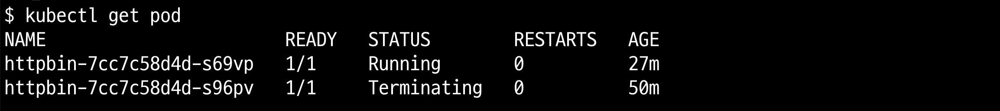
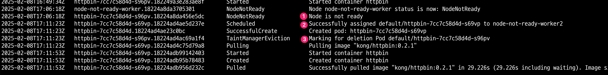
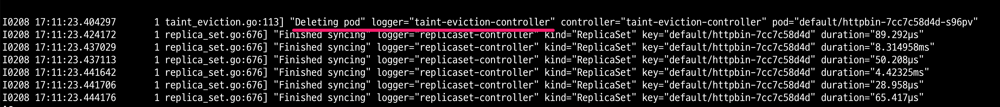

<!-- TOC -->

- [개요](#%EA%B0%9C%EC%9A%94)
- [실습환경 구축](#%EC%8B%A4%EC%8A%B5%ED%99%98%EA%B2%BD-%EA%B5%AC%EC%B6%95)
- [실습](#%EC%8B%A4%EC%8A%B5)
  - [예제 배포](#%EC%98%88%EC%A0%9C-%EB%B0%B0%ED%8F%AC)
  - [pod tolerationSeconds 확인](#pod-tolerationseconds-%ED%99%95%EC%9D%B8)
  - [node taint 확인](#node-taint-%ED%99%95%EC%9D%B8)
  - [node를 not ready로 변경](#node%EB%A5%BC-not-ready%EB%A1%9C-%EB%B3%80%EA%B2%BD)
  - [node not ready 확인](#node-not-ready-%ED%99%95%EC%9D%B8)
  - [node taint 확인](#node-taint-%ED%99%95%EC%9D%B8)
  - [pod 상태 확인](#pod-%EC%83%81%ED%83%9C-%ED%99%95%EC%9D%B8)
  - [eviction pod 상태 확인](#eviction-pod-%EC%83%81%ED%83%9C-%ED%99%95%EC%9D%B8)
  - [kubernetes events 확인](#kubernetes-events-%ED%99%95%EC%9D%B8)
  - [controller manager pod log 확인](#controller-manager-pod-log-%ED%99%95%EC%9D%B8)
- [참고자료](#%EC%B0%B8%EA%B3%A0%EC%9E%90%EB%A3%8C)

<!-- /TOC -->

## 개요

* kubernetes node not ready 이후 일어나는 일을 설명
* 블로그 정리: https://malwareanalysis.tistory.com/807

## 실습환경 구축

* [kind-cluster](./kind-cluster/)

## 실습

### 예제 배포

* httpbin pod, service 배포

```sh
kubectl apply -f ./manifests/httpbin
```

### pod tolerationSeconds 확인

```sh
$ kubectl get pod -oyaml | grep tolerations -A8
    tolerations:
    - effect: NoExecute
      key: node.kubernetes.io/not-ready
      operator: Exists
      tolerationSeconds: 300
    - effect: NoExecute
      key: node.kubernetes.io/unreachable
      operator: Exists
      tolerationSeconds: 300
```

### node taint 확인

```sh
$ kubectl describe node node-not-ready-worker | grep -i "Taints:" -A 4
Taints:             <none>
```

### node를 not ready로 변경

```sh
docker network disconnect kind node-not-ready-worker
```

### node not ready 확인

```sh
$ kubectl get node node-not-ready-worker
NAME                           STATUS     ROLES           AGE   VERSION
node-not-ready-worker          NotReady   <none>          34m   v1.30.4
```

### node taint 확인

```sh
kubectl describe node node-not-ready-worker | grep -i "Taints:" -A 4
Taints:             node.kubernetes.io/unreachable:NoExecute
                    node.kubernetes.io/unreachable:NoSchedule
```

### pod 상태 확인

```sh
kubectl get pod
```



### eviction pod 상태 확인

* DisruptionTarget 상태가 True

```sh
$ kubectl get pod {eviction된 pod} -oyaml
- lastProbeTime: null
    lastTransitionTime: "2025-02-08T17:11:23Z"
    message: 'Taint manager: deleting due to NoExecute taint'
    reason: DeletionByTaintManager
    status: "True"
    type: DisruptionTarget
```

### kubernetes events 확인

```sh
kubectl get events --sort-by='.lastTimestamp' -o custom-columns="LAST_TIMESTAMP:.lastTimestamp,NAME:.metadata.name,REASON:.reason,MESSAGE:.message"
```




### controller manager pod log 확인

```sh
kubectl -n kube-system logs -f -l component=kube-controller-manager
```



## 참고자료

* KEP-3902: https://github.com/kubernetes/enhancements/blob/master/keps/sig-scheduling/3902-decoupled-taint-manager/README.md
* tolerationSeconds: https://kubernetes.io/ko/docs/concepts/scheduling-eviction/taint-and-toleration/?utm_source=chatgpt.com
* https://github.com/kubernetes/kubernetes/issues/55713
* kube API server 인자: https://kubernetes.io/docs/reference/command-line-tools-reference/kube-apiserver/
* Admission controller: https://kubernetes.io/docs/reference/access-authn-authz/admission-controllers/#defaulttolerationseconds
* controller 분리 github PR: https://github.com/kubernetes/kubernetes/pull/115840
