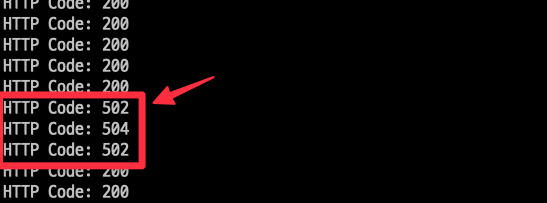

# 개요
* prestop을 설정하게 안전한 종료 설정

# 테스트 방법

* 모니터링

```sh
while true; do http_code=$(curl -s -o /dev/null -w "%{http_code}" https://nginx.choilab.xyz); echo "HTTP Code: $http_code"; sleep 0.1; done
```

* pod 재시작

```sh
kubectl rollout restart deployment nginx
```

* prestop을 설정하지 않으면 ALB에서 502에러 발생(504는 replica가 1이어서 pod가 없는 경우 발생)


